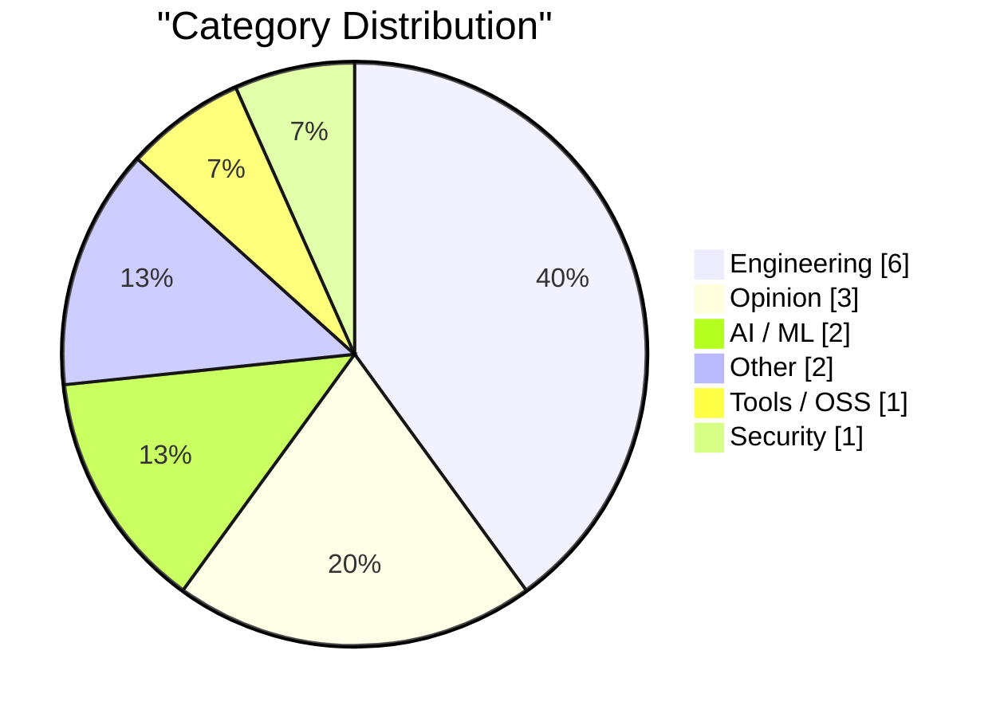
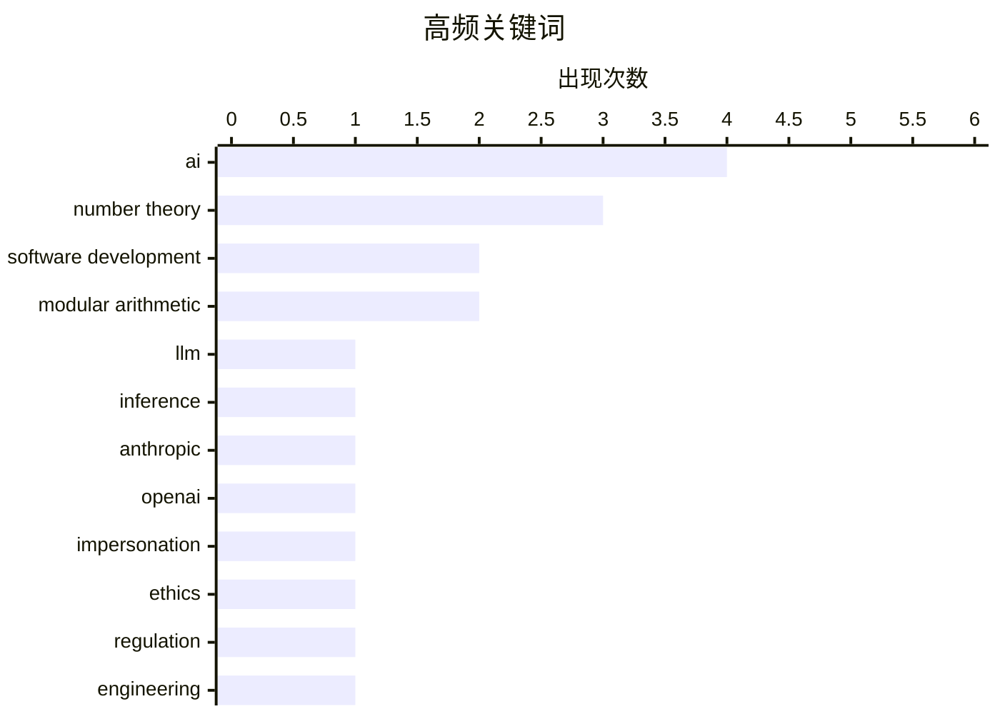

# AI Daily Digest — 2026-02-15

> Curated from 92 top tech blogs recommended by Karpathy. AI-selected Top 15.

<div class="stats-bar" data-sources="89/92" data-articles="2505" data-filtered="16" data-hours="24" data-selected="15"></div>

<div class="stats-categories" data-categories='{"AI / ML":2,"Opinion":3,"Tools / OSS":1,"Engineering":6,"Other":2,"Security":1}'></div>

<div class="stats-tags">

**ai**(4) · **number theory**(3) · **software development**(2) · modular arithmetic(2) · llm(1) · inference(1) · anthropic(1) · openai(1) · impersonation(1) · ethics(1) · regulation(1) · engineering(1) · roles(1) · teamwork(1) · junior developers(1) · profitability(1) · democratization(1) · no-code(1) · godot(1) · minesweeper(1)

</div>

## Highlights

今日看点：AI发展引发多方讨论，一方面，加速推理和模仿人类的AI应用面临伦理和法律挑战；另一方面，AI对开发者角色的影响存在争议，初级开发者价值或将提升。此外，文本驱动的设计理念正逐渐受到关注，为设计领域带来新的可能性。

---

## Top Picks

<div class="pick-card">

#1 **快速LLM推理的两种技巧**

[Two different tricks for fast LLM inference](https://seangoedecke.com/fast-llm-inference/) — seangoedecke.com · 1 小时前 · AI / ML

> Anthropic和OpenAI最近都推出了“快速模式”，旨在以更高的速度与他们的最佳编码模型进行交互。Anthropic的快速模式提供高达2.5倍的tokens/秒的吞吐量，通过减少模型大小和使用更高效的解码技术实现。OpenAI的快速模式则通过并行处理多个请求来提高速度，更像是一个负载均衡器。两种方法各有侧重，Anthropic侧重于优化单个请求的速度，而OpenAI侧重于提高并发处理能力。

**Why read this**: 了解Anthropic和OpenAI如何通过不同策略优化LLM推理速度，有助于开发者根据自身需求选择合适的加速方案。

`LLM` `inference` `Anthropic` `OpenAI`

</div>

<div class="pick-card">

#2 **我们迫切需要一项联邦法律，禁止人工智能模仿人类**

[We URGENTLY need a federal law forbidding AI from impersonating humans](https://garymarcus.substack.com/p/we-urgently-need-a-federal-law-forbidding) — garymarcus.substack.com · 7 小时前 · AI / ML

> 文章强调了人工智能模仿人类所带来的潜在危险，并呼吁制定联邦法律来禁止这种行为。作者认为，AI模仿人类可能导致欺骗、操纵和社会信任的瓦解。文章引用了Daniel Dennett的观点，强调了这项法律的紧迫性。

**Why read this**: 了解AI模仿人类的潜在风险以及法律监管的必要性，有助于我们更好地应对AI发展带来的伦理和社会挑战。

`AI` `impersonation` `ethics` `regulation`

</div>

<div class="pick-card">

#3 **引用Boris Cherny**

[Quoting Boris Cherny](https://simonwillison.net/2026/Feb/14/boris/#atom-everything) — simonwillison.net · 1 小时前 · Opinion

> Boris Cherny，Claude Code的创建者，认为即使在AI时代，工程师仍然至关重要。他指出，仍然需要有人来prompt Claude模型，与客户沟通，与其他团队协调，并决定下一步构建什么。工程的角色正在改变，但优秀的工程师比以往任何时候都更加重要。

**Why read this**: 了解AI时代工程师的角色转变，有助于工程师们更好地适应未来的工作需求。

`engineering` `AI` `roles` `teamwork`

</div>

---

<details>
<summary>Charts</summary>





```
ai                   │ ████████████████████ 4
number theory        │ ███████████████░░░░░ 3
software development │ ██████████░░░░░░░░░░ 2
modular arithmetic   │ ██████████░░░░░░░░░░ 2
llm                  │ █████░░░░░░░░░░░░░░░ 1
inference            │ █████░░░░░░░░░░░░░░░ 1
anthropic            │ █████░░░░░░░░░░░░░░░ 1
openai               │ █████░░░░░░░░░░░░░░░ 1
impersonation        │ █████░░░░░░░░░░░░░░░ 1
ethics               │ █████░░░░░░░░░░░░░░░ 1
```

</details>

---

## Engineering

### 1. Python中的Wagon算法

[Wagon’s algorithm in Python](https://www.johndcook.com/blog/2026/02/14/wagons-algorithm-in-python/) — **johndcook.com** · 1 小时前 · 18/30

> 文章介绍了Stan Wagon的算法，用于寻找满足x² + y² = p的x和y，其中p是一个奇素数。文章指出，高斯的公式虽然可以找到解，但对于较大的p来说并不实用。Wagon算法提供了一种更有效的解决方案。

`Wagon's algorithm` `number theory` `Python`

---

### 2. 求-1模p的平方根

[Finding a square root of -1 mod p](https://www.johndcook.com/blog/2026/02/14/square-root-minus-1-mod-p/) — **johndcook.com** · 2 小时前 · 18/30

> 文章讨论了如何找到x² = −1 mod p的解，其中p是一个奇素数。定理表明，当且仅当p = 1 mod 4时，该方程有解。文章介绍了Stan Wagon的算法，用于将奇素数p表示为两个平方和，从而找到解。

`square root` `modular arithmetic` `number theory`

---

### 3. 寻找一个模p的非平方数

[Finding a non-square mod p](https://www.johndcook.com/blog/2026/02/14/finding-a-non-square/) — **johndcook.com** · 3 小时前 · 18/30

> 文章介绍了Stan Wagon的算法，用于将奇素数p表示为两个平方和（当p = 1 mod 4时）。Wagon算法需要首先找到一个模p的非平方数c，即对于1到p-1中的任何d，c ≠ d² mod p。

`non-square` `modular arithmetic` `number theory`

---

### 4. 设计解构

[Design Deconstruction](https://feed.tedium.co/link/15204/17276365/text-based-design-mindset) — **tedium.co** · 8 小时前 · 18/30

> 文章探讨了设计领域中鼠标和GUI的依赖性，并提出设计也可以是文本驱动的。作者认为，没有理由认为设计必须依赖于图形界面，文本驱动的设计可以提供不同的视角和可能性。

`design` `GUI` `text-driven`

---

### 5. 随着复杂性增加，架构的重要性超越具体实现

[As Complexity Grows, Architecture Dominates Material](https://worksonmymachine.ai/p/as-complexity-grows-architecture) — **worksonmymachine.substack.com** · 9 小时前 · 18/30

> 文章探讨了在软件系统复杂性日益增加的背景下，架构设计的重要性。作者回顾了 1997 年的一个演讲，强调了架构在应对复杂性方面的关键作用。随着系统规模和复杂度的增长，良好的架构能够提供清晰的结构和组织，从而更容易理解、维护和扩展系统。因此，在构建复杂系统时，应该优先考虑架构设计，而非仅仅关注具体的实现细节。

`software architecture` `complexity` `material`

---

### 6. Intel 8087 浮点芯片中的指令解码

[Instruction decoding in the Intel 8087 floating-point chip](http://www.righto.com/feeds/8201340188892833254/comments/default) — **righto.com** · 8 小时前 · 17/30

> 文章深入研究了 Intel 8087 浮点协处理器芯片的指令解码过程。8087 芯片在 1980 年代显著提升了 IBM PC 的运算速度，尤其在 CAD 软件、电子表格和飞行模拟器等应用中。该芯片不仅支持加减乘除，还能计算三角函数和对数等超越函数，并提供 π 等常量，总共增加了 62 条新指令。文章详细分析了 8087 如何解码这些指令，揭示了其内部的工作原理。

`Intel 8087` `floating-point` `coprocessor` `instruction decoding`

---

## Opinion

### 7. 引用Boris Cherny

[Quoting Boris Cherny](https://simonwillison.net/2026/Feb/14/boris/#atom-everything) — **simonwillison.net** · 1 小时前 · 22/30

> Boris Cherny，Claude Code的创建者，认为即使在AI时代，工程师仍然至关重要。他指出，仍然需要有人来prompt Claude模型，与客户沟通，与其他团队协调，并决定下一步构建什么。工程的角色正在改变，但优秀的工程师比以往任何时候都更加重要。

`engineering` `AI` `roles` `teamwork`

---

### 8. 引用Thoughtworks

[Quoting Thoughtworks](https://simonwillison.net/2026/Feb/14/thoughtworks/#atom-everything) — **simonwillison.net** · 20 小时前 · 22/30

> Thoughtworks的报告挑战了AI会消除初级开发人员需求的观点。报告指出，初级开发人员现在比以往任何时候都更有价值，因为AI工具可以帮助他们更快地度过最初的净负收益阶段。他们是未来生产力的看涨期权，并且比高级工程师更擅长使用AI工具，因为他们从未形成固有的偏见。

`AI` `junior developers` `software development` `profitability`

---

### 9. AI Twitter最喜欢的谎言：每个人都想成为开发者

[AI twitter's favourite lie: everyone wants to be a developer](https://www.joanwestenberg.com/ai-twitters-favourite-lie-everyone-wants-to-be-a-developer/) — **joanwestenberg.com** · 23 小时前 · 22/30

> 文章批判了Twitter上一种流行的观点，即大型语言模型能够编写代码后，每个人都会成为软件开发者。作者认为，虽然AI降低了开发软件的门槛，但并非每个人都渴望或需要成为开发者。人们有各种各样的问题需要解决，而软件只是其中一种解决方案。

`AI` `software development` `democratization` `no-code`

---

## AI / ML

### 10. 快速LLM推理的两种技巧

[Two different tricks for fast LLM inference](https://seangoedecke.com/fast-llm-inference/) — **seangoedecke.com** · 1 小时前 · 24/30

> Anthropic和OpenAI最近都推出了“快速模式”，旨在以更高的速度与他们的最佳编码模型进行交互。Anthropic的快速模式提供高达2.5倍的tokens/秒的吞吐量，通过减少模型大小和使用更高效的解码技术实现。OpenAI的快速模式则通过并行处理多个请求来提高速度，更像是一个负载均衡器。两种方法各有侧重，Anthropic侧重于优化单个请求的速度，而OpenAI侧重于提高并发处理能力。

`LLM` `inference` `Anthropic` `OpenAI`

---

### 11. 我们迫切需要一项联邦法律，禁止人工智能模仿人类

[We URGENTLY need a federal law forbidding AI from impersonating humans](https://garymarcus.substack.com/p/we-urgently-need-a-federal-law-forbidding) — **garymarcus.substack.com** · 7 小时前 · 24/30

> 文章强调了人工智能模仿人类所带来的潜在危险，并呼吁制定联邦法律来禁止这种行为。作者认为，AI模仿人类可能导致欺骗、操纵和社会信任的瓦解。文章引用了Daniel Dennett的观点，强调了这项法律的紧迫性。

`AI` `impersonation` `ethics` `regulation`

---

## Other

### 12. 书评：《20 GOTO 10 - 关于复古电脑的 10101001 个事实》

[Book Review: 20 Goto 10 - 10101001 facts about retro computers by Steven Goodwin ★★★★☆](https://shkspr.mobi/blog/2026/02/book-review-20-goto-10-10101001-facts-about-retro-computers-by-steven-goodwin/) — **shkspr.mobi** · 12 小时前 · 15/30

> 这是一篇关于书籍《20 GOTO 10 - 关于复古电脑的 10101001 个事实》的评论。该书包含近 200 篇文章，涵盖了从简短轶事到复杂主题概要的各种内容，以非线性方式探索复古计算的历史。每个章节都以一个多项选择题“GOTO”结尾，引导读者在复古计算知识中漫游。评论者给予该书四星好评，认为它是一本优秀的“消遣”读物。

`retro computers` `history` `book review`

---

### 13. 阅读清单 2026/02/14

[Reading list 02/14/26](https://www.construction-physics.com/p/reading-list-021426) — **construction-physics.com** · 12 小时前 · 12/30

> 这是一份关于建筑、基础设施和工业技术的每周新闻和链接列表。它汇总了与建筑行业相关的各种新闻和资源，为读者提供了一个快速了解行业动态的入口。具体内容需要点击链接查看。

`buildings` `infrastructure` `industrial technology`

---

## Tools / OSS

### 14. 在Godot 4.1中重现Windows 2000扫雷

[Windows 2000 Minesweeper recreated in Godot 4.1](https://jayd.ml/2026/02/14/godot-minesweeper.html) — **jayd.ml** · 12 小时前 · 20/30

> 作者使用Godot 4.1尽可能精确地重现了Windows 2000扫雷游戏。该项目旨在熟悉Godot引擎，最终作者将30%的时间花在游戏本身，70%的时间花在菜单、对话框和其他琐碎的事情上。该游戏可以在minesweeper.jayd.ml上玩，源代码可在AGPL许可下获得。

`Godot` `Minesweeper` `game development`

---

## Security

### 15. 微软 Game Pass Ultimate 账单欺诈

[Microsoft Game Pass Ultimate Billing Fraud](https://jayd.ml/2026/02/14/microsoft-game-pass-fraud.html) — **jayd.ml** · 10 小时前 · 15/30

> 作者讲述了购买 Xbox Series X 的经历，并提及了早期将 Xbox Live Gold 低价转换为 Game Pass Ultimate 的方法。文章主要关注了微软 Game Pass Ultimate 的账单问题，可能涉及利用漏洞或促销活动来降低订阅成本。具体欺诈细节需要阅读原文才能了解。

`Microsoft` `Game Pass` `billing fraud`

---

*生成于 2026-02-15 01:06 | 扫描 89 源 → 获取 2505 篇 → 精选 15 篇*
*基于 [Hacker News Popularity Contest 2025](https://refactoringenglish.com/tools/hn-popularity/) RSS 源列表，由 [Andrej Karpathy](https://x.com/karpathy) 推荐*
