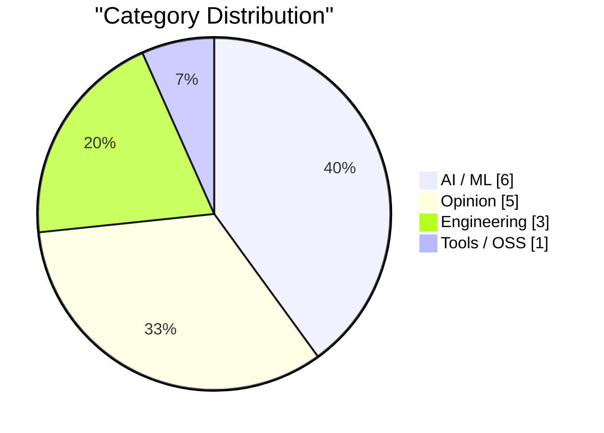
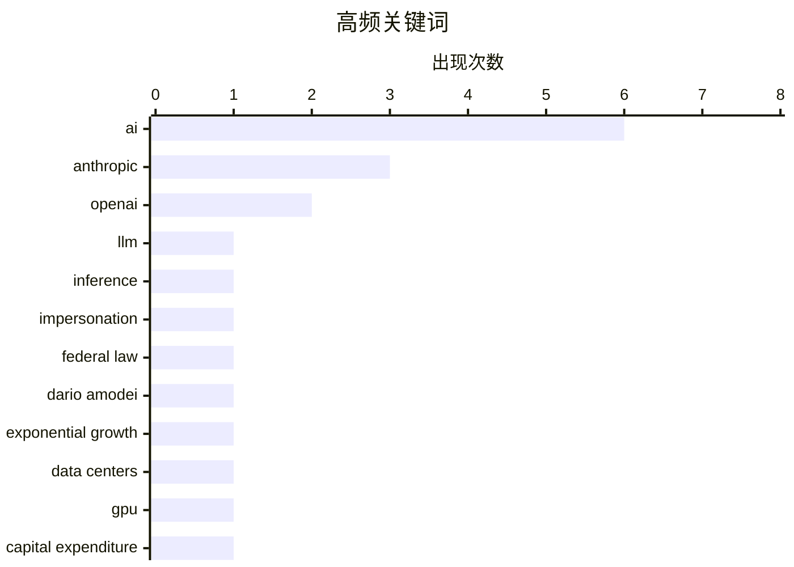

# AI Daily Digest — 2026-02-15

> Curated from 92 top tech blogs recommended by Karpathy. AI-selected Top 15.

<div class="stats-bar" data-sources="89/92" data-articles="2505" data-filtered="34" data-hours="48" data-selected="15"></div>

<div class="stats-categories" data-categories='{"AI / ML":6,"Opinion":5,"Engineering":3,"Tools / OSS":1}'></div>

<div class="stats-tags">

**ai**(6) · **anthropic**(3) · **openai**(2) · llm(1) · inference(1) · impersonation(1) · federal law(1) · dario amodei(1) · exponential growth(1) · data centers(1) · gpu(1) · capital expenditure(1) · product launch(1) · iteration(1) · startup(1) · product development(1) · package management(1) · namespaces(1) · npm(1) · maven(1)

</div>

## Highlights

今日看点：AI发展速度或将放缓，引发行业对未来瓶颈的担忧。同时，AI的伦理和社会影响日益凸显，呼吁法律监管的声音渐强。尽管AI工具涌现，但工程师，尤其是初级工程师，在AI时代的角色依然重要，甚至更具价值。

---

## Top Picks

<div class="pick-card">

#1 **快速LLM推理的两种技巧**

[Two different tricks for fast LLM inference](https://seangoedecke.com/fast-llm-inference/) — seangoedecke.com · 1 小时前 · AI / ML

> Anthropic和OpenAI都推出了“快速模式”，旨在提高代码模型的交互速度。但两种快速模式的实现方式截然不同。Anthropic的快速模式提供高达2.5倍的tokens/秒的吞吐量，而OpenAI的实现方式则未公开。文章对比了这两种方法的差异，并探讨了其背后的技术原理。

**Why read this**: 了解Anthropic和OpenAI如何通过不同的技术手段加速LLM推理，有助于开发者选择更适合自身需求的方案。

`LLM` `inference` `Anthropic` `OpenAI`

</div>

<div class="pick-card">

#2 **我们迫切需要一项联邦法律，禁止AI模仿人类**

[We URGENTLY need a federal law forbidding AI from impersonating humans](https://garymarcus.substack.com/p/we-urgently-need-a-federal-law-forbidding) — garymarcus.substack.com · 7 小时前 · AI / ML

> 文章呼吁制定联邦法律，禁止人工智能冒充人类。作者认为，AI模仿人类的行为会带来严重的伦理和社会问题，需要法律的约束。

**Why read this**: 了解AI发展带来的潜在风险，以及对相关法律法规的需求，有助于我们更好地应对AI时代的挑战。

`AI` `impersonation` `federal law`

</div>

<div class="pick-card">

#3 **Dario Amodei：“我们已接近指数增长的尾声”**

[Dario Amodei — "We are near the end of the exponential"](https://www.dwarkesh.com/p/dario-amodei-2) — dwarkesh.com · 1 天前 · AI / ML

> Dario Amodei 认为人工智能的发展正接近指数增长的尾声，并表达了紧迫感。他强调了当前形势的严峻性，暗示未来AI发展可能面临瓶颈或挑战。

**Why read this**: 了解AI领域领军人物对未来发展趋势的判断，有助于我们把握行业脉搏。

`Dario Amodei` `AI` `exponential growth` `Anthropic`

</div>

---

<details>
<summary>Charts</summary>





```
ai                 │ ████████████████████ 6
anthropic          │ ██████████░░░░░░░░░░ 3
openai             │ ███████░░░░░░░░░░░░░ 2
llm                │ ███░░░░░░░░░░░░░░░░░ 1
inference          │ ███░░░░░░░░░░░░░░░░░ 1
impersonation      │ ███░░░░░░░░░░░░░░░░░ 1
federal law        │ ███░░░░░░░░░░░░░░░░░ 1
dario amodei       │ ███░░░░░░░░░░░░░░░░░ 1
exponential growth │ ███░░░░░░░░░░░░░░░░░ 1
data centers       │ ███░░░░░░░░░░░░░░░░░ 1
```

</details>

---

## AI / ML

### 1. 快速LLM推理的两种技巧

[Two different tricks for fast LLM inference](https://seangoedecke.com/fast-llm-inference/) — **seangoedecke.com** · 1 小时前 · 23/30

> Anthropic和OpenAI都推出了“快速模式”，旨在提高代码模型的交互速度。但两种快速模式的实现方式截然不同。Anthropic的快速模式提供高达2.5倍的tokens/秒的吞吐量，而OpenAI的实现方式则未公开。文章对比了这两种方法的差异，并探讨了其背后的技术原理。

`LLM` `inference` `Anthropic` `OpenAI`

---

### 2. 我们迫切需要一项联邦法律，禁止AI模仿人类

[We URGENTLY need a federal law forbidding AI from impersonating humans](https://garymarcus.substack.com/p/we-urgently-need-a-federal-law-forbidding) — **garymarcus.substack.com** · 7 小时前 · 23/30

> 文章呼吁制定联邦法律，禁止人工智能冒充人类。作者认为，AI模仿人类的行为会带来严重的伦理和社会问题，需要法律的约束。

`AI` `impersonation` `federal law`

---

### 3. Dario Amodei：“我们已接近指数增长的尾声”

[Dario Amodei — "We are near the end of the exponential"](https://www.dwarkesh.com/p/dario-amodei-2) — **dwarkesh.com** · 1 天前 · 23/30

> Dario Amodei 认为人工智能的发展正接近指数增长的尾声，并表达了紧迫感。他强调了当前形势的严峻性，暗示未来AI发展可能面临瓶颈或挑战。

`Dario Amodei` `AI` `exponential growth` `Anthropic`

---

### 4. 高级：AI数据中心的金融危机

[Premium: The AI Data Center Financial Crisis](https://www.wheresyoured.at/data-center-crisis/) — **wheresyoured.at** · 1 天前 · 23/30

> 自2023年初以来，大型科技公司已在资本支出上投入超过8140亿美元，其中大部分用于满足OpenAI和Anthropic等AI公司的需求。这些支出主要集中在GPU、电力基础设施和数据中心建设上。文章探讨了这种大规模投资可能带来的金融风险和挑战。

`AI` `data centers` `GPU` `capital expenditure`

---

### 5. Anthropic 的公共利益使命

[Anthropic's public benefit mission](https://simonwillison.net/2026/Feb/13/anthropic-public-benefit-mission/#atom-everything) — **simonwillison.net** · 1 天前 · 20/30

> Anthropic 是一家“公共利益公司”，但不是非营利组织，因此没有像 OpenAI 那样每年向 IRS 提交公开文件的要求。文章探讨了Anthropic作为公共利益公司所承担的社会责任和使命。

`Anthropic` `public benefit` `mission`

---

### 6. OpenAI 使命声明的演变

[The evolution of OpenAI's mission statement](https://simonwillison.net/2026/Feb/13/openai-mission-statement/#atom-everything) — **simonwillison.net** · 1 天前 · 20/30

> OpenAI 作为一家美国 501(c)(3) 组织，每年都需要向 IRS 提交税务申报表。申报表中的一个必填字段是“简要描述该组织的任务或最重要的活动”，IRS 可以使用它来评估该组织是否坚持其使命并应保持其非营利免税地位。文章分析了 OpenAI 使命声明的演变过程。

`OpenAI` `mission statement` `IRS`

---

## Opinion

### 7. 发布三次

[Launch it 3 times](https://anildash.com/2026/02/13/launch-it-three-times/) — **anildash.com** · 1 天前 · 22/30

> 作者建议在发布产品或创立公司时，至少要尝试发布三次。因为一个想法往往需要多次迭代和调整才能真正引起目标用户的共鸣。每次发布都可能意味着细微的调整或重大的改变。

`product launch` `iteration` `startup` `product development`

---

### 8. 引用 Boris Cherny

[Quoting Boris Cherny](https://simonwillison.net/2026/Feb/14/boris/#atom-everything) — **simonwillison.net** · 1 小时前 · 20/30

> Boris Cherny (Claude Code 的创建者) 认为，即使在 AI 时代，仍然需要大量的工程师来负责提示 Claude、与客户沟通、协调团队以及决定下一步构建什么。他强调了优秀工程师的重要性。

`engineering` `AI` `teamwork`

---

### 9. 引用 Thoughtworks

[Quoting Thoughtworks](https://simonwillison.net/2026/Feb/14/thoughtworks/#atom-everything) — **simonwillison.net** · 20 小时前 · 20/30

> Thoughtworks 的报告指出，AI 工具并没有消除对初级开发人员的需求，反而使他们比以往任何时候都更有价值。AI 工具帮助他们更快地度过最初的负产出阶段，并且他们比高级工程师更擅长使用 AI 工具。

`AI` `junior developers` `profitability`

---

### 10. AI Twitter最喜欢的谎言：每个人都想成为开发者

[AI twitter's favourite lie: everyone wants to be a developer](https://www.joanwestenberg.com/ai-twitters-favourite-lie-everyone-wants-to-be-a-developer/) — **joanwestenberg.com** · 23 小时前 · 20/30

> 文章批判了AI领域的一种观点，即大型语言模型（LLM）的出现将使每个人都能成为软件开发者。这种观点认为，因为软件可以解决问题，而AI消除了人们与软件之间的障碍，所以每个人都会构建自己的软件。作者认为这种想法过于简化，忽略了软件开发的复杂性和专业性，以及并非每个人都有成为开发者的意愿和能力。文章强调，AI工具可以辅助开发，但并不能完全取代开发者。

`AI` `software development` `no-code`

---

### 11. 小众网站很难被发现

[The Small Web is Tricky to Find](https://matduggan.com/the-small-web-is-tricky-to-find/) — **matduggan.com** · 1 天前 · 19/30

> 文章讨论了发现小众网站的挑战，作者开发了一个Firefox扩展程序，旨在帮助用户发现更多不同类别的网站。用户反馈表明，他们希望扩展程序能提供更多网站类别选项。这促使作者需要解析网站信息，并尝试将它们归类。

`small web` `firefox extension` `web categories` `discovery`

---

## Engineering

### 12. 包管理命名空间

[Package Management Namespaces](https://nesbitt.io/2026/02/14/package-management-namespaces.html) — **nesbitt.io** · 1 天前 · 21/30

> 文章比较了 npm、Maven、Go、Swift 和 crates.io 等包管理工具的命名空间模型。通过对比不同平台的实现方式，探讨了命名空间在包管理中的作用和重要性。

`package management` `namespaces` `npm` `Maven`

---

### 13. Reachy Mini测评：Hugging Face的树莓派驱动机器人

[Testing Reachy Mini - Hugging Face's Pi powered robot](https://www.jeffgeerling.com/blog/2026/testing-reachy-mini-hugging-face-robot/) — **jeffgeerling.com** · 1 天前 · 20/30

> 本文评测了Hugging Face与Pollination Robotics合作开发的Reachy Mini机器人。Reachy Mini是一款基于树莓派的开源机器人，旨在提供一个低成本、可定制的机器人平台，用于研究和教育。作者Jeff Geerling测试了Reachy Mini的各种功能，包括头部运动、物体识别和语音交互。尽管存在一些软件和硬件限制，但作者认为Reachy Mini具有很大的潜力，尤其是在机器人教育和研究领域，并期待未来软件更新带来的改进。

`Reachy Mini` `robot` `Hugging Face` `Raspberry Pi`

---

### 14. 随着复杂性增加，架构胜过材料

[As Complexity Grows, Architecture Dominates Material](https://worksonmymachine.ai/p/as-complexity-grows-architecture) — **worksonmymachine.substack.com** · 9 小时前 · 19/30

> 文章探讨了随着系统复杂性增加，架构设计的重要性日益凸显。作者引用了1997年的一场演讲，强调在复杂系统中，良好的架构能够更好地应对变化和维护，而具体的实现细节（“材料”）则相对次要。文章暗示，在软件开发中，优先考虑清晰、可扩展的架构，比过早关注代码细节更为重要。

`complexity` `architecture` `software design`

---

## Tools / OSS

### 15. 在Godot 4.1中重现Windows 2000扫雷

[Windows 2000 Minesweeper recreated in Godot 4.1](https://jayd.ml/2026/02/14/godot-minesweeper.html) — **jayd.ml** · 12 小时前 · 19/30

> 作者使用Godot 4.1游戏引擎，尽可能精确地重现了Windows 2000版本的扫雷游戏。该项目旨在熟悉Godot引擎，并提供了一个无需考虑游戏设计，只需关注实现细节的实践机会。最终，作者将30%的时间用于游戏核心逻辑，70%的时间用于菜单、对话框等细节。该项目已开源，并提供在线试玩。

`Godot` `Minesweeper` `game development`

---

*生成于 2026-02-15 01:00 | 扫描 89 源 → 获取 2505 篇 → 精选 15 篇*
*基于 [Hacker News Popularity Contest 2025](https://refactoringenglish.com/tools/hn-popularity/) RSS 源列表，由 [Andrej Karpathy](https://x.com/karpathy) 推荐*
