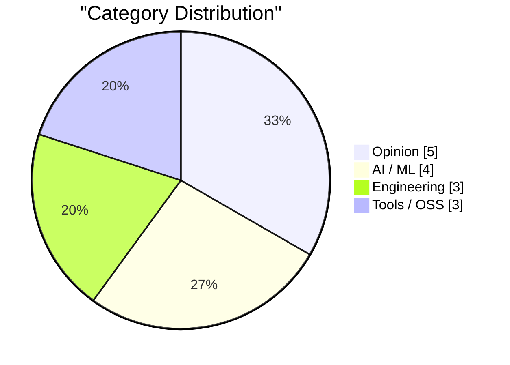
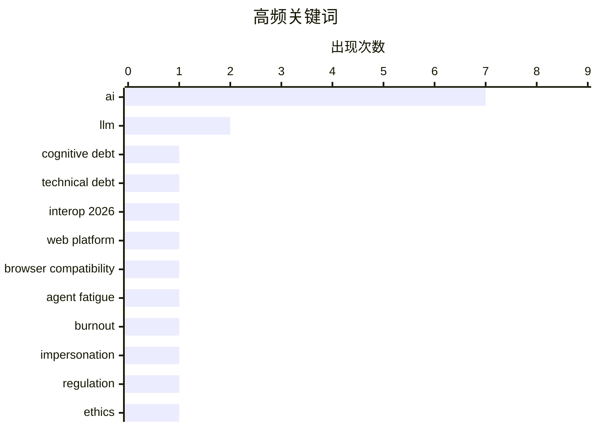

# AI Daily Digest — 2026-02-16

> Curated from 92 top tech blogs recommended by Karpathy. AI-selected Top 15.

<div class="stats-bar" data-sources="90/92" data-articles="2507" data-filtered="35" data-hours="48" data-selected="15"></div>

<div class="stats-categories" data-categories='{"AI / ML":4,"Engineering":3,"Opinion":5,"Tools / OSS":3}'></div>

<div class="stats-tags">

**ai**(7) · **llm**(2) · **cognitive debt**(1) · technical debt(1) · interop 2026(1) · web platform(1) · browser compatibility(1) · agent fatigue(1) · burnout(1) · impersonation(1) · regulation(1) · ethics(1) · gwtar(1) · html(1) · archiving(1) · ai agent(1) · crawler(1) · user-agent(1) · feed(1) · docker(1)

</div>

## Highlights

今日看点：AI发展带来认知债务和伦理挑战，开发者需警惕“深蓝”倦怠；Web平台互操作性持续推进，Interop 2026 旨在提升浏览器一致性；工程实践中，架构设计和Docker构建优化仍是提升效率的关键。

---

## Top Picks

<div class="pick-card">

#1 **从技术债务到认知债务：生成式和代理式AI带来的转变**

[How Generative and Agentic AI Shift Concern from Technical Debt to Cognitive Debt](https://simonwillison.net/2026/Feb/15/cognitive-debt/#atom-everything) — simonwillison.net · 19 小时前 · AI / ML

> 文章探讨了生成式和代理式AI的兴起如何将软件开发中的关注点从传统的技术债务转移到“认知债务”。认知债务指的是理解、维护和改进由AI系统生成的代码或决策所需的额外认知负担。作者认为，随着AI越来越多地参与软件开发，开发者需要花费更多精力来理解和验证AI的输出，这会带来新的挑战。因此，我们需要新的工具和方法来管理和减少这种认知债务，以确保AI的有效和安全使用。

**Why read this**: 了解AI时代软件开发面临的新挑战，以及如何应对认知债务，对于开发者和管理者都至关重要。

`AI` `cognitive debt` `technical debt`

</div>

<div class="pick-card">

#2 **启动 Interop 2026**

[Launching Interop 2026](https://simonwillison.net/2026/Feb/15/interop-2026/#atom-everything) — simonwillison.net · 20 小时前 · Engineering

> Interop 2026是由Apple、Google、Igalia、Microsoft和Mozilla共同发起的一项倡议，旨在确保一组特定的Web平台特性在今年内实现跨浏览器的一致性。该系列始于2021年的Compat2021，并取得了显著成功。Interop 2026将聚焦于解决Web平台互操作性的关键问题，提升开发者体验。通过合作和标准化，该倡议致力于消除浏览器之间的差异，使Web开发更加简单和高效。

**Why read this**: 关注Web标准化的最新进展，了解各大浏览器厂商如何协同工作，提升Web开发的互操作性。

`Interop 2026` `web platform` `browser compatibility`

</div>

<div class="pick-card">

#3 **AI吸血鬼**

[The AI Vampire](https://simonwillison.net/2026/Feb/15/the-ai-vampire/#atom-everything) — simonwillison.net · 1 小时前 · Opinion

> Steve Yegge 在文章中探讨了“代理疲劳”及其与职业倦怠的关系。文章假设，如果一个人在公司里是唯一使用AI的人，并以10倍的效率工作，虽然能给雇主留下深刻印象，但也可能让其他人相形见绌。这种过度依赖AI带来的高生产力，可能会导致自身和其他人的倦怠，最终对整个团队产生负面影响。因此，合理使用AI，避免过度依赖，对于维持团队的健康和效率至关重要。

**Why read this**: 警惕过度使用AI带来的负面影响，了解如何平衡AI辅助和人类工作，避免职业倦怠。

`AI` `agent fatigue` `burnout`

</div>

---

<details>
<summary>Charts</summary>





```
ai                    │ ████████████████████ 7
llm                   │ ██████░░░░░░░░░░░░░░ 2
cognitive debt        │ ███░░░░░░░░░░░░░░░░░ 1
technical debt        │ ███░░░░░░░░░░░░░░░░░ 1
interop 2026          │ ███░░░░░░░░░░░░░░░░░ 1
web platform          │ ███░░░░░░░░░░░░░░░░░ 1
browser compatibility │ ███░░░░░░░░░░░░░░░░░ 1
agent fatigue         │ ███░░░░░░░░░░░░░░░░░ 1
burnout               │ ███░░░░░░░░░░░░░░░░░ 1
impersonation         │ ███░░░░░░░░░░░░░░░░░ 1
```

</details>

---

## Opinion

### 1. AI吸血鬼

[The AI Vampire](https://simonwillison.net/2026/Feb/15/the-ai-vampire/#atom-everything) — **simonwillison.net** · 1 小时前 · 22/30

> Steve Yegge 在文章中探讨了“代理疲劳”及其与职业倦怠的关系。文章假设，如果一个人在公司里是唯一使用AI的人，并以10倍的效率工作，虽然能给雇主留下深刻印象，但也可能让其他人相形见绌。这种过度依赖AI带来的高生产力，可能会导致自身和其他人的倦怠，最终对整个团队产生负面影响。因此，合理使用AI，避免过度依赖，对于维持团队的健康和效率至关重要。

`AI` `agent fatigue` `burnout`

---

### 2. 深蓝

[Deep Blue](https://simonwillison.net/2026/Feb/15/deep-blue/#atom-everything) — **simonwillison.net** · 3 小时前 · 20/30

> 文章介绍了一个新术语“深蓝”，用来描述由于生成式AI侵入软件开发领域，许多软件开发人员所感受到的心理上的倦怠，并最终导致对自身价值的存在的恐惧。这个术语由Adam Leventhal在Oxide and Friends podcast上提出。这种“深蓝”情绪反映了开发者对AI可能取代其工作的担忧。

`AI` `software developers` `ennui`

---

### 3. AI Twitter 最喜欢的谎言：每个人都想成为开发者

[AI twitter's favourite lie: everyone wants to be a developer](https://www.joanwestenberg.com/ai-twitters-favourite-lie-everyone-wants-to-be-a-developer/) — **joanwestenberg.com** · 1 天前 · 20/30

> Twitter 上最新的共识是，由于大型语言模型可以编写代码，每个人都将成为软件开发者。这种观点认为，人们有需要解决的问题，软件可以解决这些问题，而 AI 消除了人与软件之间的障碍，因此每个人都可以构建自己的软件。然而，这种假设忽略了成为一名开发者所需的技能和热情，以及软件开发的复杂性。

`AI` `developers` `LLM`

---

### 4. 引用 Boris Cherny

[Quoting Boris Cherny](https://simonwillison.net/2026/Feb/14/boris/#atom-everything) — **simonwillison.net** · 1 天前 · 18/30

> Boris Cherny (Claude Code 创建者) 认为，即使在 AI 时代，优秀的工程师仍然至关重要。因为仍然需要有人来提示 Claude，与客户沟通，与团队协调，并决定下一步构建什么。工程正在发生变化，但对优秀工程师的需求有增无减。

`AI` `engineering` `prompt engineering`

---

### 5. 引用 Thoughtworks

[Quoting Thoughtworks](https://simonwillison.net/2026/Feb/14/thoughtworks/#atom-everything) — **simonwillison.net** · 1 天前 · 18/30

> Thoughtworks 的报告指出，AI 工具并没有消除对初级开发者的需求，反而提高了他们的盈利能力。AI 工具可以帮助他们更快地度过最初的净负收益阶段，并为未来的生产力提供了保障。此外，初级开发者比高级工程师更擅长使用 AI 工具，因为他们从未形成固有的工作习惯。

`AI` `junior developers` `software development`

---

## AI / ML

### 6. 从技术债务到认知债务：生成式和代理式AI带来的转变

[How Generative and Agentic AI Shift Concern from Technical Debt to Cognitive Debt](https://simonwillison.net/2026/Feb/15/cognitive-debt/#atom-everything) — **simonwillison.net** · 19 小时前 · 24/30

> 文章探讨了生成式和代理式AI的兴起如何将软件开发中的关注点从传统的技术债务转移到“认知债务”。认知债务指的是理解、维护和改进由AI系统生成的代码或决策所需的额外认知负担。作者认为，随着AI越来越多地参与软件开发，开发者需要花费更多精力来理解和验证AI的输出，这会带来新的挑战。因此，我们需要新的工具和方法来管理和减少这种认知债务，以确保AI的有效和安全使用。

`AI` `cognitive debt` `technical debt`

---

### 7. 我们迫切需要一项联邦法律，禁止AI模仿人类

[We URGENTLY need a federal law forbidding AI from impersonating humans](https://garymarcus.substack.com/p/we-urgently-need-a-federal-law-forbidding) — **garymarcus.substack.com** · 1 天前 · 22/30

> 文章呼吁制定联邦法律，禁止人工智能模仿人类。作者认为，未经授权的AI模仿人类可能导致严重的伦理和社会问题，例如欺骗、操纵和身份盗用。因此，需要通过法律手段来规范AI的行为，保护个人和社会免受潜在的危害。文章强调了制定相关法律的紧迫性，以确保AI技术的发展符合伦理和社会价值观。

`AI` `impersonation` `regulation` `ethics`

---

### 8. 你的Feed抓取器似乎是一个AI代理或爬虫

[Your feed fetcher appears to be an AI agent or crawler](https://utcc.utoronto.ca/~cks/cspace-no-ai-agents.html) — **utcc.utoronto.ca/~cks** · 21 小时前 · 21/30

> 作者声明，由于其软件使用User-Agent标头，表明其为AI代理或AI爬虫，因此被阻止抓取其联合提要。作者阻止所有AI代理，无论其背后是否有人，原因是AI代理是滥用过程的产物。作者认为不存在AI代理的道德使用，并且不希望帮助那些不关心其使用工具的道德规范的人。

`AI agent` `crawler` `User-Agent` `feed`

---

### 9. 快速LLM推理的两种不同技巧

[Two different tricks for fast LLM inference](https://seangoedecke.com/fast-llm-inference/) — **seangoedecke.com** · 1 天前 · 20/30

> Anthropic和OpenAI最近都宣布了“快速模式”，这是一种以显著更高的速度与其最佳编码模型交互的方式。Anthropic提供的速度高达2.5倍tokens/秒，而OpenAI的GPT-3.5 Codex Spark则通过减少模型大小和计算量来实现加速。这两种快速模式的方法截然不同，分别代表了不同的优化策略。

`LLM` `inference` `Anthropic` `OpenAI`

---

## Engineering

### 10. 启动 Interop 2026

[Launching Interop 2026](https://simonwillison.net/2026/Feb/15/interop-2026/#atom-everything) — **simonwillison.net** · 20 小时前 · 24/30

> Interop 2026是由Apple、Google、Igalia、Microsoft和Mozilla共同发起的一项倡议，旨在确保一组特定的Web平台特性在今年内实现跨浏览器的一致性。该系列始于2021年的Compat2021，并取得了显著成功。Interop 2026将聚焦于解决Web平台互操作性的关键问题，提升开发者体验。通过合作和标准化，该倡议致力于消除浏览器之间的差异，使Web开发更加简单和高效。

`Interop 2026` `web platform` `browser compatibility`

---

### 11. 在Docker构建中分离下载和安装

[Separating Download from Install in Docker Builds](https://nesbitt.io/2026/02/15/separating-download-from-install-in-docker-builds.html) — **nesbitt.io** · 1 天前 · 21/30

> 文章指出，大多数包管理器可以分离下载和安装步骤，从而更好地利用Docker层缓存。通过将下载步骤与安装步骤分离，可以避免在安装包时重新下载已经缓存的包，从而显著提高Docker构建速度。这种优化方法可以减少构建时间和资源消耗，提高开发效率。

`Docker` `caching` `package manager`

---

### 12. 随着复杂性的增长，架构占据主导地位

[As Complexity Grows, Architecture Dominates Material](https://worksonmymachine.ai/p/as-complexity-grows-architecture) — **worksonmymachine.substack.com** · 1 天前 · 21/30

> 文章回顾了1997年的一场演讲，强调了随着系统复杂性的增加，架构设计的重要性日益凸显。在复杂的系统中，良好的架构可以降低维护成本、提高可扩展性，并促进团队协作。因此，在开发复杂系统时，应该优先考虑架构设计，而不是仅仅关注具体的实现细节。

`software architecture` `complexity` `system design`

---

## Tools / OSS

### 13. Gwtar：一种静态高效的单文件HTML格式

[Gwtar: a static efficient single-file HTML format](https://simonwillison.net/2026/Feb/15/gwtar/#atom-everything) — **simonwillison.net** · 6 小时前 · 21/30

> Gwtar是由Gwern Branwen和Said Achmiz开发的一个新项目，旨在解决将大量资源合并到单个HTML存档文件中的挑战，同时确保该文件在浏览器中易于查看。其关键技巧是在页面早期触发`window.stop()`，以防止浏览器尝试加载所有资源，从而避免卡顿。Gwtar提供了一种高效的方式来打包和分发包含大量静态资源的Web页面。

`Gwtar` `HTML` `archiving`

---

### 14. OpenClaw 三个月回顾

[Three months of OpenClaw](https://simonwillison.net/2026/Feb/15/openclaw/#atom-everything) — **simonwillison.net** · 7 小时前 · 19/30

> OpenClaw 项目在短短三个月内取得了惊人的进展。该项目于 2025 年 11 月 25 日首次提交，在不到三个月的时间内，已经获得了 10,000 次提交，来自 600 位贡献者，并在 GitHub 上获得了 196,000 个 star。甚至还在 AI.com 的超级碗商业广告中以模糊的方式出现。OpenClaw 的快速发展和广泛关注表明了其潜在的价值和影响力。

`OpenClaw` `GitHub` `open source`

---

### 15. 在 Godot 4.1 中重制 Windows 2000 扫雷

[Windows 2000 Minesweeper recreated in Godot 4.1](https://jayd.ml/2026/02/14/godot-minesweeper.html) — **jayd.ml** · 1 天前 · 19/30

> 作者使用 Godot 4.1 引擎尽可能精确地重制了 Windows 2000 扫雷游戏，并发布了可玩版本 (minesweeper.jayd.ml) 和 AGPL 许可的源代码。作者的初衷是熟悉 Godot 引擎，并选择了一个无需考虑“做什么”，只需考虑“如何做”的项目。最终，作者将 30% 的时间用于游戏本身，70% 的时间用于菜单、对话框等琐碎之处。

`Godot` `Minesweeper` `game development`

---

*生成于 2026-02-16 01:01 | 扫描 90 源 → 获取 2507 篇 → 精选 15 篇*
*基于 [Hacker News Popularity Contest 2025](https://refactoringenglish.com/tools/hn-popularity/) RSS 源列表，由 [Andrej Karpathy](https://x.com/karpathy) 推荐*
