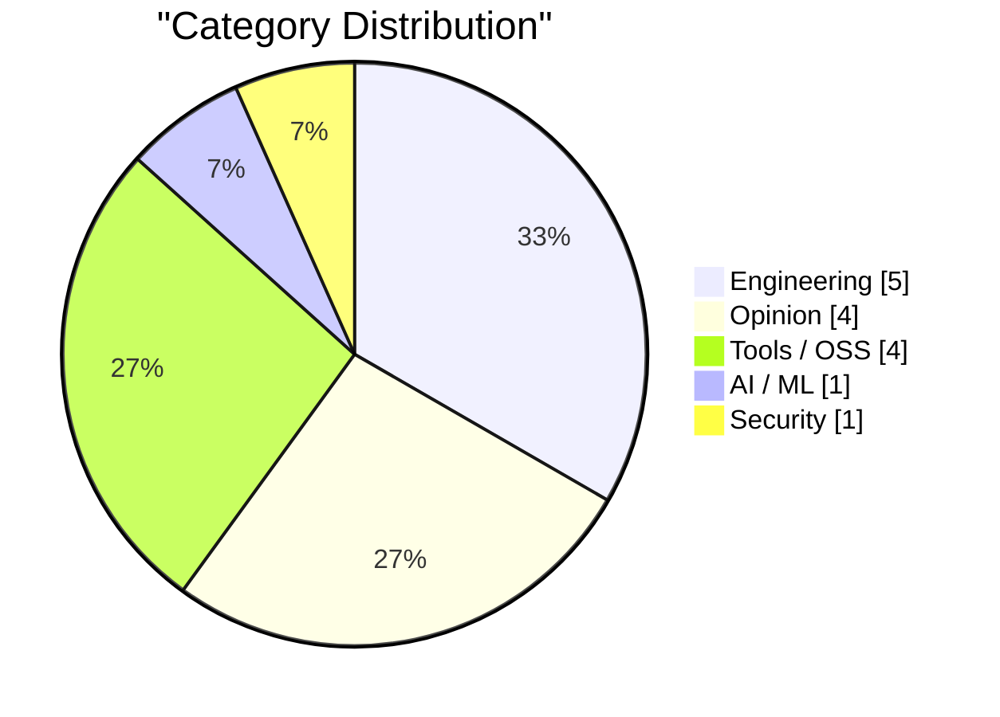
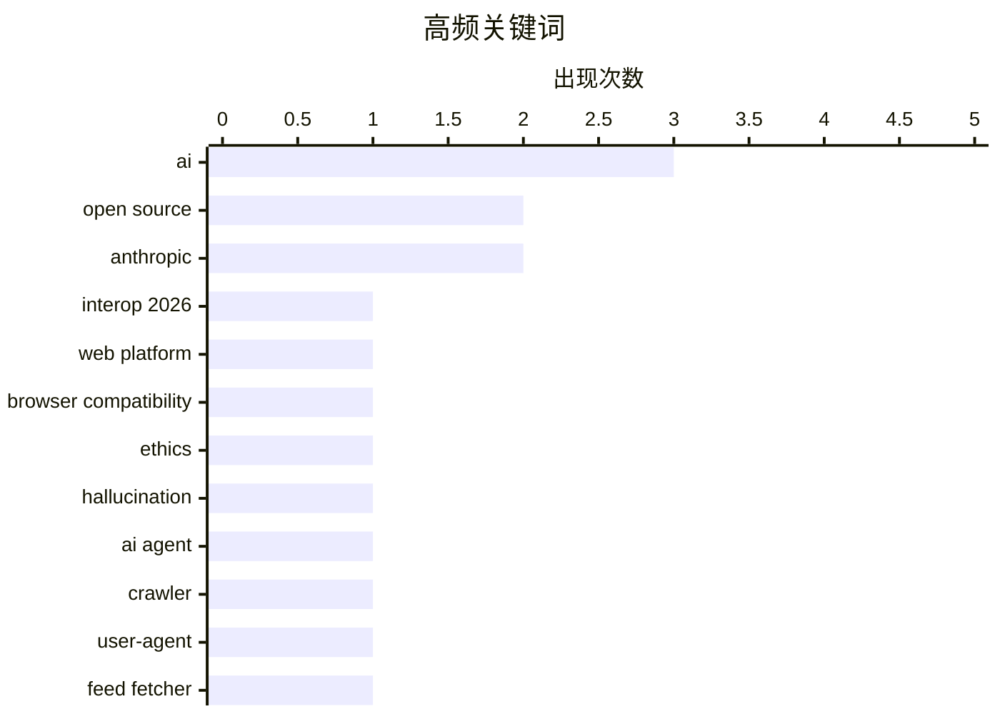

# AI Daily Digest — 2026-02-17

> Curated from 92 top tech blogs recommended by Karpathy. AI-selected Top 15.

<div class="stats-bar" data-sources="90/92" data-articles="2500" data-filtered="36" data-hours="48" data-selected="15"></div>

<div class="stats-categories" data-categories='{"Engineering":5,"Opinion":4,"AI / ML":1,"Security":1,"Tools / OSS":4}'></div>

<div class="stats-tags">

**ai**(3) · **open source**(2) · **anthropic**(2) · interop 2026(1) · web platform(1) · browser compatibility(1) · ethics(1) · hallucination(1) · ai agent(1) · crawler(1) · user-agent(1) · feed fetcher(1) · claude(1) · vulnerabilities(1) · showboat(1) · cli tool(1) · markdown(1) · claude code(1) · containerization(1) · openclaw(1)

</div>

## Highlights

今日看点：Web 平台互操作性持续推进，Interop 2026 旨在统一浏览器行为。AI 的快速发展引发对开源生态的冲击和“认知债务”的担忧，滥用和潜在风险不容忽视。同时，AI 工具和应用不断涌现，助力开发者提升效率，但也需警惕过度依赖和潜在的安全漏洞。

---

## Top Picks

<div class="pick-card">

#1 **Interop 2026 启动**

[Launching Interop 2026](https://simonwillison.net/2026/Feb/15/interop-2026/#atom-everything) — simonwillison.net · 1 天前 · Engineering

> Interop 2026 是由 Apple、Google、Igalia、Microsoft 和 Mozilla 共同发起的一项合作计划，旨在确保一系列特定的 Web 平台特性在今年内实现跨浏览器的一致性。该计划始于 2021 年的 Compat2021，并已取得显著成功，对 Web 标准的统一和开发者体验的提升产生了积极影响。Interop 2026 将继续致力于解决 Web 平台的互操作性问题，减少开发者在不同浏览器之间进行兼容性调整的工作量。通过合作和标准化，该计划旨在为开发者提供更稳定和一致的 Web 开发环境。

**Why read this**: 了解 Interop 2026 计划，可以帮助开发者更好地掌握 Web 平台的发展趋势，并为未来的 Web 开发做好准备。

`Interop 2026` `web platform` `browser compatibility`

</div>

<div class="pick-card">

#2 **AI 正在摧毁开源，而且它还不够好**

[AI is destroying Open Source, and it's not even good yet](https://www.jeffgeerling.com/blog/2026/ai-is-destroying-open-source/) — jeffgeerling.com · 3 小时前 · Opinion

> 文章指出 AI 正在对开源生态系统产生负面影响，即使目前的 AI 技术还不够完善。Ars Technica 撤回了一篇报道，原因是作者使用的 AI 捏造了开源库维护者 Scott Shambaugh 的引言。作者认为，AI 幻觉引言事件揭示了 AI 在内容生成方面的潜在风险，以及对开源社区的潜在伤害。文章强调，在 AI 技术被证明可靠之前，过度依赖 AI 可能会损害开源项目的声誉和贡献者的积极性。

**Why read this**: 了解 AI 对开源社区的潜在威胁，有助于我们更理性地看待 AI 技术，并采取措施保护开源生态系统的健康发展。

`AI` `open source` `ethics` `hallucination`

</div>

<div class="pick-card">

#3 **你的 Feed 抓取器疑似 AI 代理或爬虫**

[Your feed fetcher appears to be an AI agent or crawler](https://utcc.utoronto.ca/~cks/cspace-no-ai-agents.html) — utcc.utoronto.ca/~cks · 1 天前 · AI / ML

> 该文章的作者声明，由于其 User-Agent 标头表明其为 AI 代理或爬虫，因此阻止了某些软件抓取其联合提要。作者阻止所有 AI 代理，无论其背后是否有人工干预，因为 AI 代理是滥用过程的产物。作者认为不存在对 AI 代理的合乎道德的使用，并且不希望帮助那些不关心他们使用的工具的道德规范的人。

**Why read this**: 了解作者对 AI 抓取行为的伦理考量，可以帮助我们反思 AI 技术的使用方式，并尊重内容创作者的意愿。

`AI agent` `crawler` `User-Agent` `feed fetcher`

</div>

---

<details>
<summary>Charts</summary>





```
ai                    │ ████████████████████ 3
open source           │ █████████████░░░░░░░ 2
anthropic             │ █████████████░░░░░░░ 2
interop 2026          │ ███████░░░░░░░░░░░░░ 1
web platform          │ ███████░░░░░░░░░░░░░ 1
browser compatibility │ ███████░░░░░░░░░░░░░ 1
ethics                │ ███████░░░░░░░░░░░░░ 1
hallucination         │ ███████░░░░░░░░░░░░░ 1
ai agent              │ ███████░░░░░░░░░░░░░ 1
crawler               │ ███████░░░░░░░░░░░░░ 1
```

</details>

---

## Engineering

### 1. Interop 2026 启动

[Launching Interop 2026](https://simonwillison.net/2026/Feb/15/interop-2026/#atom-everything) — **simonwillison.net** · 1 天前 · 23/30

> Interop 2026 是由 Apple、Google、Igalia、Microsoft 和 Mozilla 共同发起的一项合作计划，旨在确保一系列特定的 Web 平台特性在今年内实现跨浏览器的一致性。该计划始于 2021 年的 Compat2021，并已取得显著成功，对 Web 标准的统一和开发者体验的提升产生了积极影响。Interop 2026 将继续致力于解决 Web 平台的互操作性问题，减少开发者在不同浏览器之间进行兼容性调整的工作量。通过合作和标准化，该计划旨在为开发者提供更稳定和一致的 Web 开发环境。

`Interop 2026` `web platform` `browser compatibility`

---

### 2. OpenClaw 的三个月

[Three months of OpenClaw](https://simonwillison.net/2026/Feb/15/openclaw/#atom-everything) — **simonwillison.net** · 1 天前 · 22/30

> OpenClaw 项目在不到三个月的时间内取得了显著进展，从 2025 年 11 月 25 日的第一次提交开始，已经积累了 10,000 次提交，吸引了 600 名贡献者，获得了 196,000 个 GitHub 星标，并且在 AI.com 的超级碗广告中有所展示。AI.com 创始人 Kris 认为 OpenClaw 是一个令人兴奋的项目，展示了 AI 的潜力。

`OpenClaw` `GitHub` `open source`

---

### 3. 诊断工厂

[Diagnostics Factory](https://matklad.github.io/2026/02/16/diagnostics-factory.html) — **matklad.github.io** · 1 天前 · 21/30

> 本文探讨了如何向用户展示有用的错误信息，这是错误管理中报告环节的关键问题。作者提出了一种默认方法，利用 Zig 的强类型错误码来处理错误，并专注于改善错误报告的用户体验。该方法旨在提供清晰且易于理解的错误消息，帮助用户快速定位和解决问题。核心观点是，良好的错误报告对于提升开发效率至关重要。

`error handling` `Zig` `diagnostics`

---

### 4. Gwtar：一种静态高效的单文件HTML格式

[Gwtar: a static efficient single-file HTML format](https://simonwillison.net/2026/Feb/15/gwtar/#atom-everything) — **simonwillison.net** · 1 天前 · 20/30

> Gwtar是一个旨在将大量资源合并到单个HTML存档文件中的新项目，解决了在浏览器中查看大型HTML文件不便的问题。其关键技术是在页面加载初期触发 `window.stop()`，阻止浏览器加载外部资源，从而实现快速渲染。Gwtar由Gwern Branwen和Said Achmiz开发，目标是创建一个静态、高效且易于使用的单文件HTML格式。

`Gwtar` `HTML` `single-file format`

---

### 5. Toy优化器中的基于类型的别名分析

[Type-based alias analysis in the Toy Optimizer](https://bernsteinbear.com/blog/toy-tbaa/?utm_source=rss) — **bernsteinbear.com** · 1 天前 · 20/30

> 本文是Toy Optimizer系列的又一篇，介绍了如何在Toy Optimizer中进行基于类型的别名分析（TBAA）。在之前的文章中，作者实现了load-store forwarding，可以在编译时缓存堆的读取和写入结果。为了处理对象别名问题，作者将堆信息分离到基于读取/写入偏移量的别名类中。这种方法可以避免因对象别名而导致的错误优化。

`compiler` `optimization` `alias analysis`

---

## Opinion

### 6. AI 正在摧毁开源，而且它还不够好

[AI is destroying Open Source, and it's not even good yet](https://www.jeffgeerling.com/blog/2026/ai-is-destroying-open-source/) — **jeffgeerling.com** · 3 小时前 · 23/30

> 文章指出 AI 正在对开源生态系统产生负面影响，即使目前的 AI 技术还不够完善。Ars Technica 撤回了一篇报道，原因是作者使用的 AI 捏造了开源库维护者 Scott Shambaugh 的引言。作者认为，AI 幻觉引言事件揭示了 AI 在内容生成方面的潜在风险，以及对开源社区的潜在伤害。文章强调，在 AI 技术被证明可靠之前，过度依赖 AI 可能会损害开源项目的声誉和贡献者的积极性。

`AI` `open source` `ethics` `hallucination`

---

### 7. 生成式和代理式 AI 如何将关注点从技术债务转移到认知债务

[How Generative and Agentic AI Shift Concern from Technical Debt to Cognitive Debt](https://simonwillison.net/2026/Feb/15/cognitive-debt/#atom-everything) — **simonwillison.net** · 1 天前 · 22/30

> Margaret-Anne Storey 的文章解释了“认知债务”的概念，认知债务指的是在使用生成式和代理式 AI 时，由于对 AI 的理解不足、过度依赖或缺乏有效管理而产生的潜在风险和负担。认知债务可能导致决策失误、信息过载和对 AI 系统的过度信任。文章强调，在使用 AI 技术的同时，需要关注认知债务问题，并采取措施降低其潜在风险。

`cognitive debt` `AI` `technical debt`

---

### 8. AI 吸血鬼

[The AI Vampire](https://simonwillison.net/2026/Feb/15/the-ai-vampire/#atom-everything) — **simonwillison.net** · 1 天前 · 21/30

> Steve Yegge 对代理疲劳及其与倦怠的关系进行了探讨。文章假设你是公司里唯一使用 AI 的人，如果你每天工作 8 小时，效率提高 10 倍，你可能会让其他人相形见绌。然而，这种做法可能会导致代理疲劳，最终导致倦怠。

`AI` `agent fatigue` `burnout`

---

### 9. 现代UI是简洁且不可见的？我希望如此！

[Modern UI is clean and invisible? Ha, I wish!](https://rakhim.exotext.com/modern-ui-is-not-invisible) — **rakhim.exotext.com** · 1 天前 · 21/30

> 本文推荐了一部关于现代UI/UX的视频“'简洁'设计的隐藏成本”，并表达了作者对视频观点的赞同。视频通过对比Apple Music和Winamp，指出现代UI过于追求“简洁”而牺牲了“个性”。作者引用视频中的观点，认为理解一个时代不应只听信证人的描述，更应关注其创造的事物。核心论点是，具有个性的设计比单纯追求简洁的设计更能体现时代的特征和价值。

`UI` `UX` `design` `modern UI`

---

## Tools / OSS

### 10. 两个新的 Showboat 工具：Chartroom 和 datasette-showboat

[Two new Showboat tools: Chartroom and datasette-showboat](https://simonwillison.net/2026/Feb/17/chartroom-and-datasette-showboat/#atom-everything) — **simonwillison.net** · 17 分钟前 · 22/30

> 作者发布了两个新的 Showboat 工具：Chartroom 和 datasette-showboat，以更好地利用 Showboat 模式。Showboat 是一个 CLI 工具，可以帮助编码代理创建演示其代码的 Markdown 文档。Chartroom 是一个与 Showboat 配合良好的 CLI 图表工具，而 datasette-showboat 是一个 Datasette 插件，允许使用 Showboat 生成的 Markdown 文档。

`Showboat` `CLI tool` `Markdown`

---

### 11. Rodney 和 Claude Code for Desktop

[Rodney and Claude Code for Desktop](https://simonwillison.net/2026/Feb/16/rodney-claude-code/#atom-everything) — **simonwillison.net** · 8 小时前 · 22/30

> 作者是 Claude Code on the web 的重度用户，这是一个 Anthropic 提供的云版本 Claude Code，所有内容都在由他们管理的容器环境中运行，从而大大降低了对计算机造成不良影响的风险。作者主要通过 iPhone 和 Mac 桌面应用程序访问 Claude Code，而不是通过 Web 界面。

`Claude Code` `Anthropic` `containerization`

---

### 12. [赞助] 实践工作坊：更快地修复问题 - Sentry 中适用于 iOS 的崩溃报告、追踪和日志

[[Sponsor] Hands-On Workshop: Fix It Faster — Crash Reporting, Tracing, and Logs for iOS in Sentry](https://sentry.io/resources/ios-workshop-jan-2026/?utm_source=daringfireball&amp;utm_medium=paid-display&amp;utm_campaign=general-fy27q1-evergreen&amp;utm_content=static-ad-mobilerss-trysentry) — **daringfireball.net** · 59 分钟前 · 22/30

> 这是一个关于如何使用 Sentry 诊断和解决 iOS 应用中问题的实践工作坊。内容涵盖如何设置 Sentry 以发现高优先级问题，使用日志和面包屑重现崩溃场景，使用追踪查找性能瓶颈，以及使用大小分析监控和减少 iOS 应用的大小。

`Sentry` `iOS` `crash reporting` `debugging`

---

### 13. 我每月花20美元购买，结果得到了完美生成的Terraform

[I Sold Out for $20 a Month and All I Got Was This Perfectly Generated Terraform](https://matduggan.com/i-sold-out-for-200-a-month-and-all-i-got-was-this-perfectly-generated-terraform/) — **matduggan.com** · 12 小时前 · 21/30

> 本文作者分享了使用LLM工具生成Terraform代码的体验。作者提到之前尝试过的LLM工具效果不佳，例如Copilot只会生成冗长的注释，Gemini会将200行的脚本变成700行的无用代码。但最近的体验有所改善，能够生成较为完美的Terraform代码。作者通过实际案例，展示了LLM在基础设施即代码领域的应用潜力。

`LLM` `Terraform` `code generation`

---

## AI / ML

### 14. 你的 Feed 抓取器疑似 AI 代理或爬虫

[Your feed fetcher appears to be an AI agent or crawler](https://utcc.utoronto.ca/~cks/cspace-no-ai-agents.html) — **utcc.utoronto.ca/~cks** · 1 天前 · 23/30

> 该文章的作者声明，由于其 User-Agent 标头表明其为 AI 代理或爬虫，因此阻止了某些软件抓取其联合提要。作者阻止所有 AI 代理，无论其背后是否有人工干预，因为 AI 代理是滥用过程的产物。作者认为不存在对 AI 代理的合乎道德的使用，并且不希望帮助那些不关心他们使用的工具的道德规范的人。

`AI agent` `crawler` `User-Agent` `feed fetcher`

---

## Security

### 15. Anthropic 发现的 500 个漏洞只是冰山一角

[Anthropic's 500 vulns are the tip of the iceberg](https://martinalderson.com/posts/anthropic-found-500-zero-days/?utm_source=rss) — **martinalderson.com** · 1 小时前 · 23/30

> Anthropic 的红队在 Claude 中发现了 500 多个关键漏洞，但他们主要关注的是维护良好的软件。作者认为，更可怕的问题是那些永远不会被修复的长尾漏洞。

`Anthropic` `Claude` `vulnerabilities`

---

*生成于 2026-02-17 01:00 | 扫描 90 源 → 获取 2500 篇 → 精选 15 篇*
*基于 [Hacker News Popularity Contest 2025](https://refactoringenglish.com/tools/hn-popularity/) RSS 源列表，由 [Andrej Karpathy](https://x.com/karpathy) 推荐*
