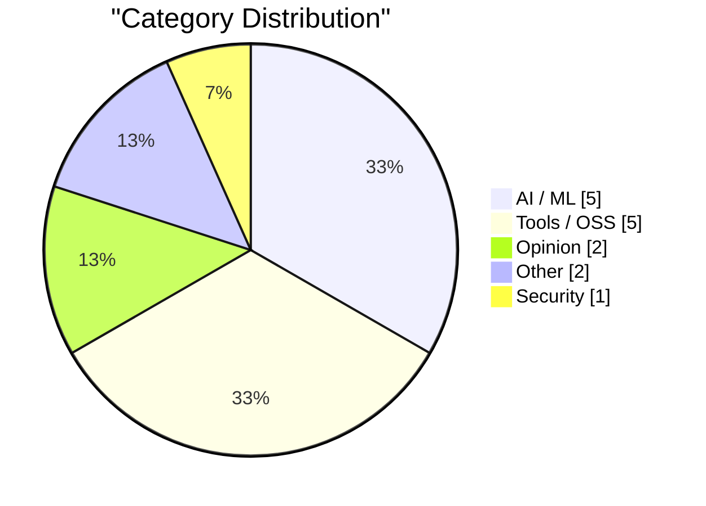
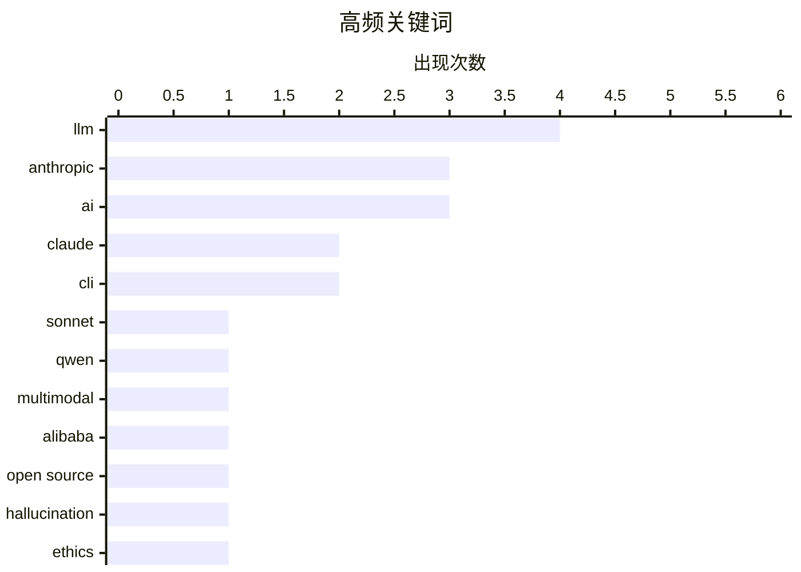

# AI Daily Digest — 2026-02-18

> Curated from 92 top tech blogs recommended by Karpathy. AI-selected Top 15.

<div class="stats-bar" data-sources="90/92" data-articles="2502" data-filtered="37" data-hours="48" data-selected="15"></div>

<div class="stats-categories" data-categories='{"AI / ML":5,"Opinion":2,"Security":1,"Tools / OSS":5,"Other":2}'></div>

<div class="stats-tags">

**llm**(4) · **anthropic**(3) · **ai**(3) · claude(2) · cli(2) · sonnet(1) · qwen(1) · multimodal(1) · alibaba(1) · open source(1) · hallucination(1) · ethics(1) · vulnerabilities(1) · ai security(1) · rodney(1) · browser automation(1) · showboat(1) · markdown(1) · coding agents(1) · claude code(1)

</div>

## Highlights

今日看点：AI 模型能力持续迭代，Anthropic 和阿里均有新进展，但同时开源社区对 AI 伦理和安全问题日益担忧，AI 生成内容的可靠性备受质疑。此外，开发者工具领域涌现新秀，旨在提升自动化效率和用户体验。尽管如此，关于 AGI 的讨论仍趋于理性，技术界普遍认为当前 AI 距离真正通用智能尚有距离。

---

## Top Picks

<div class="pick-card">

#1 **Claude Sonnet 4.6 发布**

[Introducing Claude Sonnet 4.6](https://simonwillison.net/2026/Feb/17/claude-sonnet-46/#atom-everything) — simonwillison.net · 1 小时前 · AI / ML

> Anthropic 发布了 Claude Sonnet 4.6，声称其性能与去年 11 月的 Opus 4.5 相似，但保持了 Sonnet 的定价：输入 3 美元/百万 tokens，输出 15 美元/百万 tokens。这意味着用户可以以更低的价格获得接近顶级模型的性能。Anthropic 提供了系统卡片，详细介绍了该模型的各项指标。Sonnet 4.6 的发布为用户提供了性价比更高的选择。

**Why read this**: 如果你正在寻找性价比高的 Claude 模型，Sonnet 4.6 值得关注。

`Claude` `Sonnet` `Anthropic` `LLM`

</div>

<div class="pick-card">

#2 **Qwen3.5：迈向原生多模态 Agent**

[Qwen3.5: Towards Native Multimodal Agents](https://simonwillison.net/2026/Feb/17/qwen35/#atom-everything) — simonwillison.net · 20 小时前 · AI / ML

> 阿里巴巴的 Qwen 发布了 Qwen 3.5 系列的首批两个模型，一个开源权重，一个专有模型，两者都支持视觉输入的多模态能力。开源模型名为 Qwen3.5-397B-A17B，是一个混合专家模型。Qwen 强调了该架构在服务效率方面的优势。Qwen3.5 的发布标志着国产大模型在多模态能力和效率上取得了新的进展。

**Why read this**: 如果你对多模态大模型和混合专家模型架构感兴趣，Qwen3.5 值得研究。

`Qwen` `multimodal` `Alibaba` `LLM`

</div>

<div class="pick-card">

#3 **AI 正在摧毁开源，而且它还不够好**

[AI is destroying Open Source, and it's not even good yet](https://www.jeffgeerling.com/blog/2026/ai-is-destroying-open-source/) — jeffgeerling.com · 1 天前 · Opinion

> Ars Technica 撤回了一篇报道，原因是作者使用的 AI 捏造了开源库维护者的引言。这件事讽刺的是，被捏造引言的维护者 Scott Shambaugh，也因此事发表了文章。文章作者认为，AI 可能会对开源社区造成负面影响。

**Why read this**: 这篇文章提出了一个关于 AI 对开源社区潜在危害的重要观点，值得反思。

`AI` `Open Source` `hallucination` `ethics`

</div>

---

<details>
<summary>Charts</summary>





```
llm         │ ████████████████████ 4
anthropic   │ ███████████████░░░░░ 3
ai          │ ███████████████░░░░░ 3
claude      │ ██████████░░░░░░░░░░ 2
cli         │ ██████████░░░░░░░░░░ 2
sonnet      │ █████░░░░░░░░░░░░░░░ 1
qwen        │ █████░░░░░░░░░░░░░░░ 1
multimodal  │ █████░░░░░░░░░░░░░░░ 1
alibaba     │ █████░░░░░░░░░░░░░░░ 1
open source │ █████░░░░░░░░░░░░░░░ 1
```

</details>

---

## AI / ML

### 1. Claude Sonnet 4.6 发布

[Introducing Claude Sonnet 4.6](https://simonwillison.net/2026/Feb/17/claude-sonnet-46/#atom-everything) — **simonwillison.net** · 1 小时前 · 26/30

> Anthropic 发布了 Claude Sonnet 4.6，声称其性能与去年 11 月的 Opus 4.5 相似，但保持了 Sonnet 的定价：输入 3 美元/百万 tokens，输出 15 美元/百万 tokens。这意味着用户可以以更低的价格获得接近顶级模型的性能。Anthropic 提供了系统卡片，详细介绍了该模型的各项指标。Sonnet 4.6 的发布为用户提供了性价比更高的选择。

`Claude` `Sonnet` `Anthropic` `LLM`

---

### 2. Qwen3.5：迈向原生多模态 Agent

[Qwen3.5: Towards Native Multimodal Agents](https://simonwillison.net/2026/Feb/17/qwen35/#atom-everything) — **simonwillison.net** · 20 小时前 · 25/30

> 阿里巴巴的 Qwen 发布了 Qwen 3.5 系列的首批两个模型，一个开源权重，一个专有模型，两者都支持视觉输入的多模态能力。开源模型名为 Qwen3.5-397B-A17B，是一个混合专家模型。Qwen 强调了该架构在服务效率方面的优势。Qwen3.5 的发布标志着国产大模型在多模态能力和效率上取得了新的进展。

`Qwen` `multimodal` `Alibaba` `LLM`

---

### 3. 关于 AGI 到来的谣言被大大夸大了

[Rumors of AGI’s arrival have been greatly exaggerated](https://garymarcus.substack.com/p/rumors-of-agis-arrival-have-been) — **garymarcus.substack.com** · 8 小时前 · 22/30

> 文章指出，统计近似不等于通用智能（AGI）。作者认为当前 AI 的能力被过度炒作，距离真正的 AGI 还有很长的路要走。

`AGI` `AI` `general intelligence`

---

### 4. 我每月花 200 美元购买，结果只得到了这段完美生成的 Terraform 代码

[I Sold Out for $20 a Month and All I Got Was This Perfectly Generated Terraform](https://matduggan.com/i-sold-out-for-200-a-month-and-all-i-got-was-this-perfectly-generated-terraform/) — **matduggan.com** · 1 天前 · 22/30

> 作者分享了使用 LLM 工具生成 Terraform 代码的体验。作者发现，最近 LLM 工具在生成 Terraform 代码方面表现出色，能够生成高质量的代码，而之前 Copilot 和 Gemini 等工具的效果并不理想。

`LLM` `Terraform` `code generation`

---

### 5. LLM 生成的技能有效，如果你事后生成它们

[LLM-generated skills work, if you generate them afterwards](https://seangoedecke.com/generate-skills-afterwards/) — **seangoedecke.com** · 1 天前 · 21/30

> LLM “技能” 是特定任务的简短解释性提示，通常与辅助脚本捆绑在一起。一篇论文表明，虽然技能对 LLM 有用，但 *LLM 编写的* 技能没有用。研究表明，模型无法可靠地编写它们受益的过程知识。

`LLM` `skills` `prompt engineering`

---

## Tools / OSS

### 6. Rodney v0.4.0

[Rodney v0.4.0](https://simonwillison.net/2026/Feb/17/rodney/#atom-everything) — **simonwillison.net** · 1 小时前 · 22/30

> 作者的浏览器自动化 CLI 工具 Rodney 自发布以来吸引了大量的 PR。新发布的 v0.4.0 版本修复了错误，并改进了用户体验。

`Rodney` `CLI` `browser automation`

---

### 7. 两个新的 Showboat 工具：Chartroom 和 datasette-showboat

[Two new Showboat tools: Chartroom and datasette-showboat](https://simonwillison.net/2026/Feb/17/chartroom-and-datasette-showboat/#atom-everything) — **simonwillison.net** · 1 天前 · 22/30

> 作者发布了两个新的 Showboat 工具：Chartroom 和 datasette-showboat。Chartroom 是一个与 Showboat 配合良好的 CLI 图表工具，datasette-showboat 则将 Showboat 集成到 Datasette 中，方便用户生成演示代码的 Markdown 文档。

`Showboat` `CLI` `Markdown` `coding agents`

---

### 8. Rodney 和 Claude Code for Desktop

[Rodney and Claude Code for Desktop](https://simonwillison.net/2026/Feb/16/rodney-claude-code/#atom-everything) — **simonwillison.net** · 1 天前 · 22/30

> 作者是 Anthropic 的云端 Claude Code 的重度用户，但并不使用网页界面，而是通过 iPhone 和 Mac 桌面应用访问。作者使用 Rodney 工具与 Claude Code 进行交互，以实现更高效的开发流程。

`Claude Code` `Anthropic` `container environment`

---

### 9. Sentry实战工作坊：更快修复iOS应用问题——崩溃报告、追踪和日志

[[Sponsor] Hands-On Workshop: Fix It Faster — Crash Reporting, Tracing, and Logs for iOS in Sentry](https://sentry.io/resources/ios-workshop-jan-2026/?utm_source=daringfireball&amp;utm_medium=paid-display&amp;utm_campaign=general-fy27q1-evergreen&amp;utm_content=static-ad-mobilerss-trysentry) — **daringfireball.net** · 1 天前 · 21/30

> 本次Sentry工作坊旨在帮助开发者连接iOS应用中的性能瓶颈、崩溃和用户体验问题。通过Sentry，开发者可以设置高优先级问题警报，避免信息过载；利用日志和面包屑重现崩溃场景；使用Tracing功能定位性能瓶颈；并通过Size Analysis监控并减少iOS应用体积。该工作坊提供按需观看，帮助开发者更高效地解决iOS应用问题。

`Sentry` `iOS` `crash reporting` `debugging`

---

### 10. 全新 Try Yarn Spinner

[The New Try Yarn Spinner](https://hey.paris/posts/new-try-yarn-spinner/) — **hey.paris** · 1 天前 · 20/30

> Yarn Spinner 发布了全新的 Try Yarn Spinner，并包含一个全新的演示故事。Try Yarn Spinner 是一个在线工具，允许用户尝试和体验 Yarn Spinner，一个用于创建对话和交互式叙事的工具。新版本提供了一个名为“Calibrations”的演示故事，用户可以在浏览器中直接体验。

`Yarn Spinner` `game development` `tool`

---

## Opinion

### 11. AI 正在摧毁开源，而且它还不够好

[AI is destroying Open Source, and it's not even good yet](https://www.jeffgeerling.com/blog/2026/ai-is-destroying-open-source/) — **jeffgeerling.com** · 1 天前 · 25/30

> Ars Technica 撤回了一篇报道，原因是作者使用的 AI 捏造了开源库维护者的引言。这件事讽刺的是，被捏造引言的维护者 Scott Shambaugh，也因此事发表了文章。文章作者认为，AI 可能会对开源社区造成负面影响。

`AI` `Open Source` `hallucination` `ethics`

---

### 12. 引用 Dimitris Papailiopoulos

[Quoting Dimitris Papailiopoulos](https://simonwillison.net/2026/Feb/17/dimitris-papailiopoulos/#atom-everything) — **simonwillison.net** · 10 小时前 · 19/30

> Dimitris Papailiopoulos 形容他现在拥有一个“魔法盒子”，可以免费且快速地获得问题的初步答案，极大地提升了探索新想法的效率。过去，他需要自己笨拙地搭建原型，或者让学生运行简单的实验来验证想法，而现在这个过程变得更加便捷。

`AI` `magic box` `question answering`

---

## Other

### 13. 如何强制重启iPhone

[How to Force Restart an iPhone](https://support.apple.com/guide/iphone/force-restart-iphone-iph8903c3ee6/ios) — **daringfireball.net** · 7 小时前 · 20/30

> 当iPhone无响应且无法正常关机时，可以尝试强制重启。强制重启的操作步骤为：快速按下并释放音量增大按钮，快速按下并释放音量减小按钮，然后按住侧边按钮，直到出现Apple标志后松开。作者在将iPhone 17 Pro升级到iOS 26.3后，遇到了锁屏卡死的问题，并使用此方法成功重启。

`iPhone` `restart` `troubleshooting`

---

### 14. 苹果邀请媒体于3月4日在纽约、伦敦和上海参加特别“体验”活动

[Apple Invites Media to Special ‘Experience’ in New York, London, and Shanghai on March 4](https://www.macrumors.com/2026/02/16/apple-announces-special-event-in-new-york/) — **daringfireball.net** · 52 分钟前 · 19/30

> 苹果公司邀请部分媒体于3月4日在纽约、伦敦和上海参加一个特别的“苹果体验”活动。与以往的Apple Park直播活动不同，本次活动侧重于“体验”，具体内容尚未公布。邀请函上的苹果Logo由黄色、绿色和蓝色圆盘组成。

`Apple` `event` `media`

---

## Security

### 15. Anthropic 发现的 500 个漏洞只是冰山一角

[Anthropic's 500 vulns are the tip of the iceberg](https://martinalderson.com/posts/anthropic-found-500-zero-days/?utm_source=rss) — **martinalderson.com** · 1 天前 · 25/30

> Anthropic 的红队在 Claude 中发现了 500 多个严重漏洞。但他们主要关注的是维护良好的软件。更可怕的问题是那些永远不会被修复的长尾漏洞。

`Anthropic` `Claude` `vulnerabilities` `AI security`

---

*生成于 2026-02-18 01:01 | 扫描 90 源 → 获取 2502 篇 → 精选 15 篇*
*基于 [Hacker News Popularity Contest 2025](https://refactoringenglish.com/tools/hn-popularity/) RSS 源列表，由 [Andrej Karpathy](https://x.com/karpathy) 推荐*
