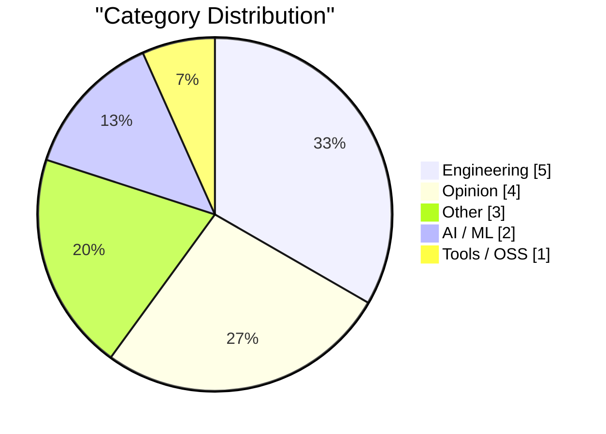
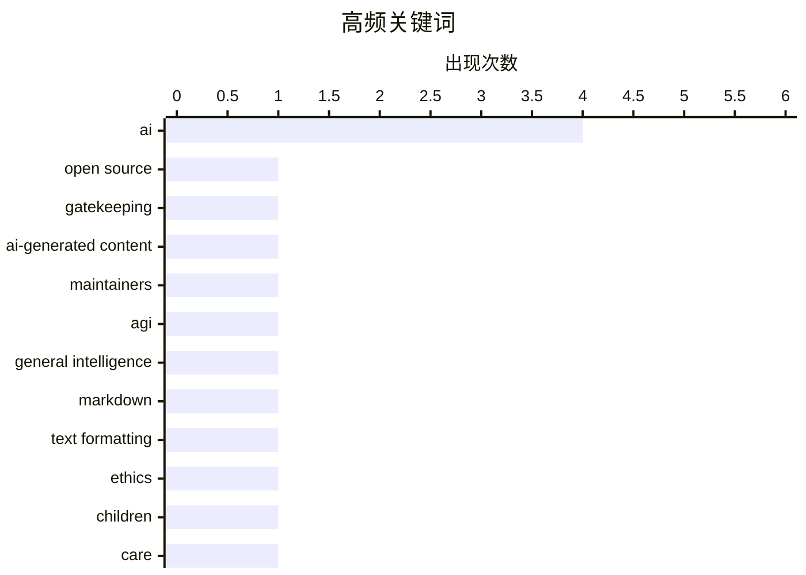

# AI Daily Digest — 2026-02-19

> Curated from 92 top tech blogs recommended by Karpathy. AI-selected Top 15.

<div class="stats-bar" data-sources="89/92" data-articles="2503" data-filtered="38" data-hours="48" data-selected="15"></div>

<div class="stats-categories" data-categories='{"Opinion":4,"AI / ML":2,"Tools / OSS":1,"Engineering":5,"Other":3}'></div>

<div class="stats-tags">

**ai**(4) · **open source**(1) · **gatekeeping**(1) · ai-generated content(1) · maintainers(1) · agi(1) · general intelligence(1) · markdown(1) · text formatting(1) · ethics(1) · children(1) · care(1) · taste(1) · product development(1) · package registries(1) · oci(1) · package management(1) · platform strings(1) · m1 mac(1) · aarch64(1)

</div>

## Highlights

今日看点：AI发展引发多重讨论，一方面，AI生成内容泛滥凸显了质量把控的重要性，另一方面，AGI的到来仍面临挑战。此外，工程领域也在探索新的技术方案，例如包管理仓库借鉴OCI，以及优化底层函数性能等。同时，技术伦理和社会责任也日益受到重视，例如AI对儿童的影响以及产品设计中的“关怀”理念。

---

## Top Picks

<div class="pick-card">

#1 **论守门人的必要性：中世纪行会的启示**

[The case for gatekeeping, or: why medieval guilds had it figured out](https://www.joanwestenberg.com/the-case-for-gatekeeping-or-why-medieval-guilds-had-it-figured-out/) — joanwestenberg.com · 22 小时前 · Opinion

> 开源维护者普遍抱怨，大量AI生成的低质量提交请求淹没了他们的代码仓库。这些提交看似合理，包含提交信息、关联问题和遵循规范，但实际上毫无价值。文章认为，这种现象凸显了“守门人”机制的重要性，即通过一定的筛选和审核，确保贡献的质量和价值。中世纪行会通过严格的标准和学徒制度，有效地维护了行业的质量和声誉，其经验值得借鉴。作者呼吁重新审视守门人的价值，以应对AI时代信息泛滥带来的挑战。

**Why read this**: 本文从开源社区的实际问题出发，探讨了AI时代下质量控制的重要性，为我们重新思考信息筛选机制提供了新的视角。

`open source` `gatekeeping` `AI-generated content` `maintainers`

</div>

<div class="pick-card">

#2 **关于通用人工智能到来的谣言被大大夸大了**

[Rumors of AGI’s arrival have been greatly exaggerated](https://garymarcus.substack.com/p/rumors-of-agis-arrival-have-been) — garymarcus.substack.com · 1 天前 · AI / ML

> 文章指出，当前人工智能的能力本质上是统计近似，而非真正的通用智能。作者认为，仅仅通过统计方法进行预测和生成，并不能等同于理解、推理和解决问题的能力。因此，关于通用人工智能（AGI）即将到来的说法被严重夸大，我们不应混淆统计近似与通用智能的本质区别。作者强调，AGI的实现仍然面临巨大的挑战，需要突破现有技术的局限。

**Why read this**: 本文对当前AI发展现状进行了冷静的分析，提醒人们不要过度炒作AGI概念，具有一定的警示意义。

`AGI` `AI` `general intelligence`

</div>

<div class="pick-card">

#3 **Markdown 的时代**

[Markdown’s Moment](https://feed.tedium.co/link/15204/17278321/markdown-growing-influence-cloudflare-ai) — tedium.co · 20 小时前 · Tools / OSS

> Markdown 正在受到越来越多大型公司的青睐，包括 Cloudflare AI。文章推测，这可能与人工智能的发展有关，但同时也带来了意想不到的好处。Markdown 简洁的语法和易于阅读的特性，使其成为编写文档和笔记的理想选择。这种趋势可能促进更高效的协作和更清晰的沟通。

**Why read this**: 本文观察到Markdown在大型公司中的流行趋势，并分析了其背后的原因，对于关注技术发展趋势的读者来说值得一读。

`Markdown` `AI` `text formatting`

</div>

---

<details>
<summary>Charts</summary>





```
ai                   │ ████████████████████ 4
open source          │ █████░░░░░░░░░░░░░░░ 1
gatekeeping          │ █████░░░░░░░░░░░░░░░ 1
ai-generated content │ █████░░░░░░░░░░░░░░░ 1
maintainers          │ █████░░░░░░░░░░░░░░░ 1
agi                  │ █████░░░░░░░░░░░░░░░ 1
general intelligence │ █████░░░░░░░░░░░░░░░ 1
markdown             │ █████░░░░░░░░░░░░░░░ 1
text formatting      │ █████░░░░░░░░░░░░░░░ 1
ethics               │ █████░░░░░░░░░░░░░░░ 1
```

</details>

---

## Engineering

### 1. 包管理仓库可以从 OCI 借鉴什么

[What Package Registries Could Borrow from OCI](https://nesbitt.io/2026/02/18/what-package-registries-could-borrow-from-oci.html) — **nesbitt.io** · 1 天前 · 19/30

> 文章探讨了将OCI（开放容器倡议）的存储原语应用于包管理的可能性。OCI提供了一种标准化的容器镜像格式和运行时，可以用于存储和分发软件。作者认为，包管理仓库可以借鉴OCI的存储机制，以提高效率、安全性和互操作性。通过采用OCI的存储原语，包管理系统可以更好地管理和分发软件包。

`package registries` `OCI` `package management`

---

### 2. 平台字符串

[Platform Strings](https://nesbitt.io/2026/02/17/platform-strings.html) — **nesbitt.io** · 1 天前 · 19/30

> 文章指出，在不同的工具中，M1 Mac的平台字符串表示方式不一致，例如可以是aarch64-apple-darwin, arm64-darwin, darwin/arm64, 或 macosx_11_0_arm64。这种不一致性给开发者带来了困扰，增加了跨平台开发的复杂性。作者强调了平台字符串标准化的重要性，以便更好地识别和支持不同的硬件和操作系统。

`platform strings` `M1 Mac` `aarch64`

---

### 3. 意识流驱动开发

[Stream of Consciousness Driven Development](https://buttondown.com/hillelwayne/archive/stream-of-consciousness-driven-development/) — **buttondown.com/hillelwayne** · 8 小时前 · 18/30

> 作者分享了一种名为“意识流驱动开发”的新方法，该方法通过创建Markdown文件来记录问题、详细描述和解决方案，而不是试图口头解释。作者在与客户合作编写规范时尝试了这种方法，并认为它具有潜力。这种方法鼓励开发者将思考过程记录下来，从而更好地理解和解决问题。

`Stream of Consciousness` `development` `spec writing`

---

### 4. 能否通过避免中间缓冲区来加快 WriteProcessMemory 的速度？

[Could Write­Process­Memory be made faster by avoiding the intermediate buffer?](https://devblogs.microsoft.com/oldnewthing/20260218-00/?p=112069) — **devblogs.microsoft.com/oldnewthing** · 10 小时前 · 16/30

> 文章提出了一个关于优化 `WriteProcessMemory` 函数性能的疑问：是否可以通过避免中间缓冲区来提高其速度？作者给出的答案是：也许可以，但是没有必要。文章暗示，这种优化可能带来的收益并不足以抵消其复杂性。

`Windows API` `WriteProcessMemory` `performance`

---

### 5. 每周更新 491

[Weekly Update 491](https://www.troyhunt.com/weekly-update-491/) — **troyhunt.com** · 1 天前 · 16/30

> Troy Hunt 本周的更新主要讲述了使用 ESP32 蓝牙桥接器连接耶鲁锁的实验失败。尽管 ESP32 蓝牙模块本身性能良好，但由于 BLE 的被动特性，无法可靠地操作耶鲁锁。作者推测，BLE 的被动特性是导致连接不稳定的主要原因。

`ESP32` `Bluetooth` `Yale lock`

---

## Opinion

### 6. 论守门人的必要性：中世纪行会的启示

[The case for gatekeeping, or: why medieval guilds had it figured out](https://www.joanwestenberg.com/the-case-for-gatekeeping-or-why-medieval-guilds-had-it-figured-out/) — **joanwestenberg.com** · 22 小时前 · 25/30

> 开源维护者普遍抱怨，大量AI生成的低质量提交请求淹没了他们的代码仓库。这些提交看似合理，包含提交信息、关联问题和遵循规范，但实际上毫无价值。文章认为，这种现象凸显了“守门人”机制的重要性，即通过一定的筛选和审核，确保贡献的质量和价值。中世纪行会通过严格的标准和学徒制度，有效地维护了行业的质量和声誉，其经验值得借鉴。作者呼吁重新审视守门人的价值，以应对AI时代信息泛滥带来的挑战。

`open source` `gatekeeping` `AI-generated content` `maintainers`

---

### 7. 关于关怀的一些随笔

[A Few Rambling Observations on Care](https://blog.jim-nielsen.com/2026/observations-on-care/) — **blog.jim-nielsen.com** · 6 小时前 · 21/30

> 在人工智能时代，“品味”被认为是至高无上的技能，但作者认为“关怀”在产品中更为重要。文章探讨了“关怀”是否可以被衡量，以及规模化是否会驱逐“关怀”。作者认为，如果产品讨论仅仅被简化为数字，那么“关怀”就会丢失。作者强调，关怀似乎与量化的还原本质是相对立的。

`care` `taste` `AI` `product development`

---

### 8. 价值提取

[Value extraction](https://keygen.sh/blog/value-extraction/) — **keygen.sh** · 19 小时前 · 17/30

> 文章讨论了末日预言者和新时代的淘金热。具体内容需要阅读原文才能了解。

`value extraction` `new age` `doom`

---

### 9. 你只是以为他们在为你工作

[You Only Think They Work For You](https://steveblank.com/2026/02/18/you-only-think-they-work-for-you/) — **steveblank.com** · 11 小时前 · 16/30

> 文章讲述了作者作为市场营销副总裁时，从公关公司身上学到的惨痛教训，并意识到所有外部供应商都存在类似问题。作者指出，需要重新思考与外部供应商合作的模式，明确他们真正应该做的事情。核心在于理解供应商的利益驱动，并据此调整合作方式，以确保自身利益最大化。作者强调，这个教训至今仍然适用。

`PR agency` `vendor management` `marketing`

---

## Other

### 10. 无需打字的类型提示

[Typing without having to type](https://simonwillison.net/2026/Feb/18/typing/#atom-everything) — **simonwillison.net** · 6 小时前 · 15/30

> 作者在 25 年的编程生涯后，开始倾向于类型提示甚至强类型。过去，作者认为类型提示会降低代码迭代速度，尤其是在 REPL 环境中。但现在，如果编码代理可以自动完成类型定义，那么显式定义类型的所有好处就变得更具吸引力。AI 编码助手可以大幅减少手动类型定义的工作量，从而提高开发效率。

---

### 11. 我们期待的人工智能颠覆已经到来

[The A.I. Disruption We’ve Been Waiting for Has Arrived](https://simonwillison.net/2026/Feb/18/the-ai-disruption/#atom-everything) — **simonwillison.net** · 7 小时前 · 15/30

> 本文是对 Paul Ford 在《纽约时报》上发表的一篇关于人工智能的文章的评论。文章讨论了人工智能对软件开发的颠覆性影响，并引用了 Paul Ford 文章中的一些精彩片段。作者认为，人工智能正在改变软件开发的格局，并带来新的机遇和挑战。

---

### 12. 引用 Martin Fowler

[Quoting Martin Fowler](https://simonwillison.net/2026/Feb/18/martin-fowler/#atom-everything) — **simonwillison.net** · 8 小时前 · 15/30

> 本文引用了 Martin Fowler 的观点，即大型语言模型（LLM）正在蚕食专业技能。随着 LLM 驱动技能变得比平台使用细节更重要，对专业前端和后端开发人员的需求将会减少。这可能会导致人们更加重视专家通才的角色。或者，LLM 编写大量代码的能力意味着它们可以绕过孤岛进行编码，而不是打破孤岛。

---

## AI / ML

### 13. 关于通用人工智能到来的谣言被大大夸大了

[Rumors of AGI’s arrival have been greatly exaggerated](https://garymarcus.substack.com/p/rumors-of-agis-arrival-have-been) — **garymarcus.substack.com** · 1 天前 · 23/30

> 文章指出，当前人工智能的能力本质上是统计近似，而非真正的通用智能。作者认为，仅仅通过统计方法进行预测和生成，并不能等同于理解、推理和解决问题的能力。因此，关于通用人工智能（AGI）即将到来的说法被严重夸大，我们不应混淆统计近似与通用智能的本质区别。作者强调，AGI的实现仍然面临巨大的挑战，需要突破现有技术的局限。

`AGI` `AI` `general intelligence`

---

### 14. 我们是如何最终用人工智能威胁孩子们的生命的？

[How did we end up threatening our kids’ lives with AI?](https://anildash.com/2026/02/18/threatening-kids-with-AI/) — **anildash.com** · 1 天前 · 22/30

> 文章对大型AI公司在影响儿童方面所做的选择提出了严厉警告，并表达了作者的强烈不满。作者认为，这些公司的一些行为已经对儿童造成了潜在的威胁，虽然文章没有详细说明具体内容，但暗示了AI技术可能被滥用，对儿童的身心健康造成负面影响。作者呼吁人们正视当代技术发展带来的伦理和社会问题，尤其是对儿童的保护。

`AI` `ethics` `children`

---

## Tools / OSS

### 15. Markdown 的时代

[Markdown’s Moment](https://feed.tedium.co/link/15204/17278321/markdown-growing-influence-cloudflare-ai) — **tedium.co** · 20 小时前 · 22/30

> Markdown 正在受到越来越多大型公司的青睐，包括 Cloudflare AI。文章推测，这可能与人工智能的发展有关，但同时也带来了意想不到的好处。Markdown 简洁的语法和易于阅读的特性，使其成为编写文档和笔记的理想选择。这种趋势可能促进更高效的协作和更清晰的沟通。

`Markdown` `AI` `text formatting`

---

*生成于 2026-02-19 01:00 | 扫描 89 源 → 获取 2503 篇 → 精选 15 篇*
*基于 [Hacker News Popularity Contest 2025](https://refactoringenglish.com/tools/hn-popularity/) RSS 源列表，由 [Andrej Karpathy](https://x.com/karpathy) 推荐*
