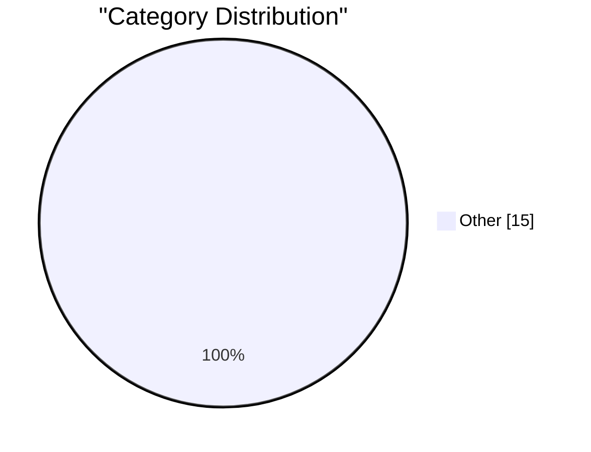

# AI Daily Digest — 2026-02-20

> Curated from 92 top tech blogs recommended by Karpathy. AI-selected Top 15.

## Top Picks

#1 **Gemini 3.1 Pro**

[Gemini 3.1 Pro](https://simonwillison.net/2026/Feb/19/gemini-31-pro/#atom-everything) — simonwillison.net · 7 小时前 · Other

> Gemini 3.1 Pro

#2 **Experimenting with sponsorship for my blog and newsletter**

[Experimenting with sponsorship for my blog and newsletter](https://simonwillison.net/2026/Feb/19/sponsorship/#atom-everything) — simonwillison.net · 19 小时前 · Other

> Experimenting with sponsorship for my blog and newsletter

#3 **SWE-bench February 2026 leaderboard update**

[SWE-bench February 2026 leaderboard update](https://simonwillison.net/2026/Feb/19/swe-bench/#atom-everything) — simonwillison.net · 20 小时前 · Other

> SWE-bench February 2026 leaderboard update

---

Charts

---

## Other

### 1. Gemini 3.1 Pro

[Gemini 3.1 Pro](https://simonwillison.net/2026/Feb/19/gemini-31-pro/#atom-everything) — **simonwillison.net** · 7 小时前 · 15/30

> Gemini 3.1 Pro

---

### 2. Experimenting with sponsorship for my blog and newsletter

[Experimenting with sponsorship for my blog and newsletter](https://simonwillison.net/2026/Feb/19/sponsorship/#atom-everything) — **simonwillison.net** · 19 小时前 · 15/30

> Experimenting with sponsorship for my blog and newsletter

---

### 3. SWE-bench February 2026 leaderboard update

[SWE-bench February 2026 leaderboard update](https://simonwillison.net/2026/Feb/19/swe-bench/#atom-everything) — **simonwillison.net** · 20 小时前 · 15/30

> SWE-bench February 2026 leaderboard update

---

### 4. LadybirdBrowser/ladybird: Abandon Swift adoption

[LadybirdBrowser/ladybird: Abandon Swift adoption](https://simonwillison.net/2026/Feb/19/ladybird/#atom-everything) — **simonwillison.net** · 23 小时前 · 15/30

> LadybirdBrowser/ladybird: Abandon Swift adoption

---

### 5. Typing without having to type

[Typing without having to type](https://simonwillison.net/2026/Feb/18/typing/#atom-everything) — **simonwillison.net** · 1 天前 · 15/30

> Typing without having to type

---

### 6. The A.I. Disruption We’ve Been Waiting for Has Arrived

[The A.I. Disruption We’ve Been Waiting for Has Arrived](https://simonwillison.net/2026/Feb/18/the-ai-disruption/#atom-everything) — **simonwillison.net** · 1 天前 · 15/30

> The A.I. Disruption We’ve Been Waiting for Has Arrived

---

### 7. Quoting Martin Fowler

[Quoting Martin Fowler](https://simonwillison.net/2026/Feb/18/martin-fowler/#atom-everything) — **simonwillison.net** · 1 天前 · 15/30

> Quoting Martin Fowler

---

### 8. Frigate with Hailo for object detection on a Raspberry Pi

[Frigate with Hailo for object detection on a Raspberry Pi](https://www.jeffgeerling.com/blog/2026/frigate-with-hailo-for-object-detection-on-a-raspberry-pi/) — **jeffgeerling.com** · 1 天前 · 15/30

> Frigate with Hailo for object detection on a Raspberry Pi

---

### 9. IMAX and Apple Collaborate to Screen F1 Races Live in Theaters

[IMAX and Apple Collaborate to Screen F1 Races Live in Theaters](https://www.motorsport.com/f1/news/f1-to-screen-live-in-imax-theatres-in-2026-as-apple-tv-unveils-new-us-viewing-experience/10798974/) — **daringfireball.net** · 1 小时前 · 15/30

> IMAX and Apple Collaborate to Screen F1 Races Live in Theaters

---

### 10. One More Spitball Idea for Apple’s March 4 Media Event ‘Experience’: Immersive F1 on Vision Pro?

[One More Spitball Idea for Apple’s March 4 Media Event ‘Experience’: Immersive F1 on Vision Pro?](https://www.formula1.com/en/latest/article/official-grand-prix-start-times-for-2026-f1-season-confirmed.2UgPfArqH76tzlOYh21jSG) — **daringfireball.net** · 20 小时前 · 15/30

> One More Spitball Idea for Apple’s March 4 Media Event ‘Experience’: Immersive F1 on Vision Pro?

---

### 11. Paul Ford: ‘The A.I. Disruption Has Arrived, and It Sure Is Fun’

[Paul Ford: ‘The A.I. Disruption Has Arrived, and It Sure Is Fun’](https://www.nytimes.com/2026/02/18/opinion/ai-software.html?unlocked_article_code=1.NFA.djaw.TBlAp8kE_N-i) — **daringfireball.net** · 1 天前 · 15/30

> Paul Ford: ‘The A.I. Disruption Has Arrived, and It Sure Is Fun’

---

### 12. Thinking Improves Thinking

[Thinking Improves Thinking](https://idiallo.com/blog/taking-our-mind-for-granted?src=feed) — **idiallo.com** · 1 天前 · 15/30

> Thinking Improves Thinking

---

### 13. Pluralistic: Six Years of Pluralistic (19 Feb 2026)

[Pluralistic: Six Years of Pluralistic (19 Feb 2026)](https://pluralistic.net/2026/02/19/now-we-are-six/) — **pluralistic.net** · 10 小时前 · 15/30

> Pluralistic: Six Years of Pluralistic (19 Feb 2026)

---

### 14. AI is a NAND Maximiser

[AI is a NAND Maximiser](https://shkspr.mobi/blog/2026/02/ai-is-a-nand-maximiser/) — **shkspr.mobi** · 12 小时前 · 15/30

> AI is a NAND Maximiser

---

### 15. Book Review: All Systems Red - The Murderbot Diaries by Martha Wells ★★⯪☆☆

[Book Review: All Systems Red - The Murderbot Diaries by Martha Wells ★★⯪☆☆](https://shkspr.mobi/blog/2026/02/book-review-all-systems-red-the-murderbot-diaries-by-martha-wells/) — **shkspr.mobi** · 1 天前 · 15/30

> Book Review: All Systems Red - The Murderbot Diaries by Martha Wells ★★⯪☆☆

---

*生成于 2026-02-20 01:00 | 扫描 89 源 → 获取 2503 篇 → 精选 15 篇*
*基于 [Hacker News Popularity Contest 2025](https://refactoringenglish.com/tools/hn-popularity/) RSS 源列表，由 [Andrej Karpathy](https://x.com/karpathy) 推荐*
