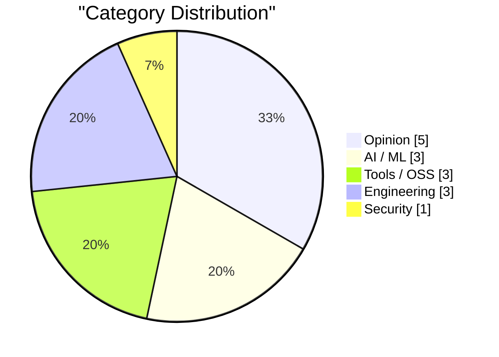
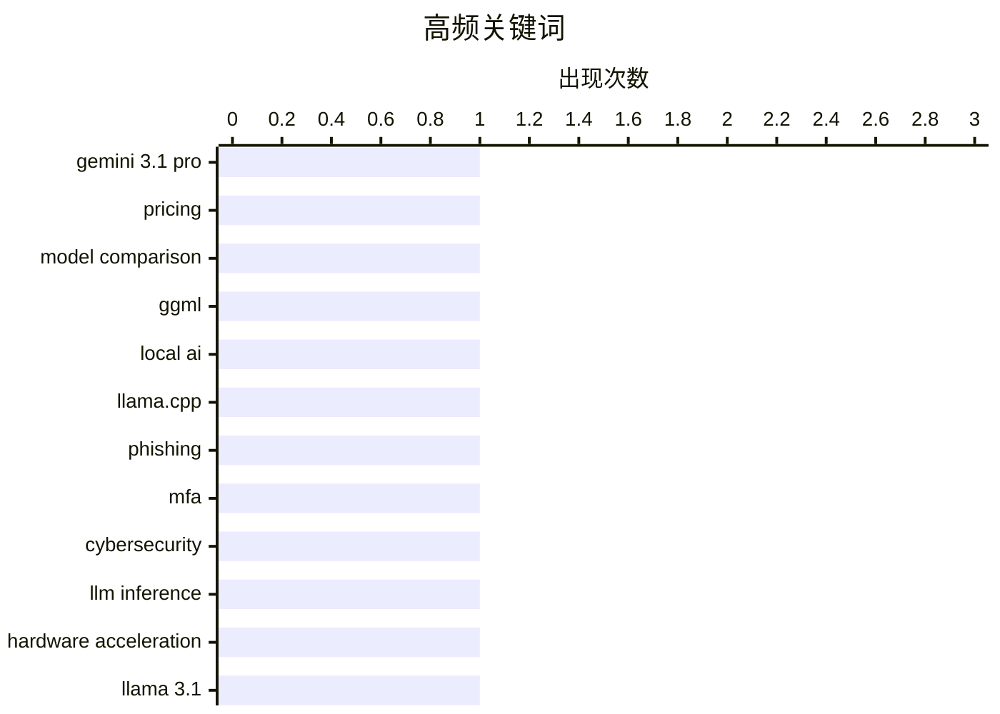

# AI Daily Digest — 2026-02-21

> Curated from 92 top tech blogs recommended by Karpathy. AI-selected Top 15.

<div class="stats-bar" data-sources="89/92" data-articles="2504" data-filtered="30" data-hours="48" data-selected="15"></div>

<div class="stats-categories" data-categories='{"AI / ML":3,"Security":1,"Tools / OSS":3,"Engineering":3,"Opinion":5}'></div>

<div class="stats-tags">

**gemini 3.1 pro**(1) · **pricing**(1) · **model comparison**(1) · ggml(1) · local ai(1) · llama.cpp(1) · phishing(1) · mfa(1) · cybersecurity(1) · llm inference(1) · hardware acceleration(1) · llama 3.1(1) · swe-bench(1) · benchmark(1) · code generation(1) · ai-chips(1) · semiconductor(1) · supply-chain(1) · prompt caching(1) · llm optimization(1)

</div>

## Highlights

今日技术圈的焦点围绕三个核心趋势展开：首先是大模型与推理的迭代加速，Gemini 3.1 Pro 的发布和 SWE-bench 新排行榜反映出主流模型厂商的持续竞争，同时 Taalas 硬件加速和提示词缓存等技术突破正在显著提升推理效率和长流程应用的可行性；其次是本地 AI 的生态成熟，ggml.ai 被 Hugging Face 收购标志着边缘计算和消费级硬件推理的技术路径得到业界认可；第三是算力基础设施面临的严峻挑战，AI 芯片需求激增对全球 NAND 产能造成冲击，与此同时安全与工程实践的权衡问题（从 Starkiller 钓鱼、Ladybird 浏览器语言选择到远程操作争议）也在重塑行业的建设方式。

---

## Top Picks

<div class="pick-card">

#1 **Gemini 3.1 Pro 发布**

[Gemini 3.1 Pro](https://simonwillison.net/2026/Feb/19/gemini-31-pro/#atom-everything) — simonwillison.net · 1 天前 · AI / ML

> Google 发布了 Gemini 3.1 系列的首款模型 Gemini 3.1 Pro，定价为每百万输入 token 2 美元、输出 12 美元（20 万 token 以内），与 Gemini 3 Pro 价格相同。这个价格不到 Claude Opus 4.6 的一半，但基准测试得分与后者非常接近。该模型在 SVG 动画性能等方面相比 Gemini 3 Pro 有所改进。

**Why read this**: 值得关注的性价比突破——同等能力的模型价格仅为竞争对手一半，重塑市场竞争格局。

`Gemini 3.1 Pro` `pricing` `model comparison`

</div>

<div class="pick-card">

#2 **ggml.ai 加入 Hugging Face，推动本地 AI 长期发展**

[ggml.ai joins Hugging Face to ensure the long-term progress of Local AI](https://simonwillison.net/2026/Feb/20/ggmlai-joins-hugging-face/#atom-everything) — simonwillison.net · 7 小时前 · AI / ML

> Georgi Gerganov 创建的 ggml.ai 被 Hugging Face 收购。Gerganov 在 2023 年 3 月推出的 llama.cpp 项目使得在消费级硬件上运行本地大模型成为可能，对本地模型生态产生了深远影响。这次收购旨在确保本地 AI 技术的长期稳定发展，巩固 Hugging Face 在开源 AI 基础设施中的地位。

**Why read this**: 反映了本地 AI 从边缘走向主流的重要信号，大公司对基础设施层的重视预示着行业的未来方向。

`ggml` `local AI` `llama.cpp`

</div>

<div class="pick-card">

#3 **'Starkiller' 网络钓鱼服务：代理真实登录页面和多因素认证**

[‘Starkiller’ Phishing Service Proxies Real Login Pages, MFA](https://krebsonsecurity.com/2026/02/starkiller-phishing-service-proxies-real-login-pages-mfa/) — krebsonsecurity.com · 5 小时前 · Security

> 一项名为 Starkiller 的新型钓鱼即服务产品采用了更隐蔽的技术手段：使用伪装的链接加载目标网站的真实页面，然后充当受害者与合法网站之间的中继，转发用户名、密码和多因素认证信息。相比传统的静态登录页面复制品，这种方法绕过了反滥用活动人士和安全公司的快速下线机制，大大提高了钓鱼成功率。

**Why read this**: 代表了钓鱼攻击技术的新升级，安全防御需要从被动应对转向主动适应新型威胁。

`phishing` `MFA` `cybersecurity`

</div>

---

<details>
<summary>Charts</summary>





```
gemini 3.1 pro   │ ████████████████████ 1
pricing          │ ████████████████████ 1
model comparison │ ████████████████████ 1
ggml             │ ████████████████████ 1
local ai         │ ████████████████████ 1
llama.cpp        │ ████████████████████ 1
phishing         │ ████████████████████ 1
mfa              │ ████████████████████ 1
cybersecurity    │ ████████████████████ 1
llm inference    │ ████████████████████ 1
```

</details>

---

## Opinion

### 1. 讨厌者眼中的 Anthropic：溢价的代价

[Premium: The Hater's Guide to Anthropic](https://www.wheresyoured.at/premium-the-haters-guide-to-anthropic/) — **wheresyoured.at** · 6 小时前 · 23/30

> 2021 年 5 月，Dario Amodei 和其他 OpenAI 前研究员创立了 Anthropic，致力于构建业界最具安全意识的大语言模型公司。这篇评论指出了 Anthropic 因强调安全性而面临的批评和讨论，反映了 AI 安全优先策略与商业竞争之间的张力。

`Anthropic` `LLM` `AI safety` `industry analysis`

---

### 2. 远程操作总是被当笑话嘲笑

[Teleoperation is Always the Butt of the Joke](https://idiallo.com/blog/teleoperation-is-the-butt-of-the-joke?src=feed) — **idiallo.com** · 13 小时前 · 22/30

> "AI" 一词在几年前被讽刺性地重新定义为 "Actual Indian"（真正的印度人），指代远程操作人员。以亚马逊 "Just Walk Out" 无人便利店为例，官方宣传用 AI 实现自动结账，但实际上有人在印度远程控制系统。这反映了一些 AI 应用的真实本质——用人工替代品冒充自动化。

`AI` `automation` `labor`

---

### 3. Is the Future “AWS for Everything”?

[Is the Future “AWS for Everything”?](https://www.construction-physics.com/p/is-the-future-aws-for-everything) — **construction-physics.com** · 1 天前 · 22/30

> A theme running through my book is the idea that efficiency improvements, and the various methods for making products cheaper over time, have historically been dependent on some degree of repetition, 

`cloud computing` `AWS` `business model` `efficiency`

---

### 4. The unbearable weight of cruft

[The unbearable weight of cruft](https://www.joanwestenberg.com/the-unbearable-weight-of-cruft/) — **joanwestenberg.com** · 2 小时前 · 21/30

> 

`technical debt` `code quality` `system complexity`

---

### 5. Pluralistic: A perforated corporate veil (20 Feb 2026)

[Pluralistic: A perforated corporate veil (20 Feb 2026)](https://pluralistic.net/2026/02/20/karioca-konzernrecht/) — **pluralistic.net** · 10 小时前 · 16/30

> Today's links A perforated corporate veil: The Brazilian method for curbing corporate power. Hey look at this: Delights to delectate. Object permanence: Social media turned US parties into host organi

`corporate-power` `regulation` `DRM`

---

## AI / ML

### 6. Gemini 3.1 Pro 发布

[Gemini 3.1 Pro](https://simonwillison.net/2026/Feb/19/gemini-31-pro/#atom-everything) — **simonwillison.net** · 1 天前 · 27/30

> Google 发布了 Gemini 3.1 系列的首款模型 Gemini 3.1 Pro，定价为每百万输入 token 2 美元、输出 12 美元（20 万 token 以内），与 Gemini 3 Pro 价格相同。这个价格不到 Claude Opus 4.6 的一半，但基准测试得分与后者非常接近。该模型在 SVG 动画性能等方面相比 Gemini 3 Pro 有所改进。

`Gemini 3.1 Pro` `pricing` `model comparison`

---

### 7. ggml.ai 加入 Hugging Face，推动本地 AI 长期发展

[ggml.ai joins Hugging Face to ensure the long-term progress of Local AI](https://simonwillison.net/2026/Feb/20/ggmlai-joins-hugging-face/#atom-everything) — **simonwillison.net** · 7 小时前 · 26/30

> Georgi Gerganov 创建的 ggml.ai 被 Hugging Face 收购。Gerganov 在 2023 年 3 月推出的 llama.cpp 项目使得在消费级硬件上运行本地大模型成为可能，对本地模型生态产生了深远影响。这次收购旨在确保本地 AI 技术的长期稳定发展，巩固 Hugging Face 在开源 AI 基础设施中的地位。

`ggml` `local AI` `llama.cpp`

---

### 8. SWE-bench 2026 年 2 月排行榜更新

[SWE-bench February 2026 leaderboard update](https://simonwillison.net/2026/Feb/19/swe-bench/#atom-everything) — **simonwillison.net** · 1 天前 · 24/30

> SWE-bench 是 AI 实验室在模型发布时常引用的关键基准测试，官方排行榜更新频率不高，但最近完成了针对当前一代模型的完整测试运行。这次更新的意义在于提供了非 AI 公司自报的第三方基准测试结果，增强了评估的公信力和客观性。

`SWE-bench` `benchmark` `code generation`

---

## Tools / OSS

### 9. Taalas 实现 Llama 3.1 8B 每秒 17000 token 的推理速度

[Taalas serves Llama 3.1 8B at 17,000 tokens/second](https://simonwillison.net/2026/Feb/20/taalas/#atom-everything) — **simonwillison.net** · 2 小时前 · 24/30

> 加拿大硬件初创公司 Taalas 发布了首款产品——Llama 3.1 8B 模型的定制硬件实现，能够以令人瞩目的 17000 token/秒的速度运行。这个性能指标代表了硬件加速在开源模型推理中的突破，展示了专门设计的芯片相比通用硬件的巨大优势。

`LLM inference` `hardware acceleration` `Llama 3.1`

---

### 10. ActivityPub

[ActivityPub](https://nesbitt.io/2026/02/20/activitypub.html) — **nesbitt.io** · 1 天前 · 19/30

> The federated protocol for announcing pub activities, first standardised in 1714 and still in use across 46,000 active instances.

`ActivityPub` `federation` `protocol`

---

### 11. CloudPebble Returns! Plus New Pure JavaScript and Round 2 SDK

[CloudPebble Returns! Plus New Pure JavaScript and Round 2 SDK](https://repebble.com/blog/cloudpebble-returns-plus-pure-javascript-and-round-2-sdk) — **ericmigi.com** · 1 天前 · 17/30

> As mentioned in our software roadmap, we’ve been working on many improvements to Pebble’s already pretty awesome SDK and developer…

`CloudPebble` `SDK` `JavaScript`

---

## Engineering

### 12. AI 是 NAND 芯片的最大需求方

[AI is a NAND Maximiser](https://shkspr.mobi/blog/2026/02/ai-is-a-nand-maximiser/) — **shkspr.mobi** · 1 天前 · 24/30

> AI 公司对芯片的需求激增对整个产业造成了灾难性影响。Phison CEO 指出，若 NVIDIA Vera Rubin 芯片出货数千万片，每片需要 20TB+ SSD，将消耗去年全球 NAND 产能的约 20%。NAND 是一种微芯片技术，这反映了 AI 基础设施需求对全球供应链的压力。

`AI-chips` `semiconductor` `supply-chain`

---

### 13. 引述 Thariq Shihipar：提示词缓存如何赋能长流程 AI 产品

[Quoting Thariq Shihipar](https://simonwillison.net/2026/Feb/20/thariq-shihipar/#atom-everything) — **simonwillison.net** · 17 小时前 · 23/30

> Claude Code 等长流程智能体产品的可行性得益于提示词缓存技术，该技术允许重复利用前几轮的计算结果，显著降低延迟和成本。Claude Code 团队将整个系统架构围绕提示词缓存构建，通过监控缓存命中率来控制成本并为订阅用户提供更慷慨的频率限制。

`prompt caching` `LLM optimization` `latency reduction`

---

### 14. Ladybird 浏览器项目放弃采用 Swift

[LadybirdBrowser/ladybird: Abandon Swift adoption](https://simonwillison.net/2026/Feb/19/ladybird/#atom-everything) — **simonwillison.net** · 1 天前 · 22/30

> Ladybird 浏览器项目在 2024 年 8 月宣布计划采用 Swift 作为内存安全语言，但最近做出了相反决定并放弃了 Swift 的采用。这一转变反映了在实际工程实施中，语言选择需要在安全性、生态成熟度和开发效率之间找到平衡。

`Ladybird browser` `Swift` `memory safety`

---

## Security

### 15. 'Starkiller' 网络钓鱼服务：代理真实登录页面和多因素认证

[‘Starkiller’ Phishing Service Proxies Real Login Pages, MFA](https://krebsonsecurity.com/2026/02/starkiller-phishing-service-proxies-real-login-pages-mfa/) — **krebsonsecurity.com** · 5 小时前 · 26/30

> 一项名为 Starkiller 的新型钓鱼即服务产品采用了更隐蔽的技术手段：使用伪装的链接加载目标网站的真实页面，然后充当受害者与合法网站之间的中继，转发用户名、密码和多因素认证信息。相比传统的静态登录页面复制品，这种方法绕过了反滥用活动人士和安全公司的快速下线机制，大大提高了钓鱼成功率。

`phishing` `MFA` `cybersecurity`

---

*生成于 2026-02-21 01:04 | 扫描 89 源 → 获取 2504 篇 → 精选 15 篇*
*基于 [Hacker News Popularity Contest 2025](https://refactoringenglish.com/tools/hn-popularity/) RSS 源列表，由 [Andrej Karpathy](https://x.com/karpathy) 推荐*
