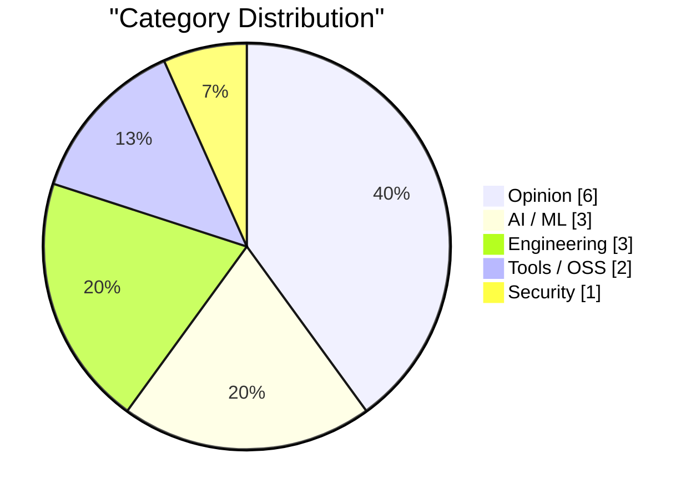
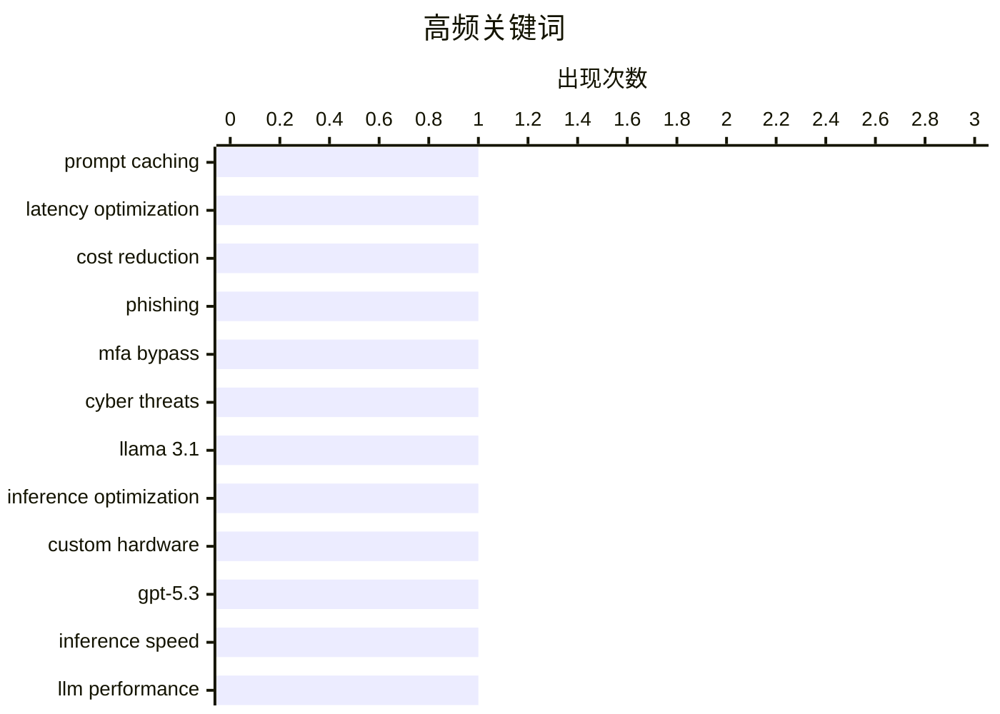

# AI Daily Digest — 2026-02-22

> Curated from 92 top tech blogs recommended by Karpathy. AI-selected Top 15.

<div class="stats-bar" data-sources="89/92" data-articles="2504" data-filtered="23" data-hours="48" data-selected="15"></div>

<div class="stats-categories" data-categories='{"Tools / OSS":2,"Security":1,"AI / ML":3,"Engineering":3,"Opinion":6}'></div>

<div class="stats-tags">

**prompt caching**(1) · **latency optimization**(1) · **cost reduction**(1) · phishing(1) · mfa bypass(1) · cyber threats(1) · llama 3.1(1) · inference optimization(1) · custom hardware(1) · gpt-5.3(1) · inference speed(1) · llm performance(1) · ggml(1) · hugging face(1) · local models(1) · ecosystem(1) · open source(1) · maintenance(1) · project sustainability(1) · nvidia(1)

</div>

## Highlights

提示词缓存技术正成为AI代理产品的核心基础设施，通过降低延迟和成本驱动长期运行应用的可行性。同时，大模型推理性能优化持续加速，从定制硬件的17000令牌/秒到OpenAI的1200+令牌/秒，推理效率竞争日趋激烈。在安全威胁方面，钓鱼即服务平台通过代理真实登录页面和MFA中继，标志着网络攻击手段的新升级。此外，开源模型生态正在整合，ggml.ai并入Hugging Face体现了本地AI长期发展的稳定化趋势。

---

## Top Picks

<div class="pick-card">

#1 **提示词缓存如何使Claude Code等长期运行的AI代理产品成为可能**

[Quoting Thariq Shihipar](https://simonwillison.net/2026/Feb/20/thariq-shihipar/#atom-everything) — simonwillison.net · 1 天前 · Tools / OSS

> 长期运行的代理产品（如Claude Code）的可行性依赖于提示词缓存技术。提示词缓存通过复用先前请求的计算结果，显著降低延迟和成本。Claude Code团队围绕提示词缓存构建了整套系统架构，通过提高缓存命中率来降低成本并为订阅用户提供更加宽松的速率限制。团队通过告警监控缓存表现，确保系统的高效运行。

**Why read this**: 揭示了现代AI产品关键的性能优化技术原理，对理解AI应用成本模型和工程实践很有参考价值。

`prompt caching` `latency optimization` `cost reduction`

</div>

<div class="pick-card">

#2 **"Starkiller"钓鱼服务通过代理真实登录页面和多因素认证进行攻击**

[‘Starkiller’ Phishing Service Proxies Real Login Pages, MFA](https://krebsonsecurity.com/2026/02/starkiller-phishing-service-proxies-real-login-pages-mfa/) — krebsonsecurity.com · 1 天前 · Security

> 一种新型钓鱼即服务（PhaaS）平台Starkiller克服了传统钓鱼网站易被识别和快速下架的问题。该服务采用伪装链接加载目标品牌的真实网站，然后作为受害者与合法网站之间的中继，转发用户名、密码和多因素认证信息。这种代理中间人的方式使得钓鱼攻击更难被检测，威胁程度大幅提升。

**Why read this**: 警示了一种高度隐蔽的新型钓鱼攻击方式，即使是多因素认证也可能被绕过，需要关注其对网络安全的实际威胁。

`phishing` `MFA bypass` `cyber threats`

</div>

<div class="pick-card">

#3 **Taalas推出定制硬件实现Llama 3.1 8B模型，吞吐量达17000令牌/秒**

[Taalas serves Llama 3.1 8B at 17,000 tokens/second](https://simonwillison.net/2026/Feb/20/taalas/#atom-everything) — simonwillison.net · 1 天前 · AI / ML

> 加拿大硬件初创公司Taalas发布了首款产品——Llama 3.1 8B模型的定制硬件实现，运行速度达到惊人的17000令牌/秒。这款硬件产品针对小型开源模型进行了专门优化，相比通用GPU的性能有数量级的提升。

**Why read this**: 展示了专用硬件在AI推理性能上的巨大潜力，为本地部署和边缘计算提供了新的可行方案。

`Llama 3.1` `inference optimization` `custom hardware`

</div>

---

<details>
<summary>Charts</summary>





```
prompt caching         │ ████████████████████ 1
latency optimization   │ ████████████████████ 1
cost reduction         │ ████████████████████ 1
phishing               │ ████████████████████ 1
mfa bypass             │ ████████████████████ 1
cyber threats          │ ████████████████████ 1
llama 3.1              │ ████████████████████ 1
inference optimization │ ████████████████████ 1
custom hardware        │ ████████████████████ 1
gpt-5.3                │ ████████████████████ 1
```

</details>

---

## Opinion

### 1. Nvidia was only invited to invest

[Nvidia was only invited to invest](https://idiallo.com/byte-size/nvidia-was-only-invited-to-invest?src=feed) — **idiallo.com** · 1 小时前 · 22/30

> Nvidia was only invited to invest

`Nvidia` `OpenAI` `investment`

---

### 2. Andrej Karpathy talks about "Claws"

[Andrej Karpathy talks about "Claws"](https://simonwillison.net/2026/Feb/21/claws/#atom-everything) — **simonwillison.net** · 1 天前 · 20/30

> Andrej Karpathy talks about "Claws"

`Andrej Karpathy` `local AI` `hardware`

---

### 3. Teleoperation is Always the Butt of the Joke

[Teleoperation is Always the Butt of the Joke](https://idiallo.com/blog/teleoperation-is-the-butt-of-the-joke?src=feed) — **idiallo.com** · 1 天前 · 19/30

> Teleoperation is Always the Butt of the Joke

`AI automation` `human labor` `tech reality`

---

### 4. Pluralistic: A perforated corporate veil (20 Feb 2026)

[Pluralistic: A perforated corporate veil (20 Feb 2026)](https://pluralistic.net/2026/02/20/karioca-konzernrecht/) — **pluralistic.net** · 1 天前 · 19/30

> Pluralistic: A perforated corporate veil (20 Feb 2026)

`corporate regulation` `social media` `policy`

---

### 5. The unbearable weight of cruft

[The unbearable weight of cruft](https://www.joanwestenberg.com/the-unbearable-weight-of-cruft/) — **joanwestenberg.com** · 1 天前 · 19/30

> 

`technical debt` `code quality` `software design`

---

### 6. Premium: The Hater's Guide to Anthropic

[Premium: The Hater's Guide to Anthropic](https://www.wheresyoured.at/premium-the-haters-guide-to-anthropic/) — **wheresyoured.at** · 1 天前 · 17/30

> In May 2021, Dario Amodei and a crew of other former OpenAI researchers formed Anthropic and dedicated themselves to building the single-most-annoying Large Language Model company of all time.&#xA0;Pa

`Anthropic` `LLM` `AI safety`

---

## AI / ML

### 7. Taalas推出定制硬件实现Llama 3.1 8B模型，吞吐量达17000令牌/秒

[Taalas serves Llama 3.1 8B at 17,000 tokens/second](https://simonwillison.net/2026/Feb/20/taalas/#atom-everything) — **simonwillison.net** · 1 天前 · 26/30

> 加拿大硬件初创公司Taalas发布了首款产品——Llama 3.1 8B模型的定制硬件实现，运行速度达到惊人的17000令牌/秒。这款硬件产品针对小型开源模型进行了专门优化，相比通用GPU的性能有数量级的提升。

`Llama 3.1` `inference optimization` `custom hardware`

---

### 8. OpenAI GPT-5.3-Codex-Spark性能提升30%，吞吐量超1200令牌/秒

[Quoting Thibault Sottiaux](https://simonwillison.net/2026/Feb/21/thibault-sottiaux/#atom-everything) — **simonwillison.net** · 23 小时前 · 25/30

> OpenAI官方宣布将GPT-5.3-Codex-Spark的性能提升了约30%，当前服务吞吐量超过1200令牌/秒。这一性能优化体现了OpenAI在模型推理效率方面的持续改进。

`GPT-5.3` `inference speed` `LLM performance`

---

### 9. ggml.ai加入Hugging Face，推动本地AI长期发展

[ggml.ai joins Hugging Face to ensure the long-term progress of Local AI](https://simonwillison.net/2026/Feb/20/ggmlai-joins-hugging-face/#atom-everything) — **simonwillison.net** · 1 天前 · 25/30

> ggml.ai项目并入Hugging Face，旨在保障本地AI的长期技术进展。Georgi Gerganov在本地模型领域的贡献至关重要，其2023年3月发布的llama.cpp项目使消费级硬件运行LLM成为可能。该并购有助于确保这一关键基础设施项目的持续维护和发展。

`ggml` `Hugging Face` `local models` `ecosystem`

---

## Engineering

### 10. Whale Fall

[Whale Fall](https://nesbitt.io/2026/02/21/whale-fall.html) — **nesbitt.io** · 1 天前 · 23/30

> Whale Fall

`open source` `maintenance` `project sustainability`

---

### 11. Computing big, certified Fibonacci numbers

[Computing big, certified Fibonacci numbers](https://www.johndcook.com/blog/2026/02/21/big-certified-fibonacci/) — **johndcook.com** · 6 小时前 · 18/30

> I’ve written before about computing big Fibonacci numbers, and about creating a certificate to verify a Fibonacci number has been calculated correctly. This post will revisit both, giving a different 

`Fibonacci` `algorithm` `cryptography` `certificate`

---

### 12. Wrapping Code Comments

[Wrapping Code Comments](https://matklad.github.io/2026/02/21/wrapping-code-comments.html) — **matklad.github.io** · 1 天前 · 16/30

> I was today years old when I realized that:

`code comments` `documentation` `best practices`

---

## Tools / OSS

### 13. 提示词缓存如何使Claude Code等长期运行的AI代理产品成为可能

[Quoting Thariq Shihipar](https://simonwillison.net/2026/Feb/20/thariq-shihipar/#atom-everything) — **simonwillison.net** · 1 天前 · 27/30

> 长期运行的代理产品（如Claude Code）的可行性依赖于提示词缓存技术。提示词缓存通过复用先前请求的计算结果，显著降低延迟和成本。Claude Code团队围绕提示词缓存构建了整套系统架构，通过提高缓存命中率来降低成本并为订阅用户提供更加宽松的速率限制。团队通过告警监控缓存表现，确保系统的高效运行。

`prompt caching` `latency optimization` `cost reduction`

---

### 14. OpenBenches at FOSDEM

[OpenBenches at FOSDEM](https://shkspr.mobi/blog/2026/02/openbenches-at-fosdem/) — **shkspr.mobi** · 12 小时前 · 16/30

> At the recent FOSDEM, I did a very quick lightning talk about our OpenBenches project.  Sadly, despite the best efforts of the AV team, the video had a missing section. I took my own audio recording a

`OpenBenches` `FOSDEM` `open-source` `video-editing`

---

## Security

### 15. "Starkiller"钓鱼服务通过代理真实登录页面和多因素认证进行攻击

[‘Starkiller’ Phishing Service Proxies Real Login Pages, MFA](https://krebsonsecurity.com/2026/02/starkiller-phishing-service-proxies-real-login-pages-mfa/) — **krebsonsecurity.com** · 1 天前 · 27/30

> 一种新型钓鱼即服务（PhaaS）平台Starkiller克服了传统钓鱼网站易被识别和快速下架的问题。该服务采用伪装链接加载目标品牌的真实网站，然后作为受害者与合法网站之间的中继，转发用户名、密码和多因素认证信息。这种代理中间人的方式使得钓鱼攻击更难被检测，威胁程度大幅提升。

`phishing` `MFA bypass` `cyber threats`

---

*生成于 2026-02-22 01:08 | 扫描 89 源 → 获取 2504 篇 → 精选 15 篇*
*基于 [Hacker News Popularity Contest 2025](https://refactoringenglish.com/tools/hn-popularity/) RSS 源列表，由 [Andrej Karpathy](https://x.com/karpathy) 推荐*
