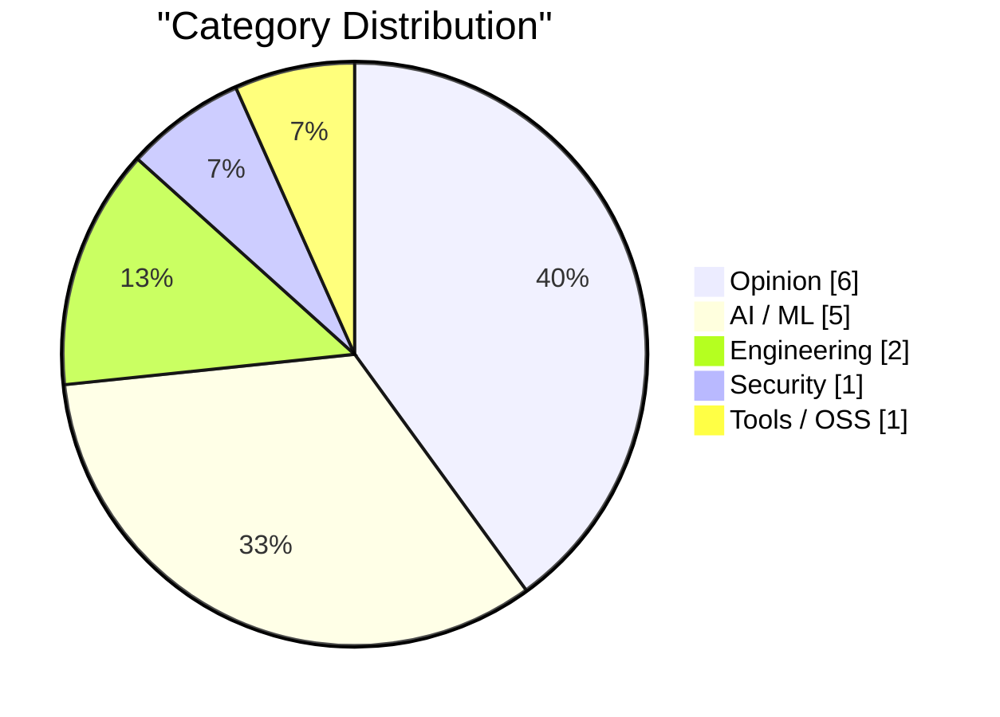
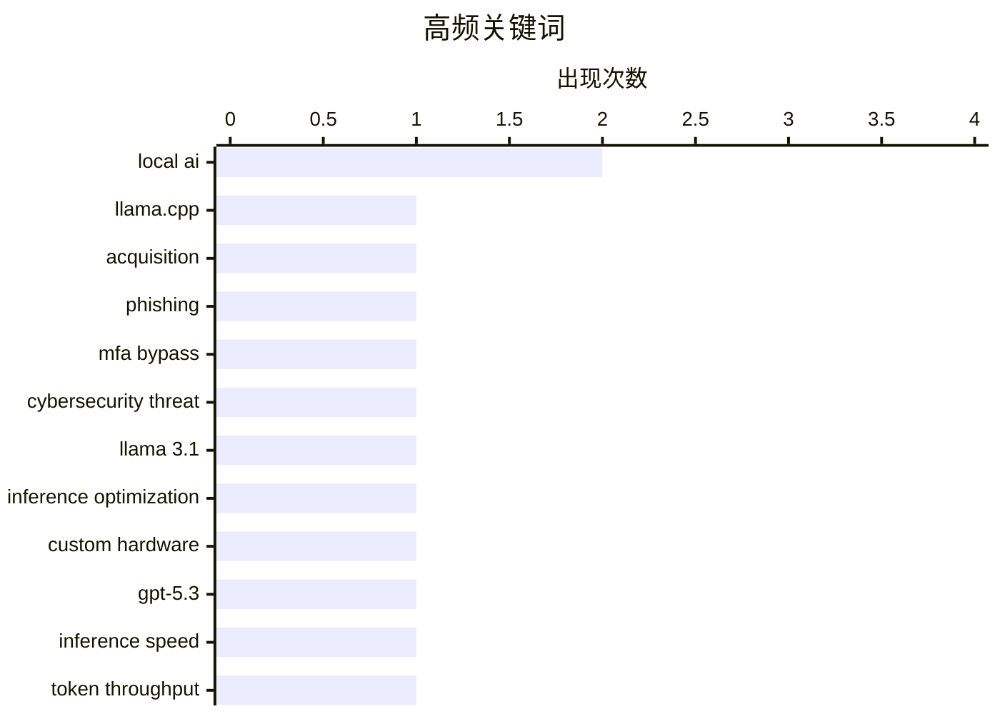

# AI Daily Digest — 2026-02-22

> Curated from 92 top tech blogs recommended by Karpathy. AI-selected Top 15.

<div class="stats-bar" data-sources="89/92" data-articles="2504" data-filtered="23" data-hours="48" data-selected="15"></div>

<div class="stats-categories" data-categories='{"AI / ML":5,"Security":1,"Opinion":6,"Tools / OSS":1,"Engineering":2}'></div>

<div class="stats-tags">

**local ai**(2) · **llama.cpp**(1) · **acquisition**(1) · phishing(1) · mfa bypass(1) · cybersecurity threat(1) · llama 3.1(1) · inference optimization(1) · custom hardware(1) · gpt-5.3(1) · inference speed(1) · token throughput(1) · prompt caching(1) · latency optimization(1) · agentic ai(1) · nvidia(1) · openai(1) · investment strategy(1) · open source(1) · project lifecycle(1)

</div>

## Highlights

本周AI产业迎来两大关键动向：开源本地化模型生态加速整合，ggml.ai并入Hugging Face进一步巩固本地大模型的长期发展路径，同时推理性能突破上限，Taalas等服务商已将Llama级别模型的推理速度提升至每秒17000token的实用级别；与此同时，安全威胁持续演变，以Starkiller为代表的新型钓鱼服务通过实时代理真实登录页面和多因素认证，大幅降低了攻击成本。这两条线索映照出当前AI浪潮的双面性：技术赋能加速民主化，但伴随而来的风险也在急速升级。

---

## Top Picks

<div class="pick-card">

#1 **ggml.ai joins Hugging Face to ensure the long-term progress of Local AI**

[ggml.ai joins Hugging Face to ensure the long-term progress of Local AI](https://simonwillison.net/2026/Feb/20/ggmlai-joins-hugging-face/#atom-everything) — simonwillison.net · 1 天前 · AI / ML

> ggml.ai joins Hugging Face to ensure the long-term progress of Local AI

`llama.cpp` `local AI` `acquisition`

</div>

<div class="pick-card">

#2 **‘Starkiller’ Phishing Service Proxies Real Login Pages, MFA**

[‘Starkiller’ Phishing Service Proxies Real Login Pages, MFA](https://krebsonsecurity.com/2026/02/starkiller-phishing-service-proxies-real-login-pages-mfa/) — krebsonsecurity.com · 1 天前 · Security

> ‘Starkiller’ Phishing Service Proxies Real Login Pages, MFA

`phishing` `MFA bypass` `cybersecurity threat`

</div>

<div class="pick-card">

#3 **Taalas serves Llama 3.1 8B at 17,000 tokens/second**

[Taalas serves Llama 3.1 8B at 17,000 tokens/second](https://simonwillison.net/2026/Feb/20/taalas/#atom-everything) — simonwillison.net · 1 天前 · AI / ML

> Taalas serves Llama 3.1 8B at 17,000 tokens/second

`Llama 3.1` `inference optimization` `custom hardware`

</div>

---

<details>
<summary>Charts</summary>





```
local ai               │ ████████████████████ 2
llama.cpp              │ ██████████░░░░░░░░░░ 1
acquisition            │ ██████████░░░░░░░░░░ 1
phishing               │ ██████████░░░░░░░░░░ 1
mfa bypass             │ ██████████░░░░░░░░░░ 1
cybersecurity threat   │ ██████████░░░░░░░░░░ 1
llama 3.1              │ ██████████░░░░░░░░░░ 1
inference optimization │ ██████████░░░░░░░░░░ 1
custom hardware        │ ██████████░░░░░░░░░░ 1
gpt-5.3                │ ██████████░░░░░░░░░░ 1
```

</details>

---

## Opinion

### 1. Nvidia was only invited to invest

[Nvidia was only invited to invest](https://idiallo.com/byte-size/nvidia-was-only-invited-to-invest?src=feed) — **idiallo.com** · 1 小时前 · 22/30

> Nvidia was only invited to invest

`Nvidia` `OpenAI` `investment strategy`

---

### 2. Whale Fall

[Whale Fall](https://nesbitt.io/2026/02/21/whale-fall.html) — **nesbitt.io** · 1 天前 · 21/30

> Whale Fall

`open source` `project lifecycle` `community`

---

### 3. Teleoperation is Always the Butt of the Joke

[Teleoperation is Always the Butt of the Joke](https://idiallo.com/blog/teleoperation-is-the-butt-of-the-joke?src=feed) — **idiallo.com** · 1 天前 · 20/30

> Teleoperation is Always the Butt of the Joke

`automation` `labor` `AI myth-busting`

---

### 4. Wrapping Code Comments

[Wrapping Code Comments](https://matklad.github.io/2026/02/21/wrapping-code-comments.html) — **matklad.github.io** · 1 天前 · 17/30

> I was today years old when I realized that:

`code comments` `documentation` `programming practices`

---

### 5. The unbearable weight of cruft

[The unbearable weight of cruft](https://www.joanwestenberg.com/the-unbearable-weight-of-cruft/) — **joanwestenberg.com** · 1 天前 · 17/30

> 

`technical debt` `software quality` `maintenance`

---

### 6. Premium: The Hater's Guide to Anthropic

[Premium: The Hater's Guide to Anthropic](https://www.wheresyoured.at/premium-the-haters-guide-to-anthropic/) — **wheresyoured.at** · 1 天前 · 17/30

> In May 2021, Dario Amodei and a crew of other former OpenAI researchers formed Anthropic and dedicated themselves to building the single-most-annoying Large Language Model company of all time.&#xA0;Pa

`Anthropic` `LLM` `AI safety`

---

## AI / ML

### 7. ggml.ai joins Hugging Face to ensure the long-term progress of Local AI

[ggml.ai joins Hugging Face to ensure the long-term progress of Local AI](https://simonwillison.net/2026/Feb/20/ggmlai-joins-hugging-face/#atom-everything) — **simonwillison.net** · 1 天前 · 27/30

> ggml.ai joins Hugging Face to ensure the long-term progress of Local AI

`llama.cpp` `local AI` `acquisition`

---

### 8. Taalas serves Llama 3.1 8B at 17,000 tokens/second

[Taalas serves Llama 3.1 8B at 17,000 tokens/second](https://simonwillison.net/2026/Feb/20/taalas/#atom-everything) — **simonwillison.net** · 1 天前 · 26/30

> Taalas serves Llama 3.1 8B at 17,000 tokens/second

`Llama 3.1` `inference optimization` `custom hardware`

---

### 9. Quoting Thibault Sottiaux

[Quoting Thibault Sottiaux](https://simonwillison.net/2026/Feb/21/thibault-sottiaux/#atom-everything) — **simonwillison.net** · 23 小时前 · 25/30

> Quoting Thibault Sottiaux

`GPT-5.3` `inference speed` `token throughput`

---

### 10. Quoting Thariq Shihipar

[Quoting Thariq Shihipar](https://simonwillison.net/2026/Feb/20/thariq-shihipar/#atom-everything) — **simonwillison.net** · 1 天前 · 24/30

> Quoting Thariq Shihipar

`prompt caching` `latency optimization` `agentic AI`

---

### 11. Andrej Karpathy talks about "Claws"

[Andrej Karpathy talks about "Claws"](https://simonwillison.net/2026/Feb/21/claws/#atom-everything) — **simonwillison.net** · 1 天前 · 20/30

> Andrej Karpathy talks about "Claws"

`OpenClaw` `local AI` `hardware`

---

## Engineering

### 12. Customizing the ways the dialog manager dismisses itself: Detecting the ESC key, first (failed) attempt

[Customizing the ways the dialog manager dismisses itself: Detecting the ESC key, first (failed) attempt](https://devblogs.microsoft.com/oldnewthing/20260220-00/?p=112074) — **devblogs.microsoft.com/oldnewthing** · 1 天前 · 16/30

> Sniffing the asynchronous keyboard state.
The post Customizing the ways the dialog manager dismisses itself: Detecting the ESC key, first (failed) attempt appeared first on The Old New Thing.

`dialog manager` `keyboard handling` `Windows`

---

### 13. Computing big, certified Fibonacci numbers

[Computing big, certified Fibonacci numbers](https://www.johndcook.com/blog/2026/02/21/big-certified-fibonacci/) — **johndcook.com** · 6 小时前 · 16/30

> I’ve written before about computing big Fibonacci numbers, and about creating a certificate to verify a Fibonacci number has been calculated correctly. This post will revisit both, giving a different 

`Fibonacci` `algorithms` `mathematical computing`

---

## Security

### 14. ‘Starkiller’ Phishing Service Proxies Real Login Pages, MFA

[‘Starkiller’ Phishing Service Proxies Real Login Pages, MFA](https://krebsonsecurity.com/2026/02/starkiller-phishing-service-proxies-real-login-pages-mfa/) — **krebsonsecurity.com** · 1 天前 · 27/30

> ‘Starkiller’ Phishing Service Proxies Real Login Pages, MFA

`phishing` `MFA bypass` `cybersecurity threat`

---

## Tools / OSS

### 15. OpenBenches at FOSDEM

[OpenBenches at FOSDEM](https://shkspr.mobi/blog/2026/02/openbenches-at-fosdem/) — **shkspr.mobi** · 12 小时前 · 17/30

> OpenBenches at FOSDEM

`OpenBenches` `FOSDEM` `benchmarking` `video editing`

---

*生成于 2026-02-22 01:03 | 扫描 89 源 → 获取 2504 篇 → 精选 15 篇*
*基于 [Hacker News Popularity Contest 2025](https://refactoringenglish.com/tools/hn-popularity/) RSS 源列表，由 [Andrej Karpathy](https://x.com/karpathy) 推荐*
