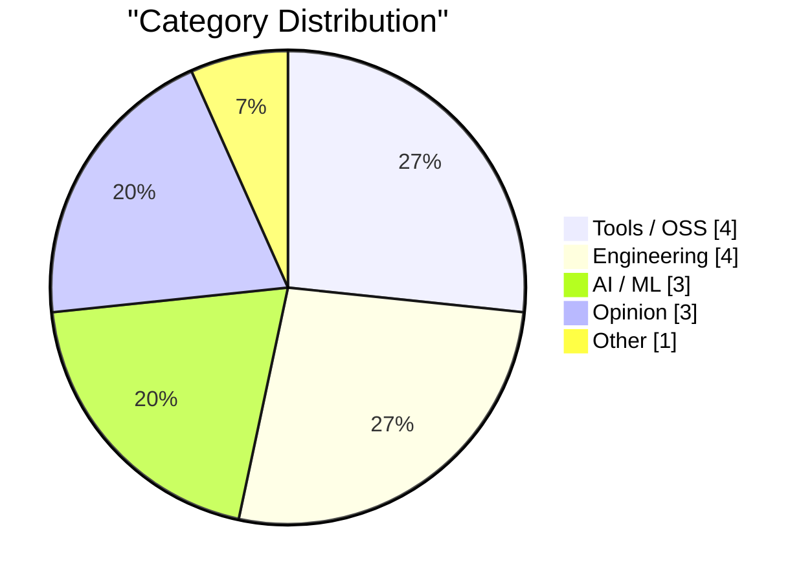
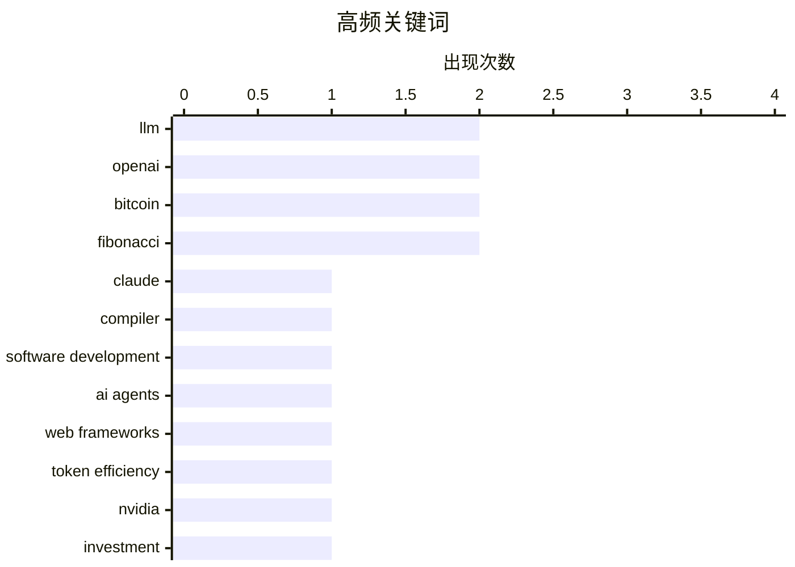

# AI Daily Digest — 2026-02-23

> Curated from 92 top tech blogs recommended by Karpathy. AI-selected Top 15.

<div class="stats-bar" data-sources="89/92" data-articles="2505" data-filtered="18" data-hours="48" data-selected="15"></div>

<div class="stats-categories" data-categories='{"AI / ML":3,"Tools / OSS":4,"Engineering":4,"Opinion":3,"Other":1}'></div>

<div class="stats-tags">

**llm**(2) · **openai**(2) · **bitcoin**(2) · fibonacci(2) · claude(1) · compiler(1) · software development(1) · ai agents(1) · web frameworks(1) · token efficiency(1) · nvidia(1) · investment(1) · performance optimization(1) · inference speed(1) · codex(1) · ai agent(1) · code generation(1) · git(1) · repository(1) · configuration(1)

</div>

## Highlights

今日技术圈的核心焦点集中在三个方向：AI 模型在系统编程和代码生成中的深化应用——从 Anthropic 用并行 Claude 构建 C 编译器到 OpenAI 提升 Codex 推理性能，体现了大模型在工程领域的实践突破；其次是 AI 代理开发的成本优化问题，轻量级框架相比全功能方案可降低近 3 倍的 token 消耗，这将直接影响 AI 产品的经济可行性；第三是 AI 产业投融资关系的重新审视，Nvidia CEO 撤回高额承诺信号表明市场预期需要调整。总体来看，当下重心从"模型能力竞速"转向"工程落地"和"成本理性"的阶段演进。

---

## Top Picks

<div class="pick-card">

#1 **Claude C 编译器：它揭示了软件未来的什么**

[The Claude C Compiler: What It Reveals About the Future of Software](https://simonwillison.net/2026/Feb/22/ccc/#atom-everything) — simonwillison.net · 1 小时前 · AI / ML

> Anthropic 使用并行 Claude 模型构建 C 编译器，探索 AI 在系统编程中的应用前景。这个项目由 Nicholas Carlini 在 2 月 5 日发起，利用 Opus 4.6 的强大能力进行复杂的编译器开发。Swift、LLVM、Clang 和 Mojo 的创造者 Chris Lattner 对此项目进行了深入分析。该项目展示了大语言模型在传统底层系统编程领域的实际应用潜力。

**Why read this**: 了解 AI 如何挑战和重塑系统编程的未来，以及大模型在编译器这类复杂工程中的实际表现。

`Claude` `LLM` `compiler` `software development`

</div>

<div class="pick-card">

#2 **哪个网络框架对 AI 代理最省 Token？**

[Which web frameworks are most token-efficient for AI agents?](https://martinalderson.com/posts/which-web-frameworks-are-most-token-efficient-for-ai-agents/?utm_source=rss) — martinalderson.com · 1 小时前 · Tools / OSS

> 对 19 个网络框架进行基准测试，衡量 AI 编程代理构建和扩展应用的 token 效率。精简框架相比全功能框架最多可节省 2.9 倍的 token 消耗。这项对比测试为选择框架时的成本-收益权衡提供了量化依据。随着 AI 编程工具的应用增加，框架的 token 效率成为了新的选型指标。

**Why read this**: 在 AI 时代，用实际数据指导框架选型，同时揭示 token 成本已成为工程决策的关键因素。

`AI agents` `web frameworks` `token efficiency`

</div>

<div class="pick-card">

#3 **英伟达只是被邀请投资**

[Nvidia was only invited to invest](https://idiallo.com/byte-size/nvidia-was-only-invited-to-invest?src=feed) — idiallo.com · 1 天前 · AI / ML

> 英伟达 CEO 黄仁勋撤回了此前关于向 OpenAI 投资 1000 亿美元的承诺，声称这只是邀请而非正式承诺。该事件打破了网络流传的 AI 公司循环投资关系图（Nvidia 投 OpenAI 1000 亿美元，OpenAI 投 Oracle 3000 亿美元，Oracle 再投 Nvidia）。这反映了 AI 产业高层战略合作的不确定性和话语权的争夺。

**Why read this**: 看 AI 产业龙头企业如何通过投资关系博弈，以及巨额投资承诺背后的政治和商业现实。

`Nvidia` `investment` `OpenAI`

</div>

---

<details>
<summary>Charts</summary>





```
llm                  │ ████████████████████ 2
openai               │ ████████████████████ 2
bitcoin              │ ████████████████████ 2
fibonacci            │ ████████████████████ 2
claude               │ ██████████░░░░░░░░░░ 1
compiler             │ ██████████░░░░░░░░░░ 1
software development │ ██████████░░░░░░░░░░ 1
ai agents            │ ██████████░░░░░░░░░░ 1
web frameworks       │ ██████████░░░░░░░░░░ 1
token efficiency     │ ██████████░░░░░░░░░░ 1
```

</details>

---

## Tools / OSS

### 1. 哪个网络框架对 AI 代理最省 Token？

[Which web frameworks are most token-efficient for AI agents?](https://martinalderson.com/posts/which-web-frameworks-are-most-token-efficient-for-ai-agents/?utm_source=rss) — **martinalderson.com** · 1 小时前 · 25/30

> 对 19 个网络框架进行基准测试，衡量 AI 编程代理构建和扩展应用的 token 效率。精简框架相比全功能框架最多可节省 2.9 倍的 token 消耗。这项对比测试为选择框架时的成本-收益权衡提供了量化依据。随着 AI 编程工具的应用增加，框架的 token 效率成为了新的选型指标。

`AI agents` `web frameworks` `token efficiency`

---

### 2. 我如何理解 Codex

[How I think about Codex](https://simonwillison.net/2026/Feb/22/how-i-think-about-codex/#atom-everything) — **simonwillison.net** · 9 小时前 · 20/30

> OpenAI APAC 地区开发者体验工程师 Gabriel Chua 阐明了 Codex 的真实含义——它是 OpenAI 的软件工程代理，可通过多个接口访问，本质上是模型加上特定指令的组合。Codex 术语在 OpenAI 生态中存在歧义，容易引起混淆。该文档澄清了 Codex 作为产品和平台的确切定义。

`Codex` `OpenAI` `AI agent` `code generation`

---

### 3. Forge-Specific Repository Folders

[Forge-Specific Repository Folders](https://nesbitt.io/2026/02/22/forge-specific-repository-folders.html) — **nesbitt.io** · 15 小时前 · 19/30

> Forge-Specific Repository Folders

`git` `repository` `configuration`

---

### 4. OpenBenches at FOSDEM

[OpenBenches at FOSDEM](https://shkspr.mobi/blog/2026/02/openbenches-at-fosdem/) — **shkspr.mobi** · 1 天前 · 15/30

> At the recent FOSDEM, I did a very quick lightning talk about our OpenBenches project.  Sadly, despite the best efforts of the AV team, the video had a missing section. I took my own audio recording a

`OpenBenches` `FOSDEM` `benchmarking`

---

## Engineering

### 5. Bitcoin mining difficulty

[Bitcoin mining difficulty](https://www.johndcook.com/blog/2026/02/22/bitcoin-mining-difficulty/) — **johndcook.com** · 5 小时前 · 18/30

> Bitcoin mining difficulty

`Bitcoin` `mining difficulty` `hash rate`

---

### 6. Exahash, Zettahash, Yottahash

[Exahash, Zettahash, Yottahash](https://www.johndcook.com/blog/2026/02/22/zettahash/) — **johndcook.com** · 6 小时前 · 17/30

> Exahash, Zettahash, Yottahash

`hash functions` `Bitcoin` `cryptography`

---

### 7. 10,000,000th Fibonacci number

[10,000,000th Fibonacci number](https://www.johndcook.com/blog/2026/02/21/f10000000/) — **johndcook.com** · 1 天前 · 15/30

> I’ve written a couple times about Fibonacci numbers and certificates. Here the certificate is auxiliary data that makes it faster to confirm that the original calculation was correct. This post puts s

`Fibonacci` `algorithm` `certificate`

---

### 8. Computing big, certified Fibonacci numbers

[Computing big, certified Fibonacci numbers](https://www.johndcook.com/blog/2026/02/21/big-certified-fibonacci/) — **johndcook.com** · 1 天前 · 15/30

> I’ve written before about computing big Fibonacci numbers, and about creating a certificate to verify a Fibonacci number has been calculated correctly. This post will revisit both, giving a different 

`Fibonacci` `verification` `computation`

---

## AI / ML

### 9. Claude C 编译器：它揭示了软件未来的什么

[The Claude C Compiler: What It Reveals About the Future of Software](https://simonwillison.net/2026/Feb/22/ccc/#atom-everything) — **simonwillison.net** · 1 小时前 · 27/30

> Anthropic 使用并行 Claude 模型构建 C 编译器，探索 AI 在系统编程中的应用前景。这个项目由 Nicholas Carlini 在 2 月 5 日发起，利用 Opus 4.6 的强大能力进行复杂的编译器开发。Swift、LLVM、Clang 和 Mojo 的创造者 Chris Lattner 对此项目进行了深入分析。该项目展示了大语言模型在传统底层系统编程领域的实际应用潜力。

`Claude` `LLM` `compiler` `software development`

---

### 10. 英伟达只是被邀请投资

[Nvidia was only invited to invest](https://idiallo.com/byte-size/nvidia-was-only-invited-to-invest?src=feed) — **idiallo.com** · 1 天前 · 23/30

> 英伟达 CEO 黄仁勋撤回了此前关于向 OpenAI 投资 1000 亿美元的承诺，声称这只是邀请而非正式承诺。该事件打破了网络流传的 AI 公司循环投资关系图（Nvidia 投 OpenAI 1000 亿美元，OpenAI 投 Oracle 3000 亿美元，Oracle 再投 Nvidia）。这反映了 AI 产业高层战略合作的不确定性和话语权的争夺。

`Nvidia` `investment` `OpenAI`

---

### 11. 引用 Thibault Sottiaux 的观点

[Quoting Thibault Sottiaux](https://simonwillison.net/2026/Feb/21/thibault-sottiaux/#atom-everything) — **simonwillison.net** · 1 天前 · 21/30

> OpenAI 工程师 Thibault Sottiaux 宣布将 GPT-5.3-Codex-Spark 的速度提升了 30%，当前模型吞吐量达到每秒 1200+ token。这标志着 OpenAI 在 Codex 系列模型性能优化上取得实质进展。高吞吐量对于实时代码生成和 AI 编程辅助的实用性至关重要。

`LLM` `performance optimization` `inference speed`

---

## Opinion

### 12. The Orality Theory of Everything

[The Orality Theory of Everything](https://www.theatlantic.com/ideas/2026/02/social-media-literacy-crisis/686076/?utm_source=feed) — **derekthompson.org** · 13 小时前 · 17/30

> The Orality Theory of Everything

`social media` `reading` `literacy`

---

### 13. How close are we to a vision for 2010?

[How close are we to a vision for 2010?](https://shkspr.mobi/blog/2026/02/how-close-are-we-to-a-vision-for-2010/) — **shkspr.mobi** · 12 小时前 · 15/30

> Twenty five years ago today, the EU's IST advisory group published a paper about the future of "Ambient Intelligence". Way before the world got distracted with cryptoscams and AI slop, we genuinely th

`ambient intelligence` `ubiquitous computing` `prediction`

---

### 14. The Great Zipper of Capitalism

[The Great Zipper of Capitalism](https://worksonmymachine.ai/p/the-great-zipper-of-capitalism) — **worksonmymachine.substack.com** · 10 小时前 · 15/30

> On Pizzas, CSVs, and Building for Markets That Don't Exist Yet

`business` `product-market-fit` `CSV`

---

## Other

### 15. Reading List 02/21/26

[Reading List 02/21/26](https://www.construction-physics.com/p/reading-list-022126) — **construction-physics.com** · 1 天前 · 16/30

> Reading List 02/21/26

`infrastructure` `construction` `industry`

---

*生成于 2026-02-23 01:04 | 扫描 89 源 → 获取 2505 篇 → 精选 15 篇*
*基于 [Hacker News Popularity Contest 2025](https://refactoringenglish.com/tools/hn-popularity/) RSS 源列表，由 [Andrej Karpathy](https://x.com/karpathy) 推荐*
