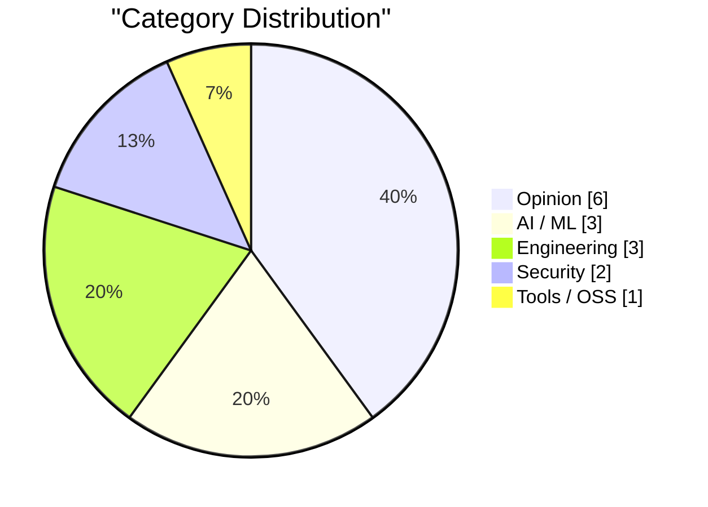
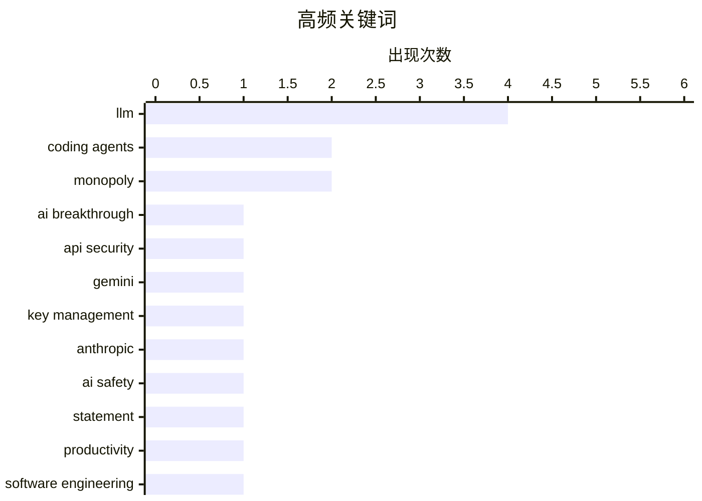

# AI Daily Digest — 2026-02-27

> Curated from 92 top tech blogs recommended by Karpathy. AI-selected Top 15.

<div class="stats-bar" data-sources="88/92" data-articles="2497" data-filtered="55" data-hours="48" data-selected="15"></div>

<div class="stats-categories" data-categories='{"AI / ML":3,"Security":2,"Engineering":3,"Opinion":6,"Tools / OSS":1}'></div>

<div class="stats-tags">

**llm**(4) · **coding agents**(2) · **monopoly**(2) · ai breakthrough(1) · api security(1) · gemini(1) · key management(1) · anthropic(1) · ai safety(1) · statement(1) · productivity(1) · software engineering(1) · open source(1) · test suite(1) · ip concerns(1) · autonomous weapons(1) · ai ethics(1) · defense policy(1) · knowledge access(1) · ai limitations(1)

</div>

## Highlights

最近两个月AI编程助手迎来质的飞跃，从不可用到基本可用，编码代理已能处理大规模复杂任务，改变了程序员的工作方式。与此同时，AI时代带来的安全隐患日益凸显，包括API密钥管理混乱和开源知识产权的新威胁，企业和开发者需要重新思考保护策略。开发者社区正在摸索与AI代理协作的最佳实践，通过积累可行方案和理解系统能力边界，来适应这个快速演变的工程范式。

---

## Top Picks

<div class="pick-card">

#1 **引用Andrej Karpathy的观点：AI如何在两个月内彻底改变编程**

[Quoting Andrej Karpathy](https://simonwillison.net/2026/Feb/26/andrej-karpathy/#atom-everything) — simonwillison.net · 6 小时前 · AI / ML

> 编程在过去两个月内因AI发生了根本性转变，特别是自12月以来的变化。编码代理在12月之前基本不可用，现在已基本可用，模型质量、长期连贯性和持久性都显著提高，能够处理大规模复杂任务。这个转变不是渐进式的技术进步，而是一个明确的质的飞跃。

**Why read this**: 了解AI编程能力的最新突破点和行业领军人物的第一手观察，对理解当前AI发展阶段至关重要。

`coding agents` `LLM` `AI breakthrough`

</div>

<div class="pick-card">

#2 **Google API密钥的安全危机：Gemini改变了游戏规则**

[Google API Keys Weren't Secrets. But then Gemini Changed the Rules.](https://simonwillison.net/2026/Feb/26/google-api-keys/#atom-everything) — simonwillison.net · 20 小时前 · Security

> Google的Gemini API和Google Maps API共享相同的密钥系统，但两者的安全需求完全不同。Google Maps API密钥设计为公开（嵌入网页），而Gemini密钥可访问私有文件和发起计费请求，这造成了严重的安全漏洞。这个设计缺陷可能导致大规模的API密钥泄露和滥用风险。

**Why read this**: 揭示一个影响数百万Google服务用户的真实安全隐患，对任何使用Google API的开发者都有紧急的防护意义。

`API security` `Gemini` `key management`

</div>

<div class="pick-card">

#3 **Dario Amodei的历史性声明**

[Historic statement from Dario Amodei](https://garymarcus.substack.com/p/historic-statement-from-dario-amodei) — garymarcus.substack.com · 1 小时前 · AI / ML

> 文章内容不完整，仅显示标题和简短的编辑说明，无法提供完整的摘要。

**Why read this**: 内容截断无法判断。

`Anthropic` `AI safety` `statement`

</div>

---

<details>
<summary>Charts</summary>





```
llm             │ ████████████████████ 4
coding agents   │ ██████████░░░░░░░░░░ 2
monopoly        │ ██████████░░░░░░░░░░ 2
ai breakthrough │ █████░░░░░░░░░░░░░░░ 1
api security    │ █████░░░░░░░░░░░░░░░ 1
gemini          │ █████░░░░░░░░░░░░░░░ 1
key management  │ █████░░░░░░░░░░░░░░░ 1
anthropic       │ █████░░░░░░░░░░░░░░░ 1
ai safety       │ █████░░░░░░░░░░░░░░░ 1
statement       │ █████░░░░░░░░░░░░░░░ 1
```

</details>

---

## Opinion

### 1. Retired US Air Force General Jack Shanahan on the Anthropic-Pentagon tensions

[Retired US Air Force General Jack Shanahan on the Anthropic-Pentagon tensions](https://garymarcus.substack.com/p/retired-us-air-force-general-jack) — **garymarcus.substack.com** · 2 小时前 · 25/30

> Retired US Air Force General Jack Shanahan on the Anthropic-Pentagon tensions

`autonomous weapons` `AI ethics` `defense policy`

---

### 2. I vibe coded my dream macOS presentation app

[I vibe coded my dream macOS presentation app](https://simonwillison.net/2026/Feb/25/present/#atom-everything) — **simonwillison.net** · 1 天前 · 23/30

> I vibe coded my dream macOS presentation app

`LLM` `demo` `macOS`

---

### 3. Greg Knauss: ‘Lose Myself’

[Greg Knauss: ‘Lose Myself’](https://www.eod.com/blog/2026/02/lose-myself/) — **daringfireball.net** · 1 天前 · 23/30

> Greg Knauss: ‘Lose Myself’

`LLM` `abstraction` `AI interaction`

---

### 4. Pluralistic: If you build it (and it works), Trump will come (and take it) (26 Feb 2026)

[Pluralistic: If you build it (and it works), Trump will come (and take it) (26 Feb 2026)](https://pluralistic.net/2026/02/26/hanged-for-a-sheep/) — **pluralistic.net** · 14 小时前 · 23/30

> Pluralistic: If you build it (and it works), Trump will come (and take it) (26 Feb 2026)

`big tech` `monopoly` `regulation`

---

### 5. Pluralistic: The whole economy pays the Amazon tax (25 Feb 2026)

[Pluralistic: The whole economy pays the Amazon tax (25 Feb 2026)](https://pluralistic.net/2026/02/25/most-favored-nation/) — **pluralistic.net** · 1 天前 · 23/30

> Pluralistic: The whole economy pays the Amazon tax (25 Feb 2026)

`Amazon` `monopoly` `economy`

---

### 6. Quoting Benedict Evans

[Quoting Benedict Evans](https://simonwillison.net/2026/Feb/26/benedict-evans/#atom-everything) — **simonwillison.net** · 21 小时前 · 22/30

> Quoting Benedict Evans

`AI adoption` `capability gap` `user behavior`

---

## AI / ML

### 7. 引用Andrej Karpathy的观点：AI如何在两个月内彻底改变编程

[Quoting Andrej Karpathy](https://simonwillison.net/2026/Feb/26/andrej-karpathy/#atom-everything) — **simonwillison.net** · 6 小时前 · 27/30

> 编程在过去两个月内因AI发生了根本性转变，特别是自12月以来的变化。编码代理在12月之前基本不可用，现在已基本可用，模型质量、长期连贯性和持久性都显著提高，能够处理大规模复杂任务。这个转变不是渐进式的技术进步，而是一个明确的质的飞跃。

`coding agents` `LLM` `AI breakthrough`

---

### 8. Dario Amodei的历史性声明

[Historic statement from Dario Amodei](https://garymarcus.substack.com/p/historic-statement-from-dario-amodei) — **garymarcus.substack.com** · 1 小时前 · 27/30

> 文章内容不完整，仅显示标题和简短的编辑说明，无法提供完整的摘要。

`Anthropic` `AI safety` `statement`

---

### 9. When access to knowledge is no longer the limitation

[When access to knowledge is no longer the limitation](https://idiallo.com/blog/access-to-knowledge-is-no-longer-a-limitation?src=feed) — **idiallo.com** · 1 天前 · 24/30

> When access to knowledge is no longer the limitation

`LLM` `knowledge access` `AI limitations`

---

## Engineering

### 10. 代理工程模式：积累你擅长做的事情

[Hoard things you know how to do](https://simonwillison.net/guides/agentic-engineering-patterns/hoard-things-you-know-how-to-do/#atom-everything) — **simonwillison.net** · 4 小时前 · 25/30

> 与编码代理协作的高效工作方法来自于传统软件开发的最佳实践。其中一个关键技巧是积累并掌握已知可行的解决方案，这是软件开发中的核心技能。通过理解什么是可能的、什么是不可能的，以及这些事情如何实现，开发者可以更好地与AI代理协作。

`coding agents` `productivity` `software engineering`

---

### 11. tldraw困境：测试套件成为开源项目的威胁

[tldraw issue: Move tests to closed source repo](https://simonwillison.net/2026/Feb/25/closed-tests/#atom-everything) — **simonwillison.net** · 1 天前 · 25/30

> 开源项目的全面测试套件现在足以让他人完全重新实现整个库，甚至用不同的编程语言，这对拥有商业模式的开源项目构成严重威胁。tldraw作为知名开源绘图库的例子，正面临这个新的知识产权保护挑战。这个现象反映了AI时代开源商业模式需要重新思考的问题。

`open source` `test suite` `IP concerns`

---

### 12. Git in Postgres

[Git in Postgres](https://nesbitt.io/2026/02/26/git-in-postgres.html) — **nesbitt.io** · 15 小时前 · 22/30

> Git in Postgres

`Git` `PostgreSQL` `database` `version control`

---

## Security

### 13. Google API密钥的安全危机：Gemini改变了游戏规则

[Google API Keys Weren't Secrets. But then Gemini Changed the Rules.](https://simonwillison.net/2026/Feb/26/google-api-keys/#atom-everything) — **simonwillison.net** · 20 小时前 · 27/30

> Google的Gemini API和Google Maps API共享相同的密钥系统，但两者的安全需求完全不同。Google Maps API密钥设计为公开（嵌入网页），而Gemini密钥可访问私有文件和发起计费请求，这造成了严重的安全漏洞。这个设计缺陷可能导致大规模的API密钥泄露和滥用风险。

`API security` `Gemini` `key management`

---

### 14. Members Only: Your anonymity set has collapsed and you don't know it yet

[Members Only: Your anonymity set has collapsed and you don't know it yet](https://www.joanwestenberg.com/members-only-your-anonymity-set-has-collapsed-and-you-dont-know-it-yet/) — **joanwestenberg.com** · 23 小时前 · 22/30

> Members Only: Your anonymity set has collapsed and you don't know it yet

`anonymity` `privacy` `security`

---

## Tools / OSS

### 15. Claude Code Remote Control

[Claude Code Remote Control](https://simonwillison.net/2026/Feb/25/claude-code-remote-control/#atom-everything) — **simonwillison.net** · 1 天前 · 23/30

> Claude Code Remote Control

`Claude Code` `remote control` `IDE`

---

*生成于 2026-02-27 01:08 | 扫描 88 源 → 获取 2497 篇 → 精选 15 篇*
*基于 [Hacker News Popularity Contest 2025](https://refactoringenglish.com/tools/hn-popularity/) RSS 源列表，由 [Andrej Karpathy](https://x.com/karpathy) 推荐*
