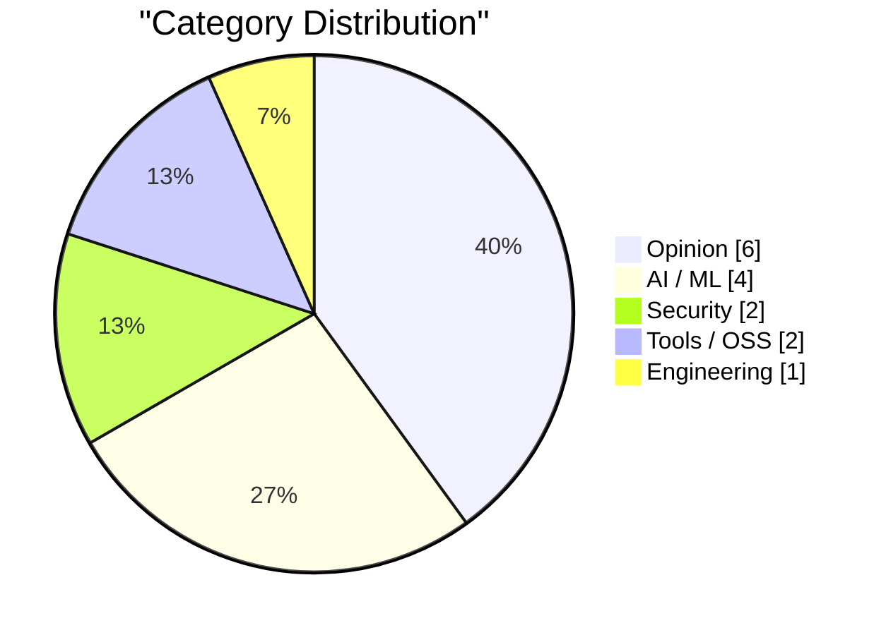
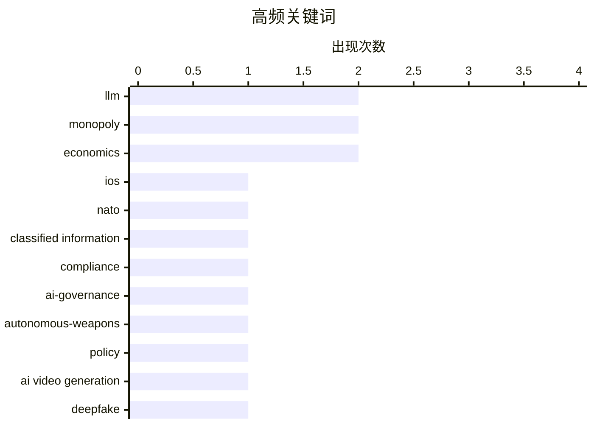

# AI Daily Digest — 2026-02-27

> Curated from 92 top tech blogs recommended by Karpathy. AI-selected Top 15.

<div class="stats-bar" data-sources="87/92" data-articles="2453" data-filtered="46" data-hours="48" data-selected="15"></div>

<div class="stats-categories" data-categories='{"Security":2,"Opinion":6,"AI / ML":4,"Tools / OSS":2,"Engineering":1}'></div>

<div class="stats-tags">

**llm**(2) · **monopoly**(2) · **economics**(2) · ios(1) · nato(1) · classified information(1) · compliance(1) · ai-governance(1) · autonomous-weapons(1) · policy(1) · ai video generation(1) · deepfake(1) · creative application(1) · ci/cd(1) · code review(1) · ai(1) · automation(1) · abstraction(1) · natural language(1) · anthropic(1)

</div>

## Highlights

今日技术圈呈现出三大核心趋势：其一，苹果设备获得北约安全认证彰显消费级硬件在国防领域的突破性应用，但围绕AI军事应用的伦理讨论也随之升温；其二，生成式AI在视频创意制作和代码审查等实际工作流中的落地应用不断扩展，从商业服务向开源自托管方案转移；其三，AI交互范式从技术层面的语言抽象演进到对人类生产力和认知方式的根本性重塑，知识获取的瓶颈逐步被打破。这反映了AI技术正从实验室走向生产环节，但安全、伦理和隐私问题也成为行业必须正视的关键话题。

---

## Top Picks

<div class="pick-card">

#1 **iPhone 和 iPad 获批用于处理北约机密信息**

[iPhone and iPad Approved to Handle Classified NATO Information](https://nr.apple.com/Do0I6B8WX0) — daringfireball.net · 4 小时前 · Security

> 苹果宣布 iPhone 和 iPad 成为首款也是唯一通过北约信息保障要求认证的消费级设备，可在无需特殊软件或设置的情况下处理北约限制级机密信息。这一认证等级超越了其他任何消费级移动设备的政府认可标准。该成就突显了苹果在安全和隐私保护方面的领先地位，为政府机构提供了可信赖的移动设备选择。

**Why read this**: 了解苹果在国防级安全认证方面的重大突破，以及这对消费级设备发展方向的意义。

`iOS` `NATO` `classified information` `compliance`

</div>

<div class="pick-card">

#2 **退役美国空军将军杰克·沙那汉谈论 Anthropic-五角大楼的紧张关系**

[Retired US Air Force General Jack Shanahan on the Anthropic-Pentagon tensions](https://garymarcus.substack.com/p/retired-us-air-force-general-jack) — garymarcus.substack.com · 2 小时前 · Opinion

> 美国退役空军将军杰克·沙那汉指出，当前形式的任何大语言模型都不应被考虑用于完全自主致命武器系统，这种建议是荒谬的。这反映了在军事应用中采用 AI 技术时的严肃伦理和安全考量。发言人强调了在将前沿 AI 技术部署到国防领域前，需要进行充分的技术评估和道德审视。

**Why read this**: 深入了解军事和 AI 伦理决策者对当前 LLM 军事应用的真实态度和安全顾虑。

`AI-governance` `autonomous-weapons` `policy`

</div>

<div class="pick-card">

#3 **Energym**

[Energym](https://www.aicandy.be/giorgio-1) — daringfireball.net · 1 小时前 · AI / ML

> 这是一段来自 2036 年对埃隆·马斯克、杰夫·贝佐斯和萨姆·奥尔特曼的虚构采访，完全由 AI 视频生成技术创作。作品展示了生成式 AI 在创意内容制作中的潜力。这正是 AI 视频生成技术应该被用于的目的——创造富有想象力和娱乐性的内容。

**Why read this**: 欣赏 AI 视频生成在创意表达中的美妙应用，以及技术发展给内容创作带来的新可能性。

`AI video generation` `deepfake` `creative application`

</div>

---

<details>
<summary>Charts</summary>





```
llm                    │ ████████████████████ 2
monopoly               │ ████████████████████ 2
economics              │ ████████████████████ 2
ios                    │ ██████████░░░░░░░░░░ 1
nato                   │ ██████████░░░░░░░░░░ 1
classified information │ ██████████░░░░░░░░░░ 1
compliance             │ ██████████░░░░░░░░░░ 1
ai-governance          │ ██████████░░░░░░░░░░ 1
autonomous-weapons     │ ██████████░░░░░░░░░░ 1
policy                 │ ██████████░░░░░░░░░░ 1
```

</details>

---

## Opinion

### 1. 退役美国空军将军杰克·沙那汉谈论 Anthropic-五角大楼的紧张关系

[Retired US Air Force General Jack Shanahan on the Anthropic-Pentagon tensions](https://garymarcus.substack.com/p/retired-us-air-force-general-jack) — **garymarcus.substack.com** · 2 小时前 · 24/30

> 美国退役空军将军杰克·沙那汉指出，当前形式的任何大语言模型都不应被考虑用于完全自主致命武器系统，这种建议是荒谬的。这反映了在军事应用中采用 AI 技术时的严肃伦理和安全考量。发言人强调了在将前沿 AI 技术部署到国防领域前，需要进行充分的技术评估和道德审视。

`AI-governance` `autonomous-weapons` `policy`

---

### 2. Pluralistic: The whole economy pays the Amazon tax (25 Feb 2026)

[Pluralistic: The whole economy pays the Amazon tax (25 Feb 2026)](https://pluralistic.net/2026/02/25/most-favored-nation/) — **pluralistic.net** · 1 天前 · 21/30

> Today's links The whole economy pays the Amazon tax: You can't shop your way out of a monopoly. Hey look at this: Delights to delectate. Object permanence: Math denial; Disney v young Tim Burton; Make

`Amazon` `monopoly` `economics`

---

### 3. The Last Gasps of the Rent Seeking Class

[The Last Gasps of the Rent Seeking Class](https://geohot.github.io//blog/jekyll/update/2026/02/26/the-last-gasps-of-the-rent-seeking-class.html) — **geohot.github.io** · 1 天前 · 20/30

> The Last Gasps of the Rent Seeking Class

`rent-seeking` `economics` `technology disruption`

---

### 4. Talking through the tech reckoning

[Talking through the tech reckoning](https://anildash.com/2026/02/25/talking-through-the-tech-reckoning/) — **anildash.com** · 1 天前 · 20/30

> Talking through the tech reckoning

`tech industry` `reckoning` `conversation` `responsibility`

---

### 5. Pluralistic: If you build it (and it works), Trump will come (and take it) (26 Feb 2026)

[Pluralistic: If you build it (and it works), Trump will come (and take it) (26 Feb 2026)](https://pluralistic.net/2026/02/26/hanged-for-a-sheep/) — **pluralistic.net** · 14 小时前 · 18/30

> Pluralistic: If you build it (and it works), Trump will come (and take it) (26 Feb 2026)

`monopoly` `big tech` `regulation`

---

### 6. They’re Vibe-Coding Spam Now

[They’re Vibe-Coding Spam Now](https://feed.tedium.co/link/15204/17283566/vibe-coded-email-spam) — **tedium.co** · 1 天前 · 18/30

> They’re Vibe-Coding Spam Now

`coding accessibility` `spam` `democratization`

---

## AI / ML

### 7. Energym

[Energym](https://www.aicandy.be/giorgio-1) — **daringfireball.net** · 1 小时前 · 23/30

> 这是一段来自 2036 年对埃隆·马斯克、杰夫·贝佐斯和萨姆·奥尔特曼的虚构采访，完全由 AI 视频生成技术创作。作品展示了生成式 AI 在创意内容制作中的潜力。这正是 AI 视频生成技术应该被用于的目的——创造富有想象力和娱乐性的内容。

`AI video generation` `deepfake` `creative application`

---

### 8. 格雷格·克劳斯：《迷失自己》

[Greg Knauss: ‘Lose Myself’](https://www.eod.com/blog/2026/02/lose-myself/) — **daringfireball.net** · 1 天前 · 22/30

> 格雷格·克劳斯探讨了用英文与 LLM 交互只是又一层抽象的概念，但指出这种抽象带来的变化是深远的，就像工业化从根本上改变了产品的本质一样。用自然语言与 AI 交互虽然在技术上是抽象，但实际上重新定义了人与机器的交互方式。这篇文章触及了 AI 时代人类身份认同和思维方式可能发生的深层转变。

`LLM` `abstraction` `natural language`

---

### 9. Historic statement from Dario Amodei

[Historic statement from Dario Amodei](https://garymarcus.substack.com/p/historic-statement-from-dario-amodei) — **garymarcus.substack.com** · 2 小时前 · 22/30

> hat tip to Kylie Robison.

`Anthropic` `Dario Amodei` `LLM-policy`

---

### 10. When access to knowledge is no longer the limitation

[When access to knowledge is no longer the limitation](https://idiallo.com/blog/access-to-knowledge-is-no-longer-a-limitation?src=feed) — **idiallo.com** · 1 天前 · 21/30

> Let's do this thought experiment together. I have a little box. I'll place the box on the table. Now I'll open the little box and put all the arguments against large language models in it. I'll put al

`LLM` `knowledge` `limitations`

---

## Security

### 11. iPhone 和 iPad 获批用于处理北约机密信息

[iPhone and iPad Approved to Handle Classified NATO Information](https://nr.apple.com/Do0I6B8WX0) — **daringfireball.net** · 4 小时前 · 24/30

> 苹果宣布 iPhone 和 iPad 成为首款也是唯一通过北约信息保障要求认证的消费级设备，可在无需特殊软件或设置的情况下处理北约限制级机密信息。这一认证等级超越了其他任何消费级移动设备的政府认可标准。该成就突显了苹果在安全和隐私保护方面的领先地位，为政府机构提供了可信赖的移动设备选择。

`iOS` `NATO` `classified information` `compliance`

---

### 12. Members Only: Your anonymity set has collapsed and you don't know it yet

[Members Only: Your anonymity set has collapsed and you don't know it yet](https://www.joanwestenberg.com/members-only-your-anonymity-set-has-collapsed-and-you-dont-know-it-yet/) — **joanwestenberg.com** · 1 天前 · 21/30

> 

`privacy` `anonymity` `surveillance`

---

## Tools / OSS

### 13. 在 CI/CD 中使用 OpenCode 进行 AI 代码审查

[Using OpenCode in CI/CD for AI pull request reviews](https://martinalderson.com/posts/using-opencode-in-cicd-for-ai-pull-request-reviews/?utm_source=rss) — **martinalderson.com** · 1 天前 · 23/30

> 作者分享了用 OpenCode 在 CI/CD 流水线中替代 SaaS 代码审查工具的经验。这种方案成本更低、安全性更高，且能与任何 Git 提供商兼容。相比商业代码审查服务，自托管的开源 AI 审查工具提供了更灵活的定制和部署选项。

`CI/CD` `code review` `AI` `automation`

---

### 14. Introducing gzpeek, a tool to parse gzip metadata

[Introducing gzpeek, a tool to parse gzip metadata](https://evanhahn.com/introducing-gzpeek/) — **evanhahn.com** · 1 天前 · 20/30

> <p><em>In short: gzip streams contain metadata, like the operating system that did the compression. I built <a href="https://codeberg.org/EvanHahn/gzpeek">a tool</a> to read this metadata.</em></p>
<p

`gzip` `file format` `tool`

---

## Engineering

### 15. Git in Postgres

[Git in Postgres](https://nesbitt.io/2026/02/26/git-in-postgres.html) — **nesbitt.io** · 15 小时前 · 20/30

> Git in Postgres

`git` `database` `Postgres`

---

*生成于 2026-02-27 01:47 | 扫描 87 源 → 获取 2453 篇 → 精选 15 篇*
*基于 [Hacker News Popularity Contest 2025](https://refactoringenglish.com/tools/hn-popularity/) RSS 源列表，由 [Andrej Karpathy](https://x.com/karpathy) 推荐*
