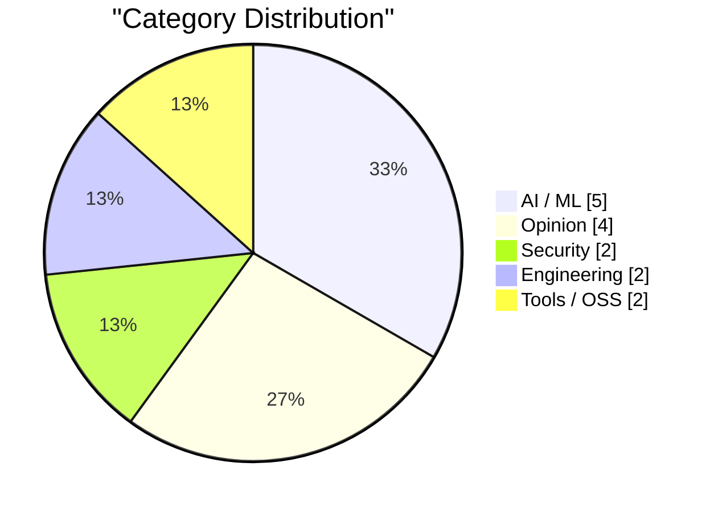
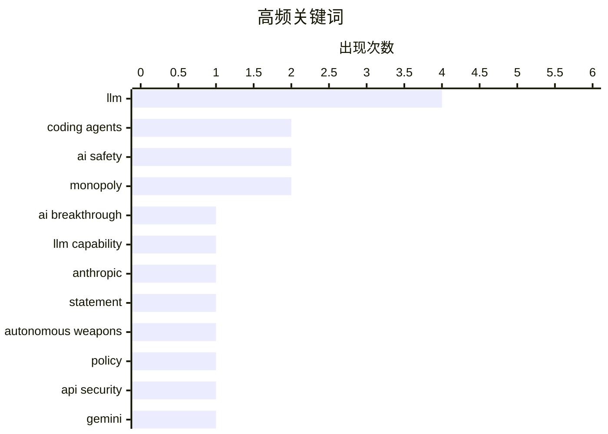

# AI Daily Digest — 2026-02-27

> Curated from 92 top tech blogs recommended by Karpathy. AI-selected Top 15.

<div class="stats-bar" data-sources="89/92" data-articles="2508" data-filtered="55" data-hours="48" data-selected="15"></div>

<div class="stats-categories" data-categories='{"AI / ML":5,"Security":2,"Engineering":2,"Tools / OSS":2,"Opinion":4}'></div>

<div class="stats-tags">

**llm**(4) · **coding agents**(2) · **ai safety**(2) · monopoly(2) · ai breakthrough(1) · llm capability(1) · anthropic(1) · statement(1) · autonomous weapons(1) · policy(1) · api security(1) · gemini(1) · credential exposure(1) · software engineering(1) · productivity patterns(1) · open source(1) · test suite(1) · intellectual property(1) · claude code(1) · remote control(1)

</div>

## Highlights

当前技术圈的核心趋势是AI编码能力的质的飞跃——过去两个月内，AI代理从基本无用跃升到真正可用的生产工具，推动编程范式发生根本性转变。同时，AI系统在军事、安全等关键领域的应用引发深刻思考，包括自主武器系统的伦理边界和API安全模式的重构需求。与此相应，开发者需要进化工作方式，通过囤积和发挥人类的核心竞争力来与AI代理有效协作，这标志着工程实践正在进入新的范式转换期。

---

## Top Picks

<div class="pick-card">

#1 **引用 Andrej Karpathy 的观点：AI 如何在两个月内彻底改变了编程**

[Quoting Andrej Karpathy](https://simonwillison.net/2026/Feb/26/andrej-karpathy/#atom-everything) — simonwillison.net · 6 小时前 · AI / ML

> 编程在过去两个月内因AI发生了剧烈变化，尤其是从12月开始。编码代理在12月前基本无法工作，12月后才真正可用，这是模型质量、长期连贯性和持久性的重大提升。新一代AI模型能够处理复杂任务并具备更强的任务完成能力，标志着AI辅助编程进入了实用阶段。这种快速转变而非渐进式进步是编程领域的一个关键里程碑。

**Why read this**: 深入了解AI编程代理的真实进展水平和能力边界，理解为什么AI编程工具在2025年底出现了质的飞跃。

`coding agents` `AI breakthrough` `LLM capability`

</div>

<div class="pick-card">

#2 **Dario Amodei 的历史性声明**

[Historic statement from Dario Amodei](https://garymarcus.substack.com/p/historic-statement-from-dario-amodei) — garymarcus.substack.com · 2 小时前 · AI / ML

> 暂无完整内容可用，文章摘要不完整。

**Why read this**: 需要访问完整内容。

`Anthropic` `AI safety` `statement`

</div>

<div class="pick-card">

#3 **退役美国空军将军 Jack Shanahan 谈 Anthropic-五角大楼紧张关系**

[Retired US Air Force General Jack Shanahan on the Anthropic-Pentagon tensions](https://garymarcus.substack.com/p/retired-us-air-force-general-jack) — garymarcus.substack.com · 2 小时前 · AI / ML

> 退役空军将军 Jack Shanahan 对使用大语言模型开发自主武器系统的建议提出了强烈警告。他明确指出，当前形式的任何大语言模型都不应该用于全自主杀伤性武器系统。这代表了军事和技术领域对AI应用于致命自主武器的严肃态度和伦理考量。

**Why read this**: 了解AI军事应用的现实制约和业内专家对安全边界的认识，这对理解AI产业的治理方向至关重要。

`LLM` `autonomous weapons` `AI safety` `policy`

</div>

---

<details>
<summary>Charts</summary>





```
llm                │ ████████████████████ 4
coding agents      │ ██████████░░░░░░░░░░ 2
ai safety          │ ██████████░░░░░░░░░░ 2
monopoly           │ ██████████░░░░░░░░░░ 2
ai breakthrough    │ █████░░░░░░░░░░░░░░░ 1
llm capability     │ █████░░░░░░░░░░░░░░░ 1
anthropic          │ █████░░░░░░░░░░░░░░░ 1
statement          │ █████░░░░░░░░░░░░░░░ 1
autonomous weapons │ █████░░░░░░░░░░░░░░░ 1
policy             │ █████░░░░░░░░░░░░░░░ 1
```

</details>

---

## AI / ML

### 1. 引用 Andrej Karpathy 的观点：AI 如何在两个月内彻底改变了编程

[Quoting Andrej Karpathy](https://simonwillison.net/2026/Feb/26/andrej-karpathy/#atom-everything) — **simonwillison.net** · 6 小时前 · 29/30

> 编程在过去两个月内因AI发生了剧烈变化，尤其是从12月开始。编码代理在12月前基本无法工作，12月后才真正可用，这是模型质量、长期连贯性和持久性的重大提升。新一代AI模型能够处理复杂任务并具备更强的任务完成能力，标志着AI辅助编程进入了实用阶段。这种快速转变而非渐进式进步是编程领域的一个关键里程碑。

`coding agents` `AI breakthrough` `LLM capability`

---

### 2. Dario Amodei 的历史性声明

[Historic statement from Dario Amodei](https://garymarcus.substack.com/p/historic-statement-from-dario-amodei) — **garymarcus.substack.com** · 2 小时前 · 27/30

> 暂无完整内容可用，文章摘要不完整。

`Anthropic` `AI safety` `statement`

---

### 3. 退役美国空军将军 Jack Shanahan 谈 Anthropic-五角大楼紧张关系

[Retired US Air Force General Jack Shanahan on the Anthropic-Pentagon tensions](https://garymarcus.substack.com/p/retired-us-air-force-general-jack) — **garymarcus.substack.com** · 2 小时前 · 27/30

> 退役空军将军 Jack Shanahan 对使用大语言模型开发自主武器系统的建议提出了强烈警告。他明确指出，当前形式的任何大语言模型都不应该用于全自主杀伤性武器系统。这代表了军事和技术领域对AI应用于致命自主武器的严肃态度和伦理考量。

`LLM` `autonomous weapons` `AI safety` `policy`

---

### 4. Greg Knauss: ‘Lose Myself’

[Greg Knauss: ‘Lose Myself’](https://www.eod.com/blog/2026/02/lose-myself/) — **daringfireball.net** · 1 天前 · 24/30

> Greg Knauss: ‘Lose Myself’

`LLM` `abstraction` `AI interaction`

---

### 5. When access to knowledge is no longer the limitation

[When access to knowledge is no longer the limitation](https://idiallo.com/blog/access-to-knowledge-is-no-longer-a-limitation?src=feed) — **idiallo.com** · 1 天前 · 24/30

> When access to knowledge is no longer the limitation

`LLM` `knowledge access` `AI limitations`

---

## Opinion

### 6. 引用本尼迪特·埃文斯的观点

[Quoting Benedict Evans](https://simonwillison.net/2026/Feb/26/benedict-evans/#atom-everything) — **simonwillison.net** · 21 小时前 · 23/30

> 文章讨论了AI模型与实际使用之间的鸿沟问题。OpenAI承认存在"能力差距"——模型能做什么和人们实际怎么用它之间的矛盾，这实际上反映了产品与市场的适配问题。如果用户每周只用几次，日常找不到应用场景，说明这些AI工具还没有真正改变人们的生活。这触及了当前AI行业的核心困境。

`AI adoption` `capability gap` `user behavior`

---

### 7. 我用即兴编码方式开发了梦想中的macOS演讲应用

[I vibe coded my dream macOS presentation app](https://simonwillison.net/2026/Feb/25/present/#atom-everything) — **simonwillison.net** · 1 天前 · 23/30

> 作者在社交科学FOO营的开放式演讲会中，临时提议了一场关于"2026年2月LLMs现状"的主题演讲。他在演讲前一晚用即兴编码（vibe coding）的方式快速开发了一个自定义macOS应用来呈现演讲内容。这展示了现代开发工具和LLM协助下，个人开发者可以在极短时间内完成一个完整的应用。

`LLM` `demo` `presentation`

---

### 8. 多元化日报：如果你构建成功了，特朗普就会来(并接收)它

[Pluralistic: If you build it (and it works), Trump will come (and take it) (26 Feb 2026)](https://pluralistic.net/2026/02/26/hanged-for-a-sheep/) — **pluralistic.net** · 14 小时前 · 23/30

> 这是一篇综合性链接汇总文章，讨论了特朗普政府倾向于让大科技公司赢利而非公平竞争的政策取向。文章涵盖多个议题，包括科技政策、出版业、加密技术等当下热点问题。重点指出了权力与商业结合带来的结构性问题。

`Big Tech` `regulation` `monopoly`

---

### 9. 多元化日报：整个经济都在为亚马逊垄断税买单

[Pluralistic: The whole economy pays the Amazon tax (25 Feb 2026)](https://pluralistic.net/2026/02/25/most-favored-nation/) — **pluralistic.net** · 1 天前 · 23/30

> 文章论述了亚马逊等科技巨头的垄断地位如何对整个经济造成负面影响，核心观点是"你无法通过购物来规避垄断"。讨论涵盖数学否定主义、迪士尼案例、新国会图书馆主任、美国寡头财富等多个相关话题。强调了垄断带来的系统性经济成本。

`Amazon` `monopoly` `market power` `economics`

---

## Security

### 10. 谷歌 API 密钥曾不是秘密。但 Gemini 改变了规则

[Google API Keys Weren't Secrets. But then Gemini Changed the Rules.](https://simonwillison.net/2026/Feb/26/google-api-keys/#atom-everything) — **simonwillison.net** · 21 小时前 · 26/30

> 谷歌的 Gemini 和 Google Maps 等服务共享相同的 API 密钥，但两者的安全要求完全不同。Google Maps API 密钥设计成公开的（嵌入网页中），而 Gemini API 密钥可用于访问私有文件和发起付费 API 请求，存在严重安全风险。这个设计缺陷导致大量暴露的 Gemini 密钥可能被恶意利用。

`API security` `Gemini` `credential exposure`

---

### 11. iPhone和iPad获批处理北约机密信息

[iPhone and iPad Approved to Handle Classified NATO Information](https://nr.apple.com/Do0I6B8WX0) — **daringfireball.net** · 3 小时前 · 22/30

> 苹果宣布iPhone和iPad成为首批也是唯一获得北约信息安保要求认证的消费级设备。这些设备无需特殊软件或设置就能处理北约限制级别的机密信息，是消费类移动设备中首次达到这一政府认证等级。这标志着苹果在政府安全认证领域取得重大突破。

`Apple` `NATO` `device certification`

---

## Engineering

### 12. 囤积你已经掌握的技能：与AI编码代理协作的工程模式

[Hoard things you know how to do](https://simonwillison.net/guides/agentic-engineering-patterns/hoard-things-you-know-how-to-do/#atom-everything) — **simonwillison.net** · 5 小时前 · 25/30

> 在与编码代理协作时，囤积你已经掌握的技能是提高生产力的关键策略。这是软件开发中理解可能性和不可能性的重要部分，具备这些知识能帮助更有效地引导和控制AI代理。这个建议将职业生涯中的经验教训延伸到AI时代，强调人类的专业判断在AI辅助开发中的持续价值。

`coding agents` `software engineering` `productivity patterns`

---

### 13. tldraw issue: Move tests to closed source repo

[tldraw issue: Move tests to closed source repo](https://simonwillison.net/2026/Feb/25/closed-tests/#atom-everything) — **simonwillison.net** · 1 天前 · 24/30

> tldraw issue: Move tests to closed source repo

`open source` `test suite` `intellectual property`

---

## Tools / OSS

### 14. Claude Code Remote Control

[Claude Code Remote Control](https://simonwillison.net/2026/Feb/25/claude-code-remote-control/#atom-everything) — **simonwillison.net** · 1 天前 · 24/30

> Claude Code Remote Control

`Claude Code` `remote control` `IDE`

---

### 15. Using OpenCode in CI/CD for AI pull request reviews

[Using OpenCode in CI/CD for AI pull request reviews](https://martinalderson.com/posts/using-opencode-in-cicd-for-ai-pull-request-reviews/?utm_source=rss) — **martinalderson.com** · 1 天前 · 24/30

> Using OpenCode in CI/CD for AI pull request reviews

`AI code review` `CI/CD` `OpenCode`

---

*生成于 2026-02-27 01:38 | 扫描 89 源 → 获取 2508 篇 → 精选 15 篇*
*基于 [Hacker News Popularity Contest 2025](https://refactoringenglish.com/tools/hn-popularity/) RSS 源列表，由 [Andrej Karpathy](https://x.com/karpathy) 推荐*
