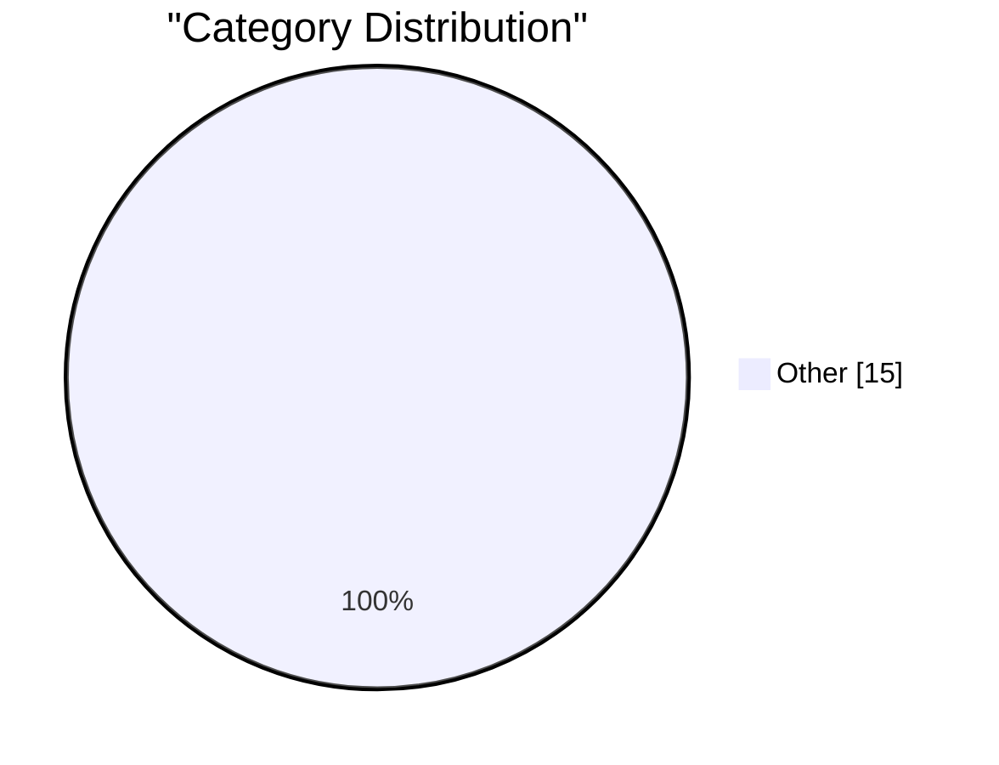

# AI Daily Digest — 2026-03-01

> Curated from 92 top tech blogs recommended by Karpathy. AI-selected Top 15.

## Top Picks

#1 **Quoting claude.com/import-memory**

[Quoting claude.com/import-memory](https://simonwillison.net/2026/Mar/1/claude-import-memory/#atom-everything) — simonwillison.net · 6 小时前 · Other

> Quoting claude.com/import-memory

#2 **Interactive explanations**

[Interactive explanations](https://simonwillison.net/guides/agentic-engineering-patterns/interactive-explanations/#atom-everything) — simonwillison.net · 18 小时前 · Other

> Interactive explanations

#3 **Please, please, please stop using passkeys for encrypting user data**

[Please, please, please stop using passkeys for encrypting user data](https://simonwillison.net/2026/Feb/27/passkeys/#atom-everything) — simonwillison.net · 1 天前 · Other

> Please, please, please stop using passkeys for encrypting user data

---

Charts

---

## Other

### 1. Quoting claude.com/import-memory

[Quoting claude.com/import-memory](https://simonwillison.net/2026/Mar/1/claude-import-memory/#atom-everything) — **simonwillison.net** · 6 小时前 · 15/30

> Quoting claude.com/import-memory

---

### 2. Interactive explanations

[Interactive explanations](https://simonwillison.net/guides/agentic-engineering-patterns/interactive-explanations/#atom-everything) — **simonwillison.net** · 18 小时前 · 15/30

> Interactive explanations

---

### 3. Please, please, please stop using passkeys for encrypting user data

[Please, please, please stop using passkeys for encrypting user data](https://simonwillison.net/2026/Feb/27/passkeys/#atom-everything) — **simonwillison.net** · 1 天前 · 15/30

> Please, please, please stop using passkeys for encrypting user data

---

### 4. An AI agent coding skeptic tries AI agent coding, in excessive detail

[An AI agent coding skeptic tries AI agent coding, in excessive detail](https://simonwillison.net/2026/Feb/27/ai-agent-coding-in-excessive-detail/#atom-everything) — **simonwillison.net** · 1 天前 · 15/30

> An AI agent coding skeptic tries AI agent coding, in excessive detail

---

### 5. Free Claude Max for (large project) open source maintainers

[Free Claude Max for (large project) open source maintainers](https://simonwillison.net/2026/Feb/27/claude-max-oss-six-months/#atom-everything) — **simonwillison.net** · 1 天前 · 15/30

> Free Claude Max for (large project) open source maintainers

---

### 6. Unicode Explorer using binary search over fetch() HTTP range requests

[Unicode Explorer using binary search over fetch() HTTP range requests](https://simonwillison.net/2026/Feb/27/unicode-explorer/#atom-everything) — **simonwillison.net** · 1 天前 · 15/30

> Unicode Explorer using binary search over fetch() HTTP range requests

---

### 7. Hoard things you know how to do

[Hoard things you know how to do](https://simonwillison.net/guides/agentic-engineering-patterns/hoard-things-you-know-how-to-do/#atom-everything) — **simonwillison.net** · 2 天前 · 15/30

> Hoard things you know how to do

---

### 8. Quoting Andrej Karpathy

[Quoting Andrej Karpathy](https://simonwillison.net/2026/Feb/26/andrej-karpathy/#atom-everything) — **simonwillison.net** · 2 天前 · 15/30

> Quoting Andrej Karpathy

---

### 9. Upgrading my Open Source Pi Surveillance Server with Frigate

[Upgrading my Open Source Pi Surveillance Server with Frigate](https://www.jeffgeerling.com/blog/2026/upgrading-my-open-source-pi-surveillance-server-frigate/) — **jeffgeerling.com** · 2 天前 · 15/30

> Upgrading my Open Source Pi Surveillance Server with Frigate

---

### 10. How to Securely Erase an old Hard Drive on macOS Tahoe

[How to Securely Erase an old Hard Drive on macOS Tahoe](https://www.jeffgeerling.com/blog/2026/securely-erase-hard-drive-macos-tahoe/) — **jeffgeerling.com** · 2 天前 · 15/30

> How to Securely Erase an old Hard Drive on macOS Tahoe

---

### 11. Who is the Kimwolf Botmaster “Dort”?

[Who is the Kimwolf Botmaster “Dort”?](https://krebsonsecurity.com/2026/02/who-is-the-kimwolf-botmaster-dort/) — **krebsonsecurity.com** · 1 天前 · 15/30

> Who is the Kimwolf Botmaster “Dort”?

---

### 12. Sentry

[Sentry](https://sentry.io/resources/ios-workshop-jan-2026/?utm_source=daringfireball&amp;utm_medium=paid-display&amp;utm_campaign=general-fy27q1-evergreen&amp;utm_content=static-ad-mobilerss-trysentry) — **daringfireball.net** · 1 小时前 · 15/30

> Sentry

---

### 13. The Talk Show: ‘Bad Dates’

[The Talk Show: ‘Bad Dates’](https://daringfireball.net/thetalkshow/2026/02/28/ep-442) — **daringfireball.net** · 1 小时前 · 15/30

> The Talk Show: ‘Bad Dates’

---

### 14. Trump’s Enormous Gamble on Regime Change in Iran

[Trump’s Enormous Gamble on Regime Change in Iran](https://www.theatlantic.com/ideas/2026/02/trumps-iran-regime-change-attack-gamble/686190/?gift=aQyUJR7AIw1mJWdQ6Ed6yOWB4bfod1kQqCyz2RXbHaY) — **daringfireball.net** · 1 天前 · 15/30

> Trump’s Enormous Gamble on Regime Change in Iran

---

### 15. West Virginia’s Anti-Apple CSAM Lawsuit Would Help Child Predators Walk Free

[West Virginia’s Anti-Apple CSAM Lawsuit Would Help Child Predators Walk Free](https://www.techdirt.com/2026/02/25/west-virginias-anti-apple-csam-lawsuit-would-help-child-predators-walk-free/) — **daringfireball.net** · 1 天前 · 15/30

> West Virginia’s Anti-Apple CSAM Lawsuit Would Help Child Predators Walk Free

---

*生成于 2026-03-01 17:23 | 扫描 88 源 → 获取 2499 篇 → 精选 15 篇*
*基于 [Hacker News Popularity Contest 2025](https://refactoringenglish.com/tools/hn-popularity/) RSS 源列表，由 [Andrej Karpathy](https://x.com/karpathy) 推荐*
